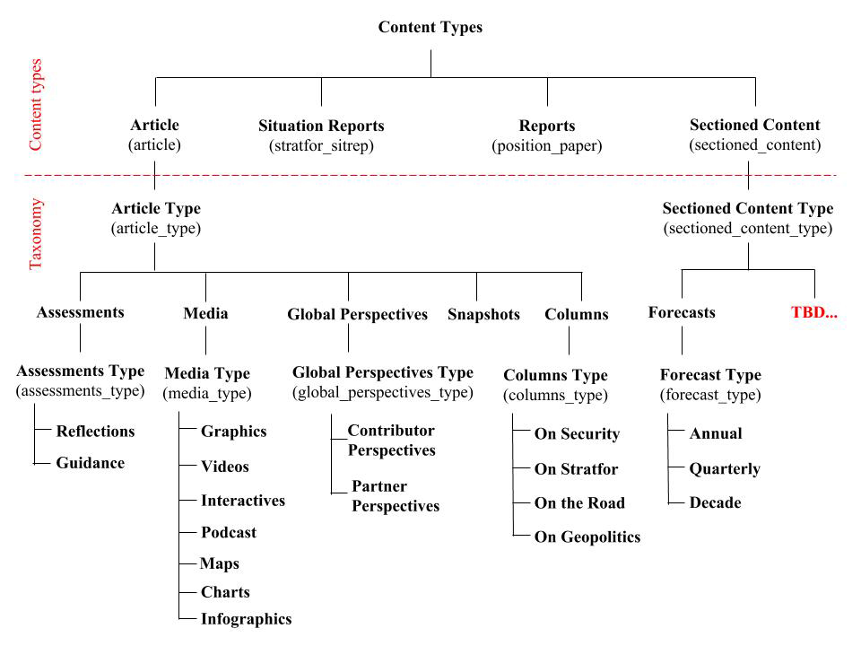

# Overview

Stratfor provides global awareness and guidance to individuals, governments and businesses around the world. We use a unique, intel-based approach to analyze world affairs.

This API reference provides information on available endpoints and how to interact with it.

## Content Types

[https://www.drupal.org/docs/7/understanding-drupal/content-types](https://www.drupal.org/docs/7/understanding-drupal/content-types)

*A single web site could contain many types of content, such as informational pages, news items, polls, blog posts, real estate listings, etc. In Drupal, each item of content is called a node, and each node belongs to a single content type, which defines various default settings for nodes of that type, such as whether the node is published automatically and whether comments are permitted. (Note that in previous versions of Drupal, content types were known as node types.)*

**These are the available content types for Worldview:**

Content type name | Machine name | Description
--- | --- | ---
Article | article | Stratfor articles, which include long-form assessments, multimedia, external contributor perspectives, columns and more.
Situation Reports | stratfor_sitrep | Swift and succinct accounts of breaking events and matters of geopolitical significance.
Sectioned Content | sectioned_content | Sectioned content includes our forecasts and research reports.
Stratfor Store Reports | position_paper | All research reports published in the Stratfor Store.



<br />

### *Article (article)* content type
*Article* content type is categorized into five article types by using the [**article_type**](#taxonomy-for-categorizing) taxonomy.

<ul>
  <li>
    <strong>Assessments</strong>
    <br />
    <em>From a foundational report to the most detailed analysis, our assessments cover every corner of the world. Reflections on daily events, guidance for the week ahead and forward-looking geopolitical evaluations are found here.</em>
    <br /><br />
    <em>Assessments</em> is further categorized into two types by using the <strong>Assessments Type (assessments_type)</strong> taxonomy.
    <br />
    <ul>
      <li>
        <strong>Reflections</strong>
        <br />
        <em>It can be difficult to separate the important from unimportant on any given day. Reflections mean to do exactly that — by thinking about what happened today, we can consider what might happen tomorrow.</em>
      </li>
      <li>
        <strong>Guidance</strong>
        <br />
        <em>Stratfor's geopolitical guidance provides insight on what we’re watching out for in the week ahead.</em>
      </li>
    </ul>
    <br />
  </li>
  <li>
    <strong>Media</strong>
    <br />
    <em>A compendium of Stratfor videos, maps, infographics and interactive content.</em>
    <br /><br />
    <em>Media</em> is further categorized into seven types by using the <strong>Media Type (media_type)</strong> taxonomy.
    <br />
    <ul>
      <li>Graphics</li>
      <li>Videos</li>
      <li>Interactives</li>
      <li>Podcast</li>
      <li>Maps</li>
      <li>Charts</li>
      <li>Infographics</li>
    </ul>
    <br />
  </li>
  <li>
    <strong>Global Perspectives</strong>
    <br />
    <em>World-class analyses from Stratfor’s external Board of Contributors, network of global experts and international partners.</em>
    <br /><br />
    <em>Global Perspectives</em> is further categorized into two types by using the <strong>Global Perspectives Type (global_perspectives_type)</strong> taxonomy.
    <br />
    <ul>
      <li>
        <strong>Contributor Perspectives</strong>
        <br />
        <em>Contributor Perspectives offer insight, analysis and commentary from Stratfor’s Board of Contributors and guest contributors who are distinguished leaders in their fields of expertise.</em>
      </li>
      <li>
        <strong>Partner Perspectives</strong>
        <br />
        <em>Partner Perspectives are a collection of high-quality analyses and commentary produced by organizations around the world. Though Stratfor does not necessarily endorse the views expressed here -- and may even disagree with them -- we respect the rigorous and innovative thought that their unique points of view inspire.</em>
      </li>
    </ul>
    <br />
  </li>
  <li>
    <strong>Snapshots</strong>
    <br />
    <em>These concise, timely reports shape our broader assessments. They identify the importance of singular events and explain how they fit into the bigger picture.</em>
    <br />
    <br />
  </li>
  <li>
    <strong>Columns</strong>
    <br />
    <em>Written by Stratfor's senior analysts, columns put our weekly reports into the proper context.</em>
    <br /><br />
    <em>Columns</em> is further categorized into four types by using the <strong>Columns Type (columns_type)</strong> taxonomy.
    <br />
    <ul>
      <li>
        <strong>On Security</strong>
        <br />
        <em>Produced by senior analysts from Stratfor Threat Lens, this column showcases high-level insight on matters of global security and terrorism.</em>
      </li>
      <li>
        <strong>On Stratfor</strong>
        <br />
        <em>In this column, we take a look behind the curtain at Stratfor's unique worldview and proprietary methodology, written by the people that understand it the most.</em>
      </li>
      <li>
        <strong>On the Road</strong>
        <br />
        <em>This periodic column shares dispatches from Stratfor personnel on the ground, in addition to reports focused on a specific locale or theme.</em>
      </li>
      <li>
        <strong>On Geopolitics</strong>
        <br />
        <em>Each week, Stratfor's most senior analysts explore an issue or subject from a high-level geopolitical perspective, revealing insights, revelations and new ways of looking at the world.</em>
      </li>
    </ul>
  </li>
</ul>

<br />

### *Sectioned Content (sectioned_content)* content type
*Sectioned Content* content type is categorized by using the [**sectioned_content_type**](#taxonomy-for-categorizing) taxonomy.

<ul>
  <li>
    <strong>Forecasts</strong>
    <br />
    <em>Forecasts provide a glimpse into the future by predicting what’s coming over months, years and decades.</em>
    <br /><br />
    <em>Forecasts</em> is further categorized into three types by using the <strong>Forecast Type (forecast_type)</strong> taxonomy.
    <br />
    <ul>
      <li>
        <strong>Annual</strong>
        <br />
        <em>Stratfor’s annual forecasts identify the global trends that will shape the year ahead.</em>
      </li>
      <li>
        <strong>Quarterly</strong>
        <br />
        <em>Stratfor’s quarterly forecasts update the annual forecasts by tracking new developments throughout the year.</em>
      </li>
      <li>
        <strong>Decade</strong>
        <br />
        <em>Stratfor’s decade forecasts take an even longer-term view of geopolitical trends. What shapes the world in the next ten years can be found here.</em>
      </li>
    </ul>
  </li>
</ul>

## Taxonomy (for categorizing)

These taxonomy vocabulary and terms are used for **categorizing** the contents:

Taxonomy vocabulary name | Vocabulary machine name | Taxonomy terms
--- | --- | ---
Article Type | article_type | **Taxonomy terms:**<ul><li>Assessments</li><li>Media</li><li>Global Perspectives</li><li>Snapshots</li><li>Columns</li></ul>
Assessments Type | assessments_type | **Taxonomy terms:**<ul><li>Reflections</li><li>Guidance</li></ul>
Media Type | media_type | **Taxonomy terms:**<ul><li>Graphics</li><li>Videos</li><li>Interactives</li><li>Podcast</li><li>Maps</li><li>Charts</li><li>Infographics</li></ul>
Global Perspectives Type | global_perspectives_type | **Taxonomy terms:**<ul><li>Contributor Perspectives</li><li>Partner Perspectives</li></ul>
Columns Type | columns_type | **Taxonomy terms:**<ul><li>On Security</li><li>On Stratfor</li><li>On the Road</li><li>On Geopolitics</li></ul>
Sectioned Content Type | sectioned_content_type | **Taxonomy terms:**<ul><li>Forecasts</li><li>...</li></ul>
Forecast Type | incident_target | **Taxonomy terms:**<ul><li>Annual</li><li>Quarterly</li><li>Decade</li></ul>

## Taxonomy (for tagging)

These taxonomy vocabulary and terms are used for **tagging** the contents:

Taxonomy vocabulary name | Vocabulary machine name | Taxonomy terms
--- | --- | ---
Regions and Countries | countries | **Taxonomy terms:**<br /><ul><li>South Sudan</li><li>Angola</li><li>Benin</li><li>[Click here](https://worldview.stratfor.com/region) to see a list of all available regions and countries.</li></ul>
Themes | wv_themes | **Taxonomy terms:**<ul><li>The U.S. and the Balance of Power</li><li>The Importance of Mexico</li><li>North America Unrivaled</li><li>[Click here](https://worldview.stratfor.com/themes) to see a list of all available themes.</li></ul>
Topics | wv_topics | **Taxonomy terms:**<ul><li>Agriculture and Technology</li><li>The Post-Apartheid Era Ends</li><li>The Geopolitics of Disease</li><li>[Click here](https://worldview.stratfor.com/topic) to see a list of all available topics.</li></ul>
Series | wv_series | **Taxonomy terms:**<ul><li>Considering NATO</li><li>Handling A Nuclear North Korea</li><li>Monographs</li><li>[Click here](https://worldview.stratfor.com/series) to see a list of all available series.</li></ul>

**vid**: Taxonomy Vocabulary ID

**tid**: Taxonomy Term ID

# Authentication

Stratfor utilizes API keys to allow access to the API.

The API expects for the API key to be included in all API requests to the server in either:

* A header that takes the following format: **`apiKey: YOUR_API_KEY`**
* A query string parameter that takes the following format: **`?apiKey=YOUR_API_KEY`**

<aside class="notice">
You must replace <code>YOUR_API_KEY</code> with your actual API key.
</aside>

# Content API

## List all contents

> **Example 1:**<br />Get a list of latest 10 worldview contents.

```shell
curl --request POST \
  --url 'https://api.stratfor.com/api/v3/content/list' \
  --header 'apiKey: YOUR_API_KEY' \
  --header 'Content-Type: application/json' \
  --data '{
      "site": "worldview"
    }'
```

```shell
curl --request GET \
  --url 'https://api.stratfor.com/api/v3/content?site=worldview' \
  --header 'apiKey: YOUR_API_KEY' \
  --header 'Content-Type: application/json' \
  --globoff
```

```php
<?php
$curl = curl_init();

$post_fields = array(
  "site" => "worldview"
);

curl_setopt_array($curl, array(
  CURLOPT_CUSTOMREQUEST => "POST",
  CURLOPT_URL => "https://api.stratfor.com/api/v3/content/list",
  CURLOPT_HTTPHEADER => array(
    "apiKey: YOUR_API_KEY",
    "Content-Type: application/json"
  ),
  CURLOPT_POSTFIELDS => json_encode($post_fields),
  CURLOPT_RETURNTRANSFER => true,
));

$response = curl_exec($curl);
$err = curl_error($curl);

curl_close($curl);

if ($err) {
  echo "cURL Error #:" . $err;
}
else {
  echo $response;
}
```

> **Example 2:**<br />Get a list of latest 20 worldview contents.

```shell
curl --request POST \
  --url 'https://api.stratfor.com/api/v3/content/list' \
  --header 'apiKey: YOUR_API_KEY' \
  --header 'Content-Type: application/json' \
  --data '{
      "site": "worldview",
      "page": 0,
      "limit": 20
    }'
```

```shell
curl --request GET \
  --url 'https://api.stratfor.com/api/v3/content?site=worldview&page=0&limit=20' \
  --header 'apiKey: YOUR_API_KEY' \
  --header 'Content-Type: application/json' \
  --globoff
```

```php
<?php
$curl = curl_init();

$post_fields = array(
  "site" => "worldview",
  "page" => 0,
  "limit" => 10
);

curl_setopt_array($curl, array(
  CURLOPT_CUSTOMREQUEST => "POST",
  CURLOPT_URL => "https://api.stratfor.com/api/v3/content/list",
  CURLOPT_HTTPHEADER => array(
    "apiKey: YOUR_API_KEY",
    "Content-Type: application/json"
  ),
  CURLOPT_POSTFIELDS => json_encode($post_fields),
  CURLOPT_RETURNTRANSFER => true,
));

$response = curl_exec($curl);
$err = curl_error($curl);

curl_close($curl);

if ($err) {
  echo "cURL Error #:" . $err;
}
else {
  echo $response;
}
```

> **Example 3:**<br />Get a list of oldest 20 worldview contents.

```shell
curl --request POST \
  --url 'https://api.stratfor.com/api/v3/content/list' \
  --header 'apiKey: YOUR_API_KEY' \
  --header 'Content-Type: application/json' \
  --data '{
      "site": "worldview",
      "page": 0,
      "limit": 20,
      "sort_by": ["created", "ASC"]
    }'
```

```php
<?php
$curl = curl_init();

$post_fields = array(
  "site" => "worldview",
  "page" => 0,
  "limit" => 10,
  "sort_by" => array("created", "ASC")
);

curl_setopt_array($curl, array(
  CURLOPT_CUSTOMREQUEST => "POST",
  CURLOPT_URL => "https://api.stratfor.com/api/v3/content/list",
  CURLOPT_HTTPHEADER => array(
    "apiKey: YOUR_API_KEY",
    "Content-Type: application/json"
  ),
  CURLOPT_POSTFIELDS => json_encode($post_fields),
  CURLOPT_RETURNTRANSFER => true,
));

$response = curl_exec($curl);
$err = curl_error($curl);

curl_close($curl);

if ($err) {
  echo "cURL Error #:" . $err;
}
else {
  echo $response;
}
```

> **Example 4:**<br />Get a list of "Article" contents.

```shell
curl --request POST \
  --url 'https://api.stratfor.com/api/v3/content/list' \
  --header 'apiKey: YOUR_API_KEY' \
  --header 'Content-Type: application/json' \
  --data '{
      "site": "worldview",
      "page": 0,
      "limit": 10,
      "type": [
        "article"
      ]
    }'
```

```php
<?php
$curl = curl_init();

$post_fields = array(
  "site" => "worldview",
  "page" => 0,
  "limit" => 10,
  "type" => array(
    "article"
  )
);

curl_setopt_array($curl, array(
  CURLOPT_CUSTOMREQUEST => "POST",
  CURLOPT_URL => "https://api.stratfor.com/api/v3/content/list",
  CURLOPT_HTTPHEADER => array(
    "apiKey: YOUR_API_KEY",
    "Content-Type: application/json"
  ),
  CURLOPT_POSTFIELDS => json_encode($post_fields),
  CURLOPT_RETURNTRANSFER => true,
));

$response = curl_exec($curl);
$err = curl_error($curl);

curl_close($curl);

if ($err) {
  echo "cURL Error #:" . $err;
}
else {
  echo $response;
}
```

> **Example 5:**<br />Get a list of "Article" and "Situation Reports" contents.

```shell
curl --request POST \
  --url 'https://api.stratfor.com/api/v3/content/list' \
  --header 'apiKey: YOUR_API_KEY' \
  --header 'Content-Type: application/json' \
  --data '{
      "site": "worldview",
      "page": 0,
      "limit": 10,
      "type": [
        "article",
        "stratfor_sitrep"
      ]
    }'
```

```php
<?php
$curl = curl_init();

$post_fields = array(
  "site" => "worldview",
  "page" => 0,
  "limit" => 10,
  "type" => array(
    "article",
    "stratfor_sitrep"
  )
);

curl_setopt_array($curl, array(
  CURLOPT_CUSTOMREQUEST => "POST",
  CURLOPT_URL => "https://api.stratfor.com/api/v3/content/list",
  CURLOPT_HTTPHEADER => array(
    "apiKey: YOUR_API_KEY",
    "Content-Type: application/json"
  ),
  CURLOPT_POSTFIELDS => json_encode($post_fields),
  CURLOPT_RETURNTRANSFER => true,
));

$response = curl_exec($curl);
$err = curl_error($curl);

curl_close($curl);

if ($err) {
  echo "cURL Error #:" . $err;
}
else {
  echo $response;
}
```

> **Example 6:**<br />Get a list of "Assessments" contents.

```shell
curl --request POST \
  --url 'https://api.stratfor.com/api/v3/content/list' \
  --header 'apiKey: YOUR_API_KEY' \
  --header 'Content-Type: application/json' \
  --data '{
      "site": "worldview",
      "page": 0,
      "limit": 10,
      "type": [
        "article"
      ],
      "taxonomy": {
        "child_operation": "OR",
        "children": [
          {
            "vocabulary": "article_type",
            "type": "name",
            "term": "Assessments"
          }
        ]
      }
    }'
```

```shell
curl --request POST \
  --url 'https://api.stratfor.com/api/v3/content?site=worldview&page=0&limit=10&type[0]=article&taxonomy[child_operation]=OR&taxonomy[children][0][vocabulary]=article_type&taxonomy[children][0][type]=name&taxonomy[children][0][term]=Assessments' \
  --header 'apiKey: YOUR_API_KEY' \
  --header 'Content-Type: application/json' \
  --globoff
```

```php
<?php
$curl = curl_init();

$post_fields = array(
  "site" => "worldview",
  "page" => 0,
  "limit" => 10,
  "type" => array(
    "article"
  ),
  "taxonomy" => array(
    "child_operation" => "OR",
    "children" => array(
      array(
        "vocabulary": "article_type",
        "type": "name",
        "term": "Assessments"
      )
    )
  )
);

curl_setopt_array($curl, array(
  CURLOPT_CUSTOMREQUEST => "POST",
  CURLOPT_URL => "https://api.stratfor.com/api/v3/content/list",
  CURLOPT_HTTPHEADER => array(
    "apiKey: YOUR_API_KEY",
    "Content-Type: application/json"
  ),
  CURLOPT_POSTFIELDS => json_encode($post_fields),
  CURLOPT_RETURNTRANSFER => true,
));

$response = curl_exec($curl);
$err = curl_error($curl);

curl_close($curl);

if ($err) {
  echo "cURL Error #:" . $err;
}
else {
  echo $response;
}
```

> **Example 7:**<br />Get a list of "Assessments", "Snapshots" or "Global Perspectives" contents.

```shell
curl --request POST \
  --url 'https://api.stratfor.com/api/v3/content/list' \
  --header 'apiKey: YOUR_API_KEY' \
  --header 'Content-Type: application/json' \
  --data '{
      "site": "worldview",
      "page": 0,
      "limit": 10,
      "type": [
        "article"
      ],
      "taxonomy": {
        "child_operation": "OR",
        "children": [
          {
            "vocabulary": "article_type",
            "type": "name",
            "term": "Assessments"
          },
          {
            "vocabulary": "article_type",
            "type": "name",
            "term": "Snapshots"
          },
          {
            "vocabulary": "article_type",
            "type": "name",
            "term": "Global Perspectives"
          }
        ]
      }
    }'
```

```shell
curl --request POST \
  --url 'https://api.stratfor.com/api/v3/content?site=worldview&page=0&limit=10&type[0]=article&taxonomy[child_operation]=OR&taxonomy[children][0][vocabulary]=article_type&taxonomy[children][0][type]=name&taxonomy[children][0][term]=Assessments&taxonomy[children][1][vocabulary]=article_type&taxonomy[children][1][type]=name&taxonomy[children][1][term]=Snapshots&taxonomy[children][2][vocabulary]=article_type&taxonomy[children][2][type]=name&taxonomy[children][2][term]=Global Perspectives' \
  --header 'apiKey: YOUR_API_KEY' \
  --header 'Content-Type: application/json' \
  --globoff
```

```php
<?php
$curl = curl_init();

$post_fields = array(
  "site" => "worldview",
  "page" => 0,
  "limit" => 10,
  "type" => array(
    "article"
  ),
  "taxonomy" => array(
    "child_operation" => "OR",
    "children" => array(
      array(
        "vocabulary": "article_type",
        "type": "name",
        "term": "Assessments"
      ),
      array(
        "vocabulary": "article_type",
        "type": "name",
        "term": "Snapshots"
      ),
      array(
        "vocabulary": "article_type",
        "type": "name",
        "term": "Global Perspectives"
      )
    )
  )
);

curl_setopt_array($curl, array(
  CURLOPT_CUSTOMREQUEST => "POST",
  CURLOPT_URL => "https://api.stratfor.com/api/v3/content/list",
  CURLOPT_HTTPHEADER => array(
    "apiKey: YOUR_API_KEY",
    "Content-Type: application/json"
  ),
  CURLOPT_POSTFIELDS => json_encode($post_fields),
  CURLOPT_RETURNTRANSFER => true,
));

$response = curl_exec($curl);
$err = curl_error($curl);

curl_close($curl);

if ($err) {
  echo "cURL Error #:" . $err;
}
else {
  echo $response;
}
```

> **Example 8:**<br />Get a list of "Assessments" or "Situation Reports"" contents.<br />**Note:** Since "Situation Reports" content type does not have "**article_type**" field, we have set it to "**undefined**".

```shell
curl --request POST \
  --url 'https://api.stratfor.com/api/v3/content/list' \
  --header 'apiKey: YOUR_API_KEY' \
  --header 'Content-Type: application/json' \
  --data '{
      "site": "worldview",
      "page": 0,
      "limit": 10,
      "type": [
        "article",
        "stratfor_sitrep"
      ],
      "taxonomy": {
        "child_operation": "OR",
        "children": [
          {
            "vocabulary": "article_type",
            "type": "name",
            "term": "Assessments"
          },
          {
            "vocabulary": "article_type",
            "type": "name",
            "term": "undefined"
          }
        ]
      }
    }'
```

```php
<?php
$curl = curl_init();

$post_fields = array(
  "site" => "worldview",
  "page" => 0,
  "limit" => 10,
  "type" => array(
    "article",
    "stratfor_sitrep"
  ),
  "taxonomy" => array(
    "child_operation" => "OR",
    "children" => array(
      array(
        "vocabulary": "article_type",
        "type": "name",
        "term": "Assessments"
      ),
      array(
        "vocabulary": "article_type",
        "type": "name",
        "term": "undefined"
      )
    )
  )
);

curl_setopt_array($curl, array(
  CURLOPT_CUSTOMREQUEST => "POST",
  CURLOPT_URL => "https://api.stratfor.com/api/v3/content/list",
  CURLOPT_HTTPHEADER => array(
    "apiKey: YOUR_API_KEY",
    "Content-Type: application/json"
  ),
  CURLOPT_POSTFIELDS => json_encode($post_fields),
  CURLOPT_RETURNTRANSFER => true,
));

$response = curl_exec($curl);
$err = curl_error($curl);

curl_close($curl);

if ($err) {
  echo "cURL Error #:" . $err;
}
else {
  echo $response;
}
```

> **Example 9:**<br />Get a list of "Reflections" contents.

```shell
curl --request POST \
  --url 'https://api.stratfor.com/api/v3/content/list' \
  --header 'apiKey: YOUR_API_KEY' \
  --header 'Content-Type: application/json' \
  --data '{
      "site": "worldview",
      "page": 0,
      "limit": 10,
      "type": [
        "article"
      ],
      "taxonomy": {
        "child_operation": "AND",
        "children": [
          {
            "vocabulary": "article_type",
            "type": "name",
            "term": "Assessments"
          },
          {
            "vocabulary": "assessments_type",
            "type": "name",
            "term": "Reflections"
          }
        ]
      }
    }'
```

```php
<?php
$curl = curl_init();

$post_fields = array(
  "site" => "worldview",
  "page" => 0,
  "limit" => 10,
  "type" => array(
    "article"
  ),
  "taxonomy" => array(
    "child_operation" => "AND",
    "children" => array(
      array(
        "vocabulary": "article_type",
        "type": "name",
        "term": "Assessments"
      ),
      array(
        "vocabulary": "article_type",
        "type": "name",
        "term": "Reflections"
      )
    )
  )
);

curl_setopt_array($curl, array(
  CURLOPT_CUSTOMREQUEST => "POST",
  CURLOPT_URL => "https://api.stratfor.com/api/v3/content/list",
  CURLOPT_HTTPHEADER => array(
    "apiKey: YOUR_API_KEY",
    "Content-Type: application/json"
  ),
  CURLOPT_POSTFIELDS => json_encode($post_fields),
  CURLOPT_RETURNTRANSFER => true,
));

$response = curl_exec($curl);
$err = curl_error($curl);

curl_close($curl);

if ($err) {
  echo "cURL Error #:" . $err;
}
else {
  echo $response;
}
```

> **Example 10:**<br />Get a list of "Reflections" or "Situation Reports" contents.<br />**Note:** Since "Situation Reports" content type does not have "**article_type**" field, we have set it to "**undefined**".

```shell
curl --request POST \
  --url 'https://api.stratfor.com/api/v3/content/list' \
  --header 'apiKey: YOUR_API_KEY' \
  --header 'Content-Type: application/json' \
  --data '{
      "site": "worldview",
      "page": 0,
      "limit": 10,
      "type": [
        "article",
        "stratfor_sitrep"
      ],
      "taxonomy": {
        "child_operation": "OR",
        "children": [
          {
            "vocabulary": "article_type",
            "type": "name",
            "term": "undefined"
          },
          {
            "child_operation": "AND",
            "children": [
              {
                "vocabulary": "article_type",
                "type": "name",
                "term": "Assessments"
              },
              {
                "vocabulary": "assessments_type",
                "type": "name",
                "term": "Reflections"
              }
            ]
          }
        ]
      }
    }'
```

```php
<?php
$curl = curl_init();

$post_fields = array(
  "site" => "worldview",
  "page" => 0,
  "limit" => 10,
  "type" => array(
    "article",
    "stratfor_sitrep"
  ),
  "taxonomy" => array(
    "child_operation" => "OR",
    "children" => array(
      array(
        "vocabulary": "article_type",
        "type": "name",
        "term": "undefined"
      ),
      array(
        "child_operation" => "AND",
        "children" => array(
          array(
            "vocabulary": "article_type",
            "type": "name",
            "term": "Assessments"
          ),
          array(
            "vocabulary": "article_type",
            "type": "name",
            "term": "Reflections"
          )
        )
      )
    )
  )
);

curl_setopt_array($curl, array(
  CURLOPT_CUSTOMREQUEST => "POST",
  CURLOPT_URL => "https://api.stratfor.com/api/v3/content/list",
  CURLOPT_HTTPHEADER => array(
    "apiKey: YOUR_API_KEY",
    "Content-Type: application/json"
  ),
  CURLOPT_POSTFIELDS => json_encode($post_fields),
  CURLOPT_RETURNTRANSFER => true,
));

$response = curl_exec($curl);
$err = curl_error($curl);

curl_close($curl);

if ($err) {
  echo "cURL Error #:" . $err;
}
else {
  echo $response;
}
```

> **Example 11:**<br />Get a list of "Forecasts" contents.

```shell
curl --request POST \
  --url 'https://api.stratfor.com/api/v3/content/list' \
  --header 'apiKey: YOUR_API_KEY' \
  --header 'Content-Type: application/json' \
  --data '{
      "site": "worldview",
      "page": 0,
      "limit": 10,
      "type": [
        "sectioned_content"
      ],
      "taxonomy": {
        "child_operation": "OR",
        "children": [
          {
            "vocabulary": "sectioned_content_type",
            "type": "name",
            "term": "Forecasts"
          }
        ]
      }
    }'
```

```php
<?php
$curl = curl_init();

$post_fields = array(
  "site" => "worldview",
  "page" => 0,
  "limit" => 10,
  "type" => array(
    "sectioned_content"
  ),
  "taxonomy" => array(
    "child_operation" => "OR",
    "children" => array(
      array(
        "vocabulary": "sectioned_content_type",
        "type": "name",
        "term": "Forecasts"
      )
    )
  )
);

curl_setopt_array($curl, array(
  CURLOPT_CUSTOMREQUEST => "POST",
  CURLOPT_URL => "https://api.stratfor.com/api/v3/content/list",
  CURLOPT_HTTPHEADER => array(
    "apiKey: YOUR_API_KEY",
    "Content-Type: application/json"
  ),
  CURLOPT_POSTFIELDS => json_encode($post_fields),
  CURLOPT_RETURNTRANSFER => true,
));

$response = curl_exec($curl);
$err = curl_error($curl);

curl_close($curl);

if ($err) {
  echo "cURL Error #:" . $err;
}
else {
  echo $response;
}
```

> **Example 12:**<br />Get a list of "Quarterly Forecasts" contents.

```shell
curl --request POST \
  --url 'https://api.stratfor.com/api/v3/content/list' \
  --header 'apiKey: YOUR_API_KEY' \
  --header 'Content-Type: application/json' \
  --data '{
      "site": "worldview",
      "page": 0,
      "limit": 10,
      "type": [
        "sectioned_content"
      ],
      "taxonomy": {
        "child_operation": "AND",
        "children": [
          {
            "vocabulary": "sectioned_content_type",
            "type": "name",
            "term": "Forecasts"
          },
          {
            "vocabulary": "forecast_type",
            "type": "name",
            "term": "Quarterly"
          }
        ]
      }
    }'
```

```php
<?php
$curl = curl_init();

$post_fields = array(
  "site" => "worldview",
  "page" => 0,
  "limit" => 10,
  "type" => array(
    "sectioned_content"
  ),
  "taxonomy" => array(
    "child_operation" => "AND",
    "children" => array(
      array(
        "vocabulary": "sectioned_content_type",
        "type": "name",
        "term": "Forecasts"
      ),
      array(
        "vocabulary": "forecast_type",
        "type": "name",
        "term": "Quarterly"
      )
    )
  )
);

curl_setopt_array($curl, array(
  CURLOPT_CUSTOMREQUEST => "POST",
  CURLOPT_URL => "https://api.stratfor.com/api/v3/content/list",
  CURLOPT_HTTPHEADER => array(
    "apiKey: YOUR_API_KEY",
    "Content-Type: application/json"
  ),
  CURLOPT_POSTFIELDS => json_encode($post_fields),
  CURLOPT_RETURNTRANSFER => true,
));

$response = curl_exec($curl);
$err = curl_error($curl);

curl_close($curl);

if ($err) {
  echo "cURL Error #:" . $err;
}
else {
  echo $response;
}
```

> **Example 13:**<br />Get a list of "Quarterly" or "Annual" Forecasts contents.

```shell
curl --request POST \
  --url 'https://api.stratfor.com/api/v3/content/list' \
  --header 'apiKey: YOUR_API_KEY' \
  --header 'Content-Type: application/json' \
  --data '{
      "site": "worldview",
      "page": 0,
      "limit": 10,
      "type": [
        "sectioned_content"
      ],
      "taxonomy": {
        "child_operation": "AND",
        "children": [
          {
            "vocabulary": "sectioned_content_type",
            "type": "name",
            "term": "Forecasts"
          },
          {
            "child_operation": "OR",
            "children":[
              {
                "vocabulary":"forecast_type",
                "type":"name",
                "term":"Quarterly"
              },
              {
                "vocabulary":"forecast_type",
                "type":"name",
                "term":"Annual"
              }
            ]
          }
        ]
      }
    }'
```

```php
<?php
$curl = curl_init();

$post_fields = array(
  "site" => "worldview",
  "page" => 0,
  "limit" => 10,
  "type" => array(
    "sectioned_content"
  ),
  "taxonomy" => array(
    "child_operation" => "AND",
    "children" => array(
      array(
        "vocabulary": "sectioned_content_type",
        "type": "name",
        "term": "Forecasts"
      ),
      array(
        "child_operation" => "OR",
        "children" => array(
          array(
            "vocabulary": "forecast_type",
            "type": "name",
            "term": "Quarterly"
          ),
          array(
            "vocabulary": "forecast_type",
            "type": "name",
            "term": "Annual"
          )
        )
      )
    )
  )
);

curl_setopt_array($curl, array(
  CURLOPT_CUSTOMREQUEST => "POST",
  CURLOPT_URL => "https://api.stratfor.com/api/v3/content/list",
  CURLOPT_HTTPHEADER => array(
    "apiKey: YOUR_API_KEY",
    "Content-Type: application/json"
  ),
  CURLOPT_POSTFIELDS => json_encode($post_fields),
  CURLOPT_RETURNTRANSFER => true,
));

$response = curl_exec($curl);
$err = curl_error($curl);

curl_close($curl);

if ($err) {
  echo "cURL Error #:" . $err;
}
else {
  echo $response;
}
```

> **Example 14:**<br />Get a list of "Forecasts", "Article", "Situation Reports" or "Stratfor Store Reports" contents.<br /><br />**Note:**<br />To get the "Forecasts", we have to filter by "sectioned_content_type" taxonomy.<br />Since "Article", "Situation Reports" and "Stratfor Store Reports" content types do not have "**sectioned_content_type**" field, we have set the "sectioned_content_type" to "**undefined**".

```shell
curl --request POST \
  --url 'https://api.stratfor.com/api/v3/content/list' \
  --header 'apiKey: YOUR_API_KEY' \
  --header 'Content-Type: application/json' \
  --data '{
      "site": "worldview",
      "page": 0,
      "limit": 10,
      "type": [
        "article",
        "stratfor_sitrep",
        "position_paper",
        "sectioned_content"
      ],
      "taxonomy": {
        "child_operation": "OR",
        "children": [
          {
            "vocabulary": "sectioned_content_type",
            "type": "name",
            "term": "Forecasts"
          },
          {
            "vocabulary": "sectioned_content_type",
            "type": "name",
            "term": "undefined"
          }
        ]
      }
    }'
```

```php
<?php
$curl = curl_init();

$post_fields = array(
  "site" => "worldview",
  "page" => 0,
  "limit" => 10,
  "type" => array(
    "article",
    "stratfor_sitrep",
    "position_paper",
    "sectioned_content"
  ),
  "taxonomy" => array(
    "child_operation" => "AND",
    "children" => array(
      array(
        "vocabulary": "sectioned_content_type",
        "type": "name",
        "term": "Forecasts"
      ),
      array(
        "vocabulary": "sectioned_content_type",
        "type": "name",
        "term": "undefined"
      )
    )
  )
);

curl_setopt_array($curl, array(
  CURLOPT_CUSTOMREQUEST => "POST",
  CURLOPT_URL => "https://api.stratfor.com/api/v3/content/list",
  CURLOPT_HTTPHEADER => array(
    "apiKey: YOUR_API_KEY",
    "Content-Type: application/json"
  ),
  CURLOPT_POSTFIELDS => json_encode($post_fields),
  CURLOPT_RETURNTRANSFER => true,
));

$response = curl_exec($curl);
$err = curl_error($curl);

curl_close($curl);

if ($err) {
  echo "cURL Error #:" . $err;
}
else {
  echo $response;
}
```

> **Example 15:**<br />Get a list of contents tagged with "United States" country term.

```shell
curl --request POST \
  --url 'https://api.stratfor.com/api/v3/content/list' \
  --header 'apiKey: YOUR_API_KEY' \
  --header 'Content-Type: application/json' \
  --data '{
      "site": "worldview",
      "page": 0,
      "limit": 10,
      "taxonomy": {
        "child_operation": "OR",
        "children": [
          {
            "vocabulary": "countries",
            "type": "name",
            "term": "United States"
          }
        ]
      }
    }'
```

```php
<?php
$curl = curl_init();

$post_fields = array(
  "site" => "worldview",
  "page" => 0,
  "limit" => 10,
  "taxonomy" => array(
    "child_operation" => "OR",
    "children" => array(
      array(
        "vocabulary": "countries",
        "type": "name",
        "term": "United States"
      )
    )
  )
);

curl_setopt_array($curl, array(
  CURLOPT_CUSTOMREQUEST => "POST",
  CURLOPT_URL => "https://api.stratfor.com/api/v3/content/list",
  CURLOPT_HTTPHEADER => array(
    "apiKey: YOUR_API_KEY",
    "Content-Type: application/json"
  ),
  CURLOPT_POSTFIELDS => json_encode($post_fields),
  CURLOPT_RETURNTRANSFER => true,
));

$response = curl_exec($curl);
$err = curl_error($curl);

curl_close($curl);

if ($err) {
  echo "cURL Error #:" . $err;
}
else {
  echo $response;
}
```

> **Example 16:**<br />Get a list of contents tagged with "A Crude Recovery" themes term.

```shell
curl --request POST \
  --url 'https://api.stratfor.com/api/v3/content/list' \
  --header 'apiKey: YOUR_API_KEY' \
  --header 'Content-Type: application/json' \
  --data '{
      "site": "worldview",
      "page": 0,
      "limit": 10,
      "taxonomy": {
        "child_operation": "OR",
        "children": [
          {
            "vocabulary": "wv_themes",
            "type": "name",
            "term": "A Crude Recovery"
          }
        ]
      }
    }'
```

```php
<?php
$curl = curl_init();

$post_fields = array(
  "site" => "worldview",
  "page" => 0,
  "limit" => 10,
  "taxonomy" => array(
    "child_operation" => "OR",
    "children" => array(
      array(
        "vocabulary": "wv_themes",
        "type": "name",
        "term": "A Crude Recovery"
      )
    )
  )
);

curl_setopt_array($curl, array(
  CURLOPT_CUSTOMREQUEST => "POST",
  CURLOPT_URL => "https://api.stratfor.com/api/v3/content/list",
  CURLOPT_HTTPHEADER => array(
    "apiKey: YOUR_API_KEY",
    "Content-Type: application/json"
  ),
  CURLOPT_POSTFIELDS => json_encode($post_fields),
  CURLOPT_RETURNTRANSFER => true,
));

$response = curl_exec($curl);
$err = curl_error($curl);

curl_close($curl);

if ($err) {
  echo "cURL Error #:" . $err;
}
else {
  echo $response;
}
```

> **Example 17:**<br />Get a list of contents tagged with "Brexit And Beyond" topics term.

```shell
curl --request POST \
  --url 'https://api.stratfor.com/api/v3/content/list' \
  --header 'apiKey: YOUR_API_KEY' \
  --header 'Content-Type: application/json' \
  --data '{
      "site": "worldview",
      "page": 0,
      "limit": 10,
      "taxonomy": {
        "child_operation": "OR",
        "children": [
          {
            "vocabulary": "wv_topics",
            "type": "name",
            "term": "Brexit And Beyond"
          }
        ]
      }
    }'
```

```php
<?php
$curl = curl_init();

$post_fields = array(
  "site" => "worldview",
  "page" => 0,
  "limit" => 10,
  "taxonomy" => array(
    "child_operation" => "OR",
    "children" => array(
      array(
        "vocabulary": "wv_topics",
        "type": "name",
        "term": "Brexit And Beyond"
      )
    )
  )
);

curl_setopt_array($curl, array(
  CURLOPT_CUSTOMREQUEST => "POST",
  CURLOPT_URL => "https://api.stratfor.com/api/v3/content/list",
  CURLOPT_HTTPHEADER => array(
    "apiKey: YOUR_API_KEY",
    "Content-Type: application/json"
  ),
  CURLOPT_POSTFIELDS => json_encode($post_fields),
  CURLOPT_RETURNTRANSFER => true,
));

$response = curl_exec($curl);
$err = curl_error($curl);

curl_close($curl);

if ($err) {
  echo "cURL Error #:" . $err;
}
else {
  echo $response;
}
```

> **Example 18:**<br />Get a list of contents tagged with "Considering NATO" country term.

```shell
curl --request POST \
  --url 'https://api.stratfor.com/api/v3/content/list' \
  --header 'apiKey: YOUR_API_KEY' \
  --header 'Content-Type: application/json' \
  --data '{
      "site": "worldview",
      "page": 0,
      "limit": 10,
      "taxonomy": {
        "child_operation": "OR",
        "children": [
          {
            "vocabulary": "wv_series",
            "type": "name",
            "term": "Considering NATO"
          }
        ]
      }
    }'
```

```php
<?php
$curl = curl_init();

$post_fields = array(
  "site" => "worldview",
  "page" => 0,
  "limit" => 10,
  "taxonomy" => array(
    "child_operation" => "OR",
    "children" => array(
      array(
        "vocabulary": "wv_series",
        "type": "name",
        "term": "Considering NATO"
      )
    )
  )
);

curl_setopt_array($curl, array(
  CURLOPT_CUSTOMREQUEST => "POST",
  CURLOPT_URL => "https://api.stratfor.com/api/v3/content/list",
  CURLOPT_HTTPHEADER => array(
    "apiKey: YOUR_API_KEY",
    "Content-Type: application/json"
  ),
  CURLOPT_POSTFIELDS => json_encode($post_fields),
  CURLOPT_RETURNTRANSFER => true,
));

$response = curl_exec($curl);
$err = curl_error($curl);

curl_close($curl);

if ($err) {
  echo "cURL Error #:" . $err;
}
else {
  echo $response;
}
```

> **Example 19:**<br />Get a list of "Article" or "Situation Reports" contents tagged with "Iran" country term AND "A Crude Recovery" themes term.

```shell
curl --request POST \
  --url 'https://api.stratfor.com/api/v3/content/list' \
  --header 'apiKey: YOUR_API_KEY' \
  --header 'Content-Type: application/json' \
  --data '{
      "site": "worldview",
      "page": 0,
      "limit": 10,
      "type": [
        "article",
        "stratfor_sitrep"
      ],
      "taxonomy": {
        "child_operation": "AND",
        "children": [
          {
            "vocabulary": "countries",
            "type": "name",
            "term": "Iran"
          },
          {
            "vocabulary": "wv_themes",
            "type": "name",
            "term": "A Crude Recovery"
          }
        ]
      }
    }'
```

```php
<?php
$curl = curl_init();

$post_fields = array(
  "site" => "worldview",
  "page" => 0,
  "limit" => 10,
  "type" => array(
    "article",
    "stratfor_sitrep"
  ),
  "taxonomy" => array(
    "child_operation" => "AND",
    "children" => array(
      array(
        "vocabulary": "countries",
        "type": "name",
        "term": "Iran"
      ),
      array(
        "vocabulary": "wv_themes",
        "type": "name",
        "term": "A Crude Recovery"
      )
    )
  )
);

curl_setopt_array($curl, array(
  CURLOPT_CUSTOMREQUEST => "POST",
  CURLOPT_URL => "https://api.stratfor.com/api/v3/content/list",
  CURLOPT_HTTPHEADER => array(
    "apiKey: YOUR_API_KEY",
    "Content-Type: application/json"
  ),
  CURLOPT_POSTFIELDS => json_encode($post_fields),
  CURLOPT_RETURNTRANSFER => true,
));

$response = curl_exec($curl);
$err = curl_error($curl);

curl_close($curl);

if ($err) {
  echo "cURL Error #:" . $err;
}
else {
  echo $response;
}
```

> Response body:

```json
{
  "total_count": "43097",
  "nodes": [
    {
      "nid": "290185",
      "type": "article",
      "title": "Peaceful Coexistence: China's Path",
      "promo_image": {
        "uri": "public://china-trump-diplomacy.jpg",
        "alt": "U.S. President Donald Trump and Chinese President Xi Jinping sit center-stage, flanked by their wives, during a tour of Beijing's Forbidden City in November 2017. ",
        "title": "U.S. President Donald Trump and Chinese President Xi Jinping sit center-stage, flanked by their wives, during a tour of Beijing's Forbidden City in November 2017. ",
        "caption": "<p>U.S. President Donald Trump and Chinese President Xi Jinping sit center-stage, flanked by their wives, during a tour of Beijing&#39;s Forbidden City in November 2017.</p>",
        "credit": "(JIM WATSON/AFP/Getty Images)",
        "sizes": {
          "16x9": {
            "tiny": "16x9_tiny/public/china-trump-diplomacy.jpg?itok=z4HTDmoU",
            "small": "16x9_small/public/china-trump-diplomacy.jpg?itok=aBSE1nP5",
            "medium": "16x9_medium/public/china-trump-diplomacy.jpg?itok=JqZn00tS",
            "large": "16x9_large/public/china-trump-diplomacy.jpg?itok=sbKGgfPj",
            "full": "16x9_full/public/china-trump-diplomacy.jpg?itok=AxGB3r6o"
          },
          "square": {
            "tiny": "square_tiny/public/china-trump-diplomacy.jpg?itok=XcB6x-fn",
            "small": "square_small/public/china-trump-diplomacy.jpg?itok=i8KXvU4s",
            "medium": "square_medium/public/china-trump-diplomacy.jpg?itok=3XfwqdIT",
            "large": "square_large/public/china-trump-diplomacy.jpg?itok=b1HbRmKj",
            "full": "square_full/public/china-trump-diplomacy.jpg?itok=8bQuO7nR"
          },
          "article": {
            "tiny": "article_tiny/public/china-trump-diplomacy.jpg?itok=bd4n8OF2",
            "small": "article_small/public/china-trump-diplomacy.jpg?itok=sp54X1Hw",
            "medium": "article_medium/public/china-trump-diplomacy.jpg?itok=vBBJj6rr",
            "large": "article_large/public/china-trump-diplomacy.jpg?itok=ztFs5Uxq",
            "full": "article_full/public/china-trump-diplomacy.jpg?itok=aF2GlxZ2"
          },
          "2x1": {
            "tiny": "2x1_tiny/public/china-trump-diplomacy.jpg?itok=VNmVw3hF",
            "small": "2x1_small/public/china-trump-diplomacy.jpg?itok=cXVfKe2P",
            "medium": "2x1_medium/public/china-trump-diplomacy.jpg?itok=s2I1maoM",
            "large": "2x1_large/public/china-trump-diplomacy.jpg?itok=WEzEIndw",
            "full": "2x1_full/public/china-trump-diplomacy.jpg?itok=bFKgBjHQ"
          },
          "metatag": "https://www.stratfor.com:443/sites/default/files/styles/16x9_small/public/china-trump-diplomacy.jpg?itok=aBSE1nP5"
        }
      },
      "teaser_body": "China's former ambassador to Bahrain describes China's regional security goals, its position in the trade dispute with the United States and the role of diplomacy to defuse international tension.",
      "overview": "",
      "youtube_video_url": "",
      "created": "1530610200",
      "created_formatted": "Jul 3, 2018 | 09:30 GMT",
      "changed": "1530610202",
      "changed_formatted": "Jul 3, 2018 | 09:30 GMT",
      "path_alias": "article/peaceful-coexistence-chinas-path",
      "article_type": {
        "tid": "504",
        "vid": "30",
        "name": "Global Perspectives"
      },
      "assessments_type": [],
      "column_type": [],
      "media_type": [],
      "global_perspectives_type": {
        "tid": "599",
        "vid": "36",
        "name": "Partner Perspectives"
      },
      "sectioned_content_type": [],
      "forecast_type": [],
      "www_public_postings_type": [],
      "source": "",
      "www_site_page_type": [],
      "taxonomy": [
        {
          "tid": "195",
          "vid": "5",
          "v_name": "countries",
          "name": "China",
          "code": "CN",
          "path_alias": "/region/asia-pacific/china"
        }
      ],
      "author": [],
      "pdf": "",
      "status": 1
    },
    {
      "nid": "290223",
      "type": "stratfor_sitrep",
      "title": "Russia: U.S. Lawmakers Visit Ahead of Trump, Putin Summit",
      "promo_image": "",
      "teaser_body": "Five U.S. senators and one congresswoman have arrived in Russia for meetings with high-ranking officials, including Foreign Minister Sergei Lavrov and the speaker of Russia's lower house of parliament, ahead of a summit between U.S. President Donald Trump and Russian President Vladimir Putin, AP reported July 3.",
      "mailout": "",
      "overview": "",
      "youtube_video_url": "",
      "created": "1530634694",
      "created_formatted": "Jul 3, 2018 | 16:18 GMT",
      "changed": "1530636251",
      "changed_formatted": "Jul 3, 2018 | 16:44 GMT",
      "path_alias": "situation-report/russia-us-lawmakers-visit-ahead-trump-putin-summit",
      "article_type": [],
      "assessments_type": [],
      "column_type": [],
      "media_type": [],
      "global_perspectives_type": [],
      "sectioned_content_type": [],
      "forecast_type": [],
      "www_public_postings_type": [],
      "source": "",
      "www_site_page_type": [],
      "taxonomy": [
        {
          "tid": "59",
          "vid": "5",
          "v_name": "countries",
          "name": "United States",
          "code": "US",
          "path_alias": "/region/americas/united-states"
        },
        {
          "tid": "110",
          "vid": "5",
          "v_name": "countries",
          "name": "Russia",
          "code": "RU",
          "path_alias": "/region/eurasia/russia"
        },
        {
          "tid": "582",
          "vid": "34",
          "v_name": "wv_themes",
          "name": "Echoes of the Cold War",
          "path_alias": "/themes/echoes-cold-war"
        }
      ],
      "author": [],
      "pdf": "",
      "status": 1
    },
    {
      "nid": "289681",
      "type": "position_paper",
      "title": "The Brexit Negotiations Scenario Planning",
      "promo_image": {
        "uri": "public://P1 Brexit Scenario Planning - Stratfor Store.jpg",
        "alt": "The Brexit Negotiations Scenario Planning",
        "title": "The Brexit Negotiations Scenario Planning",
        "caption": "",
        "credit": "",
        "sizes": {
          "16x9": {
            "tiny": "16x9_tiny/public/P1%20Brexit%20Scenario%20Planning%20-%20Stratfor%20Store.jpg?itok=376Zm3G-",
            "small": "16x9_small/public/P1%20Brexit%20Scenario%20Planning%20-%20Stratfor%20Store.jpg?itok=25t5SqGE",
            "medium": "16x9_medium/public/P1%20Brexit%20Scenario%20Planning%20-%20Stratfor%20Store.jpg?itok=9KSUbVEx",
            "large": "16x9_large/public/P1%20Brexit%20Scenario%20Planning%20-%20Stratfor%20Store.jpg?itok=YHTHF1VE",
            "full": "16x9_full/public/P1%20Brexit%20Scenario%20Planning%20-%20Stratfor%20Store.jpg?itok=HgvsGk2K"
          },
          "square": {
            "tiny": "square_tiny/public/P1%20Brexit%20Scenario%20Planning%20-%20Stratfor%20Store.jpg?itok=FNMoBsYe",
            "small": "square_small/public/P1%20Brexit%20Scenario%20Planning%20-%20Stratfor%20Store.jpg?itok=n2HMOmZG",
            "medium": "square_medium/public/P1%20Brexit%20Scenario%20Planning%20-%20Stratfor%20Store.jpg?itok=ywXs-Oyp",
            "large": "square_large/public/P1%20Brexit%20Scenario%20Planning%20-%20Stratfor%20Store.jpg?itok=EqQsp-8W",
            "full": "square_full/public/P1%20Brexit%20Scenario%20Planning%20-%20Stratfor%20Store.jpg?itok=Uosx9Hwd"
          },
          "article": {
            "tiny": "article_tiny/public/P1%20Brexit%20Scenario%20Planning%20-%20Stratfor%20Store.jpg?itok=CGiqZCSf",
            "small": "article_small/public/P1%20Brexit%20Scenario%20Planning%20-%20Stratfor%20Store.jpg?itok=k1TQ17Nn",
            "medium": "article_medium/public/P1%20Brexit%20Scenario%20Planning%20-%20Stratfor%20Store.jpg?itok=4yAIcUZx",
            "large": "article_large/public/P1%20Brexit%20Scenario%20Planning%20-%20Stratfor%20Store.jpg?itok=Tv5hZAk9",
            "full": "article_full/public/P1%20Brexit%20Scenario%20Planning%20-%20Stratfor%20Store.jpg?itok=rP171VdN"
          },
          "2x1": {
            "tiny": "2x1_tiny/public/P1%20Brexit%20Scenario%20Planning%20-%20Stratfor%20Store.jpg?itok=PzXnZvDM",
            "small": "2x1_small/public/P1%20Brexit%20Scenario%20Planning%20-%20Stratfor%20Store.jpg?itok=bkTy4OxT",
            "medium": "2x1_medium/public/P1%20Brexit%20Scenario%20Planning%20-%20Stratfor%20Store.jpg?itok=ig40f0xK",
            "large": "2x1_large/public/P1%20Brexit%20Scenario%20Planning%20-%20Stratfor%20Store.jpg?itok=B1wSygOu",
            "full": "2x1_full/public/P1%20Brexit%20Scenario%20Planning%20-%20Stratfor%20Store.jpg?itok=jUWmvZhY"
          },
          "metatag": "https://www.stratfor.com:443/sites/default/files/styles/16x9_small/public/P1%20Brexit%20Scenario%20Planning%20-%20Stratfor%20Store.jpg?itok=25t5SqGE"
        }
      },
      "teaser_body": "The ongoing Brexit negotiations between the United Kingdom and the European Union could lead to at least six scenarios after March 2019, the date when Britain will officially leave the continental bloc. Although all of these scenarios are possible, based on Stratfor’s methodology for assessing geopolitical risks and trends, our team of analysts considers that some are more probable than others. ",
      "mailout": "",
      "overview": "",
      "youtube_video_url": "",
      "created": "1527800136",
      "created_formatted": "May 31, 2018 | 20:55 GMT",
      "changed": "1527800136",
      "changed_formatted": "May 31, 2018 | 20:55 GMT",
      "path_alias": "position-paper/brexit-negotiations-scenario-planning",
      "article_type": [],
      "assessments_type": [],
      "column_type": [],
      "media_type": [],
      "global_perspectives_type": [],
      "sectioned_content_type": [],
      "forecast_type": [],
      "www_public_postings_type": [],
      "source": "",
      "www_site_page_type": [],
      "taxonomy": [],
      "author": [],
      "pdf": "https://www.stratfor.com:443/system/files/P1%20Brexit%20Scenario%20Planning%20-%20Stratfor%20Store.pdf",
      "status": 1
    },
    {
      "nid": "289798",
      "type": "sectioned_content",
      "title": "2018 Third-Quarter Forecast",
      "promo_image": {
        "uri": "public://forecast_collage(2).jpg",
        "alt": "Stratfor's 2018 Third-Quarter Forecast, looking ahead at the coming months. ",
        "title": "It promises to be an eventful third quarter. ",
        "caption": "<p>It promises to be an especially fractious quarter as the United States continues to spar not only with adversaries but allies as well. The simmering trade dispute with China will continue, Russia will struggle to break its stalemate with the West, Europe has a litany of problems to address, and anything could happen on the Korean Peninsula.&nbsp; &nbsp;</p>",
        "credit": "(ALY SONG-POL/JOHANNES EISELE/HULTON ARCHIVE/MLADEN ANTONOV/TIMOTHY A. CLARY/ABID KATIB/KATJA BUCHHOLZ/DAVID MCNEW/ATTA KENARE/F",
        "sizes": {
          "16x9": {
            "tiny": "16x9_tiny/public/forecast_collage%282%29.jpg?itok=BVLZdKdx",
            "small": "16x9_small/public/forecast_collage%282%29.jpg?itok=hJ2N2aof",
            "medium": "16x9_medium/public/forecast_collage%282%29.jpg?itok=ByBvfw_D",
            "large": "16x9_large/public/forecast_collage%282%29.jpg?itok=UwKx_vA5",
            "full": "16x9_full/public/forecast_collage%282%29.jpg?itok=rbQnv8A_"
          },
          "square": {
            "tiny": "square_tiny/public/forecast_collage%282%29.jpg?itok=mAO5J9dk",
            "small": "square_small/public/forecast_collage%282%29.jpg?itok=Bct4tpa9",
            "medium": "square_medium/public/forecast_collage%282%29.jpg?itok=BGy-eq3q",
            "large": "square_large/public/forecast_collage%282%29.jpg?itok=TJ0BSs_j",
            "full": "square_full/public/forecast_collage%282%29.jpg?itok=aQRExpI_"
          },
          "article": {
            "tiny": "article_tiny/public/forecast_collage%282%29.jpg?itok=TqIJAYjL",
            "small": "article_small/public/forecast_collage%282%29.jpg?itok=xt2df7zB",
            "medium": "article_medium/public/forecast_collage%282%29.jpg?itok=KYu99_Je",
            "large": "article_large/public/forecast_collage%282%29.jpg?itok=5_KFXlpj",
            "full": "article_full/public/forecast_collage%282%29.jpg?itok=VjYP-j8k"
          },
          "2x1": {
            "tiny": "2x1_tiny/public/forecast_collage%282%29.jpg?itok=r_cRmphp",
            "small": "2x1_small/public/forecast_collage%282%29.jpg?itok=MRsnCRsa",
            "medium": "2x1_medium/public/forecast_collage%282%29.jpg?itok=RWjm5RDL",
            "large": "2x1_large/public/forecast_collage%282%29.jpg?itok=CiWncvJA",
            "full": "2x1_full/public/forecast_collage%282%29.jpg?itok=5eJ2YKkR"
          },
          "metatag": "https://www.stratfor.com:443/sites/default/files/styles/16x9_small/public/forecast_collage%282%29.jpg?itok=hJ2N2aof"
        }
      },
      "teaser_body": "It promises to be an especially fractious quarter as the United States continues to spar not only with adversaries but allies as well. The simmering trade dispute with China will continue, Russia will struggle to break its stalemate with the West, Europe has a litany of problems to address, and anything could happen on the Korean Peninsula.   ",
      "mailout": "As the United States enters the long summer stretch before midterm congressional elections in the fall, the midpoint of Donald Trump's presidency will also come into sight this quarter. And after a particularly suspenseful spring of sanctions, tariffs, Cabinet changes and summit surprises, the U.S. president has only reaffirmed to the world his reputation for bending constraints toward a particular policy end -- even if the means to that end cause considerable collateral damage at home and abroad.\r\n\r\nAnd so, with several negotiations still pending -- including discussions over the fate of the Korean Peninsula and high-stakes trade talks -- a world weary from grappling with the fitful superpower is bracing itself for another quarter of whiplash from White House maneuvers.",
      "overview": "<p>&nbsp;</p><p><strong>China Remains in the U.S. Crosshairs.</strong> The United States will impose tariffs, sanctions and blocks on investment and research in a bid to frustrate China&#39;s development of strategic technologies. China not only has the tools to manage the economic blow, but will also accelerate efforts to lessen its reliance on foreign-sourced technological components.</p><p><strong>Trade Battles Fall Short of a Full-Fledged War. </strong>Trade frictions will remain high this quarter as the White House continues on an economic warpath in the name of national security. U.S. tariffs will invite countermeasures from trading partners targeting U.S. agricultural and industrial goods. As Congress attempts to reclaim trade authority, the White House will refrain from escalating these trade battles into an all-out trade war.</p><p><strong>Taking the First Big Step with North Korea.</strong> Drama will inevitably surround the negotiation, but the United States and North Korea have a decent shot at making progress toward a political agreement this quarter, something that will set the stage for much thornier and lengthier technical discussions on denuclearization. Even if talks appear to break down in the coming months, Pyongyang will avoid more aggressive measures in the near term while working to maintain diplomatic and economic momentum with China and South Korea.</p><p><strong>Tremors in Europe. </strong>The new Euroskeptic government in Rome will hold off on threats to leave the eurozone for now, but will be seeking allies in southern Europe to battle Brussels on fiscal deficit and debt rules. Divisions within the British government will meanwhile raise the potential for Parliament to take more control of the Brexit process to keep the UK in the customs union.</p><p><strong>All Eyes on Riyadh. </strong>As Iran&#39;s major European and Asian clients negotiate waivers with the United States in return for reducing oil exports from Iran, Washington will be looking to Saudi Arabia to coordinate with major oil producers to make up the supply gap. Riyadh will nonetheless be cautious in planning a market intervention as it aims for a higher price band in anticipation of the Saudi Aramco IPO.</p><p>&nbsp;</p><center><iframe allow=\"autoplay; encrypted-media\" allowfullscreen=\"\" frameborder=\"0\" height=\"315\" src=\"https://www.youtube.com/embed/FN9h3sjJ-4Y\" width=\"560\"></iframe></center><p>&nbsp;</p><p><strong>Moscow Tries to Break a Stalemate with Washington.</strong> Poland and other borderland states will make appeals for stronger security guarantees from Washington while they still have the United States&#39; attention. Russia will try to break a negotiating stalemate with the United States to talk sanctions, military build-ups and arms control by promoting its mediation in the Syrian conflict and its potential utility in North Korean denuclearization. Don&#39;t hold your breath for a breakthrough, though.</p><p><strong>Polarizing Allies.</strong> In harnessing the power of tariffs and extraterritoriality in sanctions, the United States will polarize many of its security allies in Europe and Asia -- strategic partners that Washington needs to counterbalance the emerging threat from China and Russia. Attempts to target Russia&#39;s strategic relationships will call into question the long-term reliability of the United States as a defense partner and invite heavy pushback from Turkey, Vietnam, Germany and India, in particular.</p><p><strong>Iran&#39;s Return to the &#39;Resistance Economy.&#39;</strong> As the limits of EU economic safeguards are exposed, Tehran will cautiously walk back its commitments to the nuclear deal while seeking out willing partners to circumvent sanctions. Russia will take advantage of Iran&#39;s rising vulnerability to deepen its military ties with Tehran while mediating between Iran and Israel in Syria.</p><p><strong>The Big Turkish Gamble. </strong>Turkey will be a big feature of the third quarter following a precarious electoral gamble by Turkish President Recep Tayyip Erdogan. Erdogan has the tools to eke out a win and whip up a nationalist reaction to any outside questioning of the vote, but the highly polarized country will remain on shaky economic ground amid worsening relations with the West.</p><p><strong>Votes Against the Status Quo.</strong> Mexico&#39;s populist candidate stands a chance of winning big in July elections, which could pose a threat to energy and education reforms while further complicating NAFTA talks. A strong anti-establishment current will also be on display in Colombia, where the FARC peace deal is under threat, and in Brazil and Argentina, where the appetite for economic reform will plummet.</p>",
      "youtube_video_url": "https://www.youtube.com/watch?v=FN9h3sjJ-4Y&feature=youtu.be",
      "created": "1528672692",
      "created_formatted": "Jun 10, 2018 | 23:18 GMT",
      "changed": "1528750070",
      "changed_formatted": "Jun 11, 2018 | 20:47 GMT",
      "path_alias": "article/2018-third-quarter-forecast-geopolitics-global-events-risk",
      "article_type": [],
      "assessments_type": [],
      "column_type": [],
      "media_type": [],
      "global_perspectives_type": [],
      "sectioned_content_type": {
        "tid": "513",
        "vid": "32",
        "name": "Forecasts"
      },
      "forecast_type": {
        "tid": "270",
        "vid": "10",
        "name": "Quarterly"
      },
      "www_public_postings_type": [],
      "source": "",
      "www_site_page_type": [],
      "taxonomy": [],
      "author": [],
      "pdf": "",
      "status": 1
    },
    ... another node object here ...
  ]
}
```

This endpoint returns a list of all Worldview contents.
<br />
[Click here](#content-types) to see a list of all available Worldview content types.

### HTTP Request

<a href="#list-all-contents" class="method post">POST</a> `/api/v3/content/list`
<br />
or,
<br />
<a href="#list-all-contents" class="method get">GET</a> `/api/v3/content`

We can use either `POST` or `GET` version of the API to get a list of contents. Both of them returns the same result.

**Note:**
Most of the examples are using the `POST` version of API. Make sure to convert the request body to query parameters if you want to use the `GET` version of API.

For example:

POST version:<br />
`curl --request POST --url 'https://api.stratfor.com/api/v3/content/list' --header 'apiKey: YOUR_API_KEY' --header 'Content-Type: application/json' --data '{ "site": "worldview", "page": 0, "limit": 20, "sort_by": ["created", "ASC"]}'`

Equivalent GET version:<br />
`curl --request GET --url 'https://api.stratfor.com/api/v3/content?site=worldview&page=0&limit=10&sort_by[0]=created&sort_by[1]=ASC' --header 'apiKey: YOUR_API_KEY' --header 'Content-Type: application/json' --globoff`

### Request body parameters

Parameter | Default | Description
--- | --- | ---
site<br />*`integer, required`* | worldview | "**site**" parameter must be set to "**worldview**" for Worldview site.
page<br />*`integer, optional`* | 0 | The page number to start with.<br />0 = First page<br />1 = Second page<Br />and, so on.
limit<br />*`integer, optional`* | 10 | The number of items to return in the response.
type<br />*`array, optional`* | | Worldview content types.<br />**Available content types for Worldview:**<ul><li>article</li><li>stratfor_sitrep</li><li>sectioned_content</li><li>position_paper</li></ul>If **type** parameter is not specified, it returns contents from all available content types.<br />**Note:** Use *machine name* of the content type.<br />[Click here](#content-types) to get more details about content types.
taxonomy<br />*`object, optional`* | | Filter by taxonomy terms.<br />[Click here](#taxonomy) to get more details about taxonomy vocabulary and terms.
sort_by<br />*`array, optional`* | ["created", "DESC"] | Sort the list of contents.<br />**Available options:**<br />["created", "DESC"]<br />["created", "ASC"]<br />["changed", "DESC"]<br />["changed", "ASC"]<br />["nid", "DESC"]<br />["nid", "ASC"]

### Format of "taxonomy" filter:

@todo

Examples:

1. Get a list of latest 10 worldview contents.
2. Get a list of latest 20 worldview contents.
3. Get a list of oldest 20 worldview contents.
4. Get a list of "Article" contents.
5. Get a list of "Article" and "Situation Reports" contents.
6. Get a list of "Assessments" contents.
7. Get a list of "Assessments", "Snapshots" or "Global Perspectives" contents.
8. Get a list of "Assessments" or "Situation Reports"" contents.
9. Get a list of "Reflections" contents.
10. Get a list of "Reflections" or "Situation Reports" contents.
11. Get a list of "Forecasts" contents.
12. Get a list of "Quarterly Forecasts" contents.
13. Get a list of "Quarterly" or "Annual" Forecasts contents.
14. Get a list of "Forecasts", "Article", "Situation Reports" or "Stratfor Store Reports" contents.
15. Get a list of contents tagged with "United States" country term.
16. Get a list of contents tagged with "A Crude Recovery" themes term.
17. Get a list of contents tagged with "Brexit And Beyond" topics term.
18. Get a list of contents tagged with "Considering NATO" country term.
19. Get a list of "Article" or "Situation Reports" contents tagged with "Iran" country term AND "A Crude Recovery" themes term.

## Retrieve full content

```shell
curl --request GET \
  --url 'https://api.stratfor.com/api/v3/content/290185?site=worldview' \
  --header 'apiKey: YOUR_API_KEY' \
  --header 'Content-Type: application/json'
```

```shell
curl --request GET \
  --url 'https://api.stratfor.com/api/v3/content/article%252Fpeaceful-coexistence-chinas-path?site=worldview' \
  --header 'apiKey: YOUR_API_KEY' \
  --header 'Content-Type: application/json'
```

```php
<?php
$curl = curl_init();

curl_setopt_array($curl, array(
  CURLOPT_CUSTOMREQUEST => "GET",
  CURLOPT_URL => "https://api.stratfor.com/api/v3/content/290185?site=worldview",
  CURLOPT_HTTPHEADER => array(
    "apiKey: YOUR_API_KEY",
    "Content-Type: application/json"
  ),
  CURLOPT_RETURNTRANSFER => true,
));

$response = curl_exec($curl);
$err = curl_error($curl);

curl_close($curl);

if ($err) {
  echo "cURL Error #:" . $err;
}
else {
  echo $response;
}
```

> Response body:

```json
{
  "nid": "290185",
  "type": "article",
  "title": "Peaceful Coexistence: China's Path",
  "teaser_body": "China's former ambassador to Bahrain describes China's regional security goals, its position in the trade dispute with the United States and the role of diplomacy to defuse international tension.",
  "mailout": null,
  "promo_image": {
    "uri": "public://china-trump-diplomacy.jpg",
    "alt": "U.S. President Donald Trump and Chinese President Xi Jinping sit center-stage, flanked by their wives, during a tour of Beijing's Forbidden City in November 2017. ",
    "title": "U.S. President Donald Trump and Chinese President Xi Jinping sit center-stage, flanked by their wives, during a tour of Beijing's Forbidden City in November 2017. ",
    "caption": "<p>U.S. President Donald Trump and Chinese President Xi Jinping sit center-stage, flanked by their wives, during a tour of Beijing&#39;s Forbidden City in November 2017.</p>",
    "credit": "(JIM WATSON/AFP/Getty Images)",
    "sizes": {
      "16x9": {
        "tiny": "16x9_tiny/public/china-trump-diplomacy.jpg?itok=z4HTDmoU",
        "small": "16x9_small/public/china-trump-diplomacy.jpg?itok=aBSE1nP5",
        "medium": "16x9_medium/public/china-trump-diplomacy.jpg?itok=JqZn00tS",
        "large": "16x9_large/public/china-trump-diplomacy.jpg?itok=sbKGgfPj",
        "full": "16x9_full/public/china-trump-diplomacy.jpg?itok=AxGB3r6o"
      },
      "square": {
        "tiny": "square_tiny/public/china-trump-diplomacy.jpg?itok=XcB6x-fn",
        "small": "square_small/public/china-trump-diplomacy.jpg?itok=i8KXvU4s",
        "medium": "square_medium/public/china-trump-diplomacy.jpg?itok=3XfwqdIT",
        "large": "square_large/public/china-trump-diplomacy.jpg?itok=b1HbRmKj",
        "full": "square_full/public/china-trump-diplomacy.jpg?itok=8bQuO7nR"
      },
      "article": {
        "tiny": "article_tiny/public/china-trump-diplomacy.jpg?itok=bd4n8OF2",
        "small": "article_small/public/china-trump-diplomacy.jpg?itok=sp54X1Hw",
        "medium": "article_medium/public/china-trump-diplomacy.jpg?itok=vBBJj6rr",
        "large": "article_large/public/china-trump-diplomacy.jpg?itok=ztFs5Uxq",
        "full": "article_full/public/china-trump-diplomacy.jpg?itok=aF2GlxZ2"
      },
      "2x1": {
        "tiny": "2x1_tiny/public/china-trump-diplomacy.jpg?itok=VNmVw3hF",
        "small": "2x1_small/public/china-trump-diplomacy.jpg?itok=cXVfKe2P",
        "medium": "2x1_medium/public/china-trump-diplomacy.jpg?itok=s2I1maoM",
        "large": "2x1_large/public/china-trump-diplomacy.jpg?itok=WEzEIndw",
        "full": "2x1_full/public/china-trump-diplomacy.jpg?itok=bFKgBjHQ"
      },
      "metatag": "https://www.stratfor.com:443/sites/default/files/styles/16x9_small/public/china-trump-diplomacy.jpg?itok=aBSE1nP5"
    }
  },
  "summary": {
    "title": "Highlights",
    "description": ""
  },
  "paragraph": [
    {
      "bundle": "copy",
      "description": "<p><strong>By Ambassador Qi Zhenhong for the <a href=\"http://www.internationalaffairs.org.au/australianoutlook/peaceful-coexistence-chinas-goals-and-challenges/\">Australian Institute of International Affairs</a></strong></p><p><em>In an eventful month with the Kim-Trump Summit, what are China&#39;s long-term security goals in the Indo-Pacific region? What are the threats to the US-China trade relationship? And what role can public diplomacy play in times of tension?</em></p><h3>Have US and China Have Managed to Avoid a Trade War?</h3><p>When China and US established diplomatic relations almost 40 years ago, the bilateral trade volume was only USD$ 2.5 billion (AUD$ 3.4 billion), and last year it reached USD$ 580 billion, 232 times more, which suggests that the reciprocal nature of the China-US trade relations has not changed. China-US economic cooperation and trade will continue to ensure that bilateral ties keep moving forward in a steady way.</p><p>As the two major powers in the world, it is natural that China and US have different views on certain issues. The Chinese side believes that China and the US are capable and wise enough to properly manage their differences, which is surely more in line with the interests of the two countries and their peoples, and better for the world at large.</p><p>In dealing with the China-US trade disputes, China has always promoted consultation in an active and pragmatic manner, with the larger picture of China-US relations in mind. The two sides once achieved results and formulated a very clear consultation road map and timetable. The Chinese side believes that the previous consultations are positive and constructive, and serve the interests of both peoples. However, the US side chose to abandon its previous consensus with China and reignite the trade war. Its actions betrayed the trust of everyone, hurt the interests of the people and business communities on the two sides, and worked against the benefits of the people around the world.</p><p>Though a trade war is not something we want, we are definitely not afraid of one. We will continue to take effective measures to firmly safeguard the interests of our nation and our people and resolutely uphold the economic globalisation and the multilateral trading system. No matter what happens outside China, we will continue to move forward our reform and opening-up endeavours, pursue high-quality economic growth and accelerate the building of a modern economic system, following our set pace and always placing the people at the centre of all our efforts.</p><h3>China&#39;s Long-Term Security Goals in the Asia-Pacific</h3><p>China is committed to promoting peace and stability in this region. It follows the path of peaceful development and the mutually beneficial strategy of opening up and it pursues friendly cooperation with all countries on the basis of the Five Principles of Peaceful Coexistence. It has participated in regional cooperation in an all-round way and taken active steps in response to both traditional and non-traditional security challenges, contributing to lasting peace and common prosperity in the Asia-Pacific region.</p><p>China is devoted to the achievement of Common, Comprehensive, Cooperative and Sustainable Security in the Asia-Pacific. Common security means respecting and ensuring the security of each and every country involved. We cannot just have the security of one or some countries while leaving the rest insecure, still less should we seek &quot;absolute security&quot; of oneself at the expense of the security of others. Comprehensive security means upholding security in both traditional and non-traditional fields. Cooperative security means promoting the security of both individual countries and the region as a whole through dialogue and cooperation. Sustainable security means that the countries involved need to focus on both development and security to realise durable security.</p><p>In order to achieve that goal, first, we should promote common development and lay a solid economic foundation for peace and stability in the Asia-Pacific region. To enhance the convergence of economic interests is an important basis for sound state-to-state relations. Common development provides a fundamental safeguard for peace and stability, and holds the key to various security issues.</p><p>Second, we should promote the building of partnerships and strengthen the political foundation for peace and stability in the Asia-Pacific region. All countries should make joint efforts to pursue a new path of dialogue instead of confrontation and pursue partnerships rather than alliances, and build an Asia-Pacific partnership featuring mutual trust, inclusiveness and mutually beneficial cooperation.</p><p>Third, we should improve the existing regional multilateral mechanisms and strengthen the framework for supporting peace and stability in the Asia-Pacific region. All parties concerned should adhere to multilateralism, oppose unilateralism, further support the development of regional multilateral security mechanisms, push for close coordination between relevant mechanisms, and play a bigger role in enhancing mutual understanding and trust, and expanding exchanges and cooperation in the field of security dialogues.</p><p>Fourth, we should promote the rule-setting and improve the institutional safeguards for peace and stability in the Asia-Pacific region. International and regional rules should be discussed, formulated and observed by all countries concerned, rather than being dictated by any particular country.</p><p>Fifth, we should intensify military exchanges and cooperation to offer more guarantees for peace and stability in the Asia-Pacific region.</p><p>Sixth, we should properly resolve differences and disputes, and maintain a sound environment of peace and stability in the Asia-Pacific region. Most of the hotspot and sensitive issues in this region have been left over from history. To handle them, the countries in the region should follow the tradition of mutual respect, seeking common ground while reserving differences, and peaceful coexistence, and work to solve disputes properly and peacefully through direct negotiation and consultation. We should not allow old problems to hamper regional development and cooperation, and undermine mutual trust.</p><h3>China&#39;s Reaction to the Trump-Kim Summit&nbsp;</h3><p>On June 12, the landmark North Korea-US Summit achieved positive results that have been widely welcomed and valued over the world. North Korea and the US have been contradictory or even hostile to each other for more than half a century. The top leaders of the two countries sat down and engaged in equal dialogue, which in itself is of great and positive significance. It created history. China welcomes and supports&nbsp;this, for it&nbsp;is the goal that China&nbsp;has always pursued and worked hard for.</p><p>China has always been firmly committed to the denuclearisation of the Korean Peninsula. At the same time, China&nbsp;believes that in promoting the denuclearisation of the Peninsula, it is necessary to attach importance to and resolve the legitimate security concerns of North Korea. The current process of political settlement of the Peninsula issue is moving in the direction of a &quot;dual-track approach&quot; to promote denuclearisation of the Peninsula and establish a peace regime in parallel&nbsp;proposed by the Chinese side. With the positive progress made in the denuclearisation process, relevant parties should also take active measures in establishing a peace mechanism on the peninsula and resolving the reasonable security concerns of North Korea.</p><p>It can be said that China&#39;s relevant ideas and initiatives as well as the close communication with all the relevant parties&nbsp;have played an active and constructive role in the development of the situation on the peninsula.&nbsp;As a major party&nbsp;and&nbsp;one of the co-signers of the Korean War Armistice Agreement, China&nbsp;has the responsibility and&nbsp;obligation to play its due role in replacing the armistice agreement with a peace mechanism. China will continue to take an active part in the peace process of the Peninsula and make due contributions to achieving the denuclearisation, establishing a peace mechanism and upholding peace and stability on the Peninsula.</p><h3>In Times of Tension, What Can Public Diplomacy Contribute?</h3><p>Funded in 1956, China Institute of International Studies (CIIS) is the first thinktank specialised in foreign policy and international studies in the People&#39;s Republic of China and the only one of its kind attached to the Ministry of Foreign Affairs of China. Since its establishment, CIIS has built extensive exchange network with relevant internationally renowned think tanks and actively promoted Track II diplomacy activities. Public diplomacy activities, especially exchanges between think tanks, are conducive for promoting bilateral and multilateral policy communication and enhancing political mutual trust. When tensions occur, public diplomacy activities are able to lead the public to properly interpret the situation as well as relevant policies to reduce suspicion, eliminate misunderstanding, and increase mutual trust, and thus to remove the obstacles for Track I diplomacy. There are many such dialogue mechanisms between China and Australia, such as the China-Australia Cultural Dialogue, the China-Australia Annual Forum, the China-Australia Media Forum and the China-Australia Hospital Forum.</p><p>CIIS has established sound exchange relations with the Australian Institute of International Affairs and is willing to forge closer cooperation with AIIA to help promote healthy and stable relations between China and Australia.</p><p><em>Ambassador Qi Zhenhong is the President of the Chinese Institute of International Studies. He served as Chinese Ambassador to Bahrain from 2014-2017 and is the former Deputy Director-General of the General Office of the Chinese Ministry of Foreign Affairs.</em></p><p><em>He visited AIIA National Office on 14 June 2018 for a&nbsp;<a href=\"http://www.internationalaffairs.org.au/news-item/roundtable-discussion-with-the-chinese-institute-of-international-studies/\">Roundtable Discussion</a>&nbsp;with a delegation from the China Institute of International Studies which discussed the implications of the US-North Korea summit for China, China&#39;s long term security goals and relationships.</em></p>"
    }
  ],
  "article_type": {
    "tid": "504",
    "vid": "30",
    "name": "Global Perspectives"
  },
  "assessments_type": [],
  "column_type": [],
  "media_type": [],
  "global_perspectives_type": {
    "tid": "599",
    "vid": "36",
    "name": "Partner Perspectives"
  },
  "taxonomy": [
    {
      "tid": "195",
      "vid": "5",
      "v_name": "countries",
      "name": "China",
      "code": "CN",
      "path_alias": "/region/asia-pacific/china"
    }
  ],
  "sectioned_content_type": [],
  "forecast_type": [],
  "overview": "",
  "youtube_video_url": "",
  "section": [],
  "author": [],
  "www_public_postings_type": [],
  "source": "",
  "www_site_page_type": [],
  "created": "1530610200",
  "created_formatted": "Jul 3, 2018 | 09:30 GMT",
  "changed": "1530610202",
  "changed_formatted": "Jul 3, 2018 | 09:30 GMT",
  "path_alias": "article/peaceful-coexistence-chinas-path",
  "pdf": "",
  "status": 1,
  "metatag": {
    "title": "What Does China Want?",
    "description": "China's former ambassador to Bahrain describes China's regional security goals, its position in the trade dispute with the United States and the role of diplomacy to defuse international tension.",
    "twitter": {
      "creator:id": "28350927",
      "creator": "@stratfor",
      "title": "Peaceful Coexistence: China's Path",
      "description": "China's former ambassador to Bahrain describes China's regional security goals, its position in the trade dispute with the United States and the role of diplomacy to defuse international tension.",
      "card": "summary_large_image",
      "site": "@stratfor",
      "site:id": "28350927",
      "image": "https://www.stratfor.com:443/sites/default/files/styles/16x9_small/public/china-trump-diplomacy.jpg?itok=aBSE1nP5"
    },
    "og": {
      "url": "article/peaceful-coexistence-chinas-path",
      "title": "Peaceful Coexistence: China's Path",
      "description": "China's former ambassador to Bahrain describes China's regional security goals, its position in the trade dispute with the United States and the role of diplomacy to defuse international tension.",
      "site_name": "Stratfor",
      "type": "website",
      "image": "https://www.stratfor.com:443/sites/default/files/styles/16x9_small/public/china-trump-diplomacy.jpg?itok=aBSE1nP5"
    },
    "fb": {
      "app_id": "129720993742459"
    }
  }
}
```

This endpoint retrieves a full content details.

### HTTP Request

<a href="#retrieve-full-content" class="method get">GET</a> `/api/v3/content/{nid}?site=worldview`
<br />
or,
<br />
<a href="#retrieve-full-content" class="method get">GET</a> `/api/v3/content/{path_alias}?site=worldview`

### Path parameters

Parameter | Type | Default | Required | Description
--- | --- | --- | --- | ---
nid | integer | | Yes | Node ID. Also called as "Content ID".
path_alias | string | | Yes | Path alias of the content.

**Note:**
<br />
Use either `nid` or `path_alias` to retrieve the full content.

If `path_alias` is used, `/` character must be double encoded to `%252F`.

For example:
<br />
path alias = article/test-test
<br />
double encoded path alias = article%252Ftest-test

### Query parameters

Parameter | Type | Default | Required | Description
--- | --- | --- | --- | ---
site | string | worldview | Yes | "**site**" parameter must be set to "**worldview**" for Worldview site.

# Taxonomy API

## List taxonomy

> **Example 1:**<br />List all "Themes" taxonomy terms.

```shell
curl --request GET \
  --url 'https://api.stratfor.com/api/v3/taxonomy?vocabulary[type]=machine_name&vocabulary[data][0]=wv_themes' \
  --header 'apiKey: YOUR_API_KEY' \
  --header 'Content-Type: application/json' \
  --globoff
```

```php
<?php
$curl = curl_init();

curl_setopt_array($curl, array(
  CURLOPT_CUSTOMREQUEST => "GET",
  CURLOPT_URL => "https://api.stratfor.com/api/v3/taxonomy?vocabulary[type]=machine_name&vocabulary[data][0]=wv_themes",
  CURLOPT_HTTPHEADER => array(
    "apiKey: YOUR_API_KEY",
    "Content-Type: application/json"
  ),
  CURLOPT_RETURNTRANSFER => true,
));

$response = curl_exec($curl);
$err = curl_error($curl);

curl_close($curl);

if ($err) {
  echo "cURL Error #:" . $err;
}
else {
  echo $response;
}
```

> **Example 2:**<br />List all "Topics" taxonomy terms ordered by weight in descending order.

```shell
curl --request GET \
  --url 'https://api.stratfor.com/api/v3/taxonomy?vocabulary[type]=machine_name&vocabulary[data][0]=wv_topics&sort_by[0]=weight&sort_by[1]=DESC' \
  --header 'apiKey: YOUR_API_KEY' \
  --header 'Content-Type: application/json' \
  --globoff
```

```php
<?php
$curl = curl_init();

curl_setopt_array($curl, array(
  CURLOPT_CUSTOMREQUEST => "GET",
  CURLOPT_URL => "https://api.stratfor.com/api/v3/taxonomy?vocabulary[type]=machine_name&vocabulary[data][0]=wv_topics&sort_by[0]=weight&sort_by[1]=DESC",
  CURLOPT_HTTPHEADER => array(
    "apiKey: YOUR_API_KEY",
    "Content-Type: application/json"
  ),
  CURLOPT_RETURNTRANSFER => true,
));

$response = curl_exec($curl);
$err = curl_error($curl);

curl_close($curl);

if ($err) {
  echo "cURL Error #:" . $err;
}
else {
  echo $response;
}
```

> **Example 3:**<br />List all "Themes" and "Topics" taxonomy terms.

```shell
curl --request GET \
  --url 'https://api.stratfor.com/api/v3/taxonomy?vocabulary[type]=machine_name&vocabulary[data][0]=wv_themes&vocabulary[data][1]=wv_topics' \
  --header 'apiKey: YOUR_API_KEY' \
  --header 'Content-Type: application/json' \
  --globoff
```

```php
<?php
$curl = curl_init();

curl_setopt_array($curl, array(
  CURLOPT_CUSTOMREQUEST => "GET",
  CURLOPT_URL => "https://api.stratfor.com/api/v3/taxonomy?vocabulary[type]=machine_name&vocabulary[data][0]=wv_themes&vocabulary[data][1]=wv_topics",
  CURLOPT_HTTPHEADER => array(
    "apiKey: YOUR_API_KEY",
    "Content-Type: application/json"
  ),
  CURLOPT_RETURNTRANSFER => true,
));

$response = curl_exec($curl);
$err = curl_error($curl);

curl_close($curl);

if ($err) {
  echo "cURL Error #:" . $err;
}
else {
  echo $response;
}
```

> **Example 4:**<br />List all "Themes", "Topics" and "Series" taxonomy terms grouped by vocabulary.

```shell
curl --request GET \
  --url 'https://api.stratfor.com/api/v3/taxonomy?vocabulary[type]=machine_name&vocabulary[data][0]=wv_themes&vocabulary[data][1]=wv_topics&vocabulary[data][1]=wv_series&options[group_by_vocabulary]=1' \
  --header 'apiKey: YOUR_API_KEY' \
  --header 'Content-Type: application/json' \
  --globoff
```

```php
<?php
$curl = curl_init();

curl_setopt_array($curl, array(
  CURLOPT_CUSTOMREQUEST => "GET",
  CURLOPT_URL => "https://api.stratfor.com/api/v3/taxonomy?vocabulary[type]=machine_name&vocabulary[data][0]=wv_themes&vocabulary[data][1]=wv_topics&vocabulary[data][1]=wv_series&options[group_by_vocabulary]=1",
  CURLOPT_HTTPHEADER => array(
    "apiKey: YOUR_API_KEY",
    "Content-Type: application/json"
  ),
  CURLOPT_RETURNTRANSFER => true,
));

$response = curl_exec($curl);
$err = curl_error($curl);

curl_close($curl);

if ($err) {
  echo "cURL Error #:" . $err;
}
else {
  echo $response;
}
```

> **Example 5:**<br />List all "Themes" and "Topics" taxonomies by Vocabulary ID.

```shell
curl --request GET \
  --url 'https://api.stratfor.com/api/v3/taxonomy?vocabulary[type]=vid&vocabulary[data][0]=34&vocabulary[data][1]=33' \
  --header 'apiKey: YOUR_API_KEY' \
  --header 'Content-Type: application/json' \
  --globoff
```

```php
<?php
$curl = curl_init();

curl_setopt_array($curl, array(
  CURLOPT_CUSTOMREQUEST => "GET",
  CURLOPT_URL => "https://api.stratfor.com/api/v3/taxonomy?vocabulary[type]=vid&vocabulary[data][0]=34&vocabulary[data][1]=33",
  CURLOPT_HTTPHEADER => array(
    "apiKey: YOUR_API_KEY",
    "Content-Type: application/json"
  ),
  CURLOPT_RETURNTRANSFER => true,
));

$response = curl_exec($curl);
$err = curl_error($curl);

curl_close($curl);

if ($err) {
  echo "cURL Error #:" . $err;
}
else {
  echo $response;
}
```

> Response body (not grouped by vocabulary):

```json
[
  {
    "tid": "572",
    "vid": "34",
    "vocabulary_machine_name": "wv_themes",
    "term_name": "The U.S. and the Balance of Power",
    "path_alias": "/themes/us-and-balance-power",
    "description": "The United States is an empire, albeit a reluctant one. So vast are its interests that it is invariably drawn into conflicts, even difficult, faraway conflicts, it might otherwise avoid were it a weaker nation. But the United States cannot involve itself in every situation that impinges on its power; doing so would exhaust its resources and leave it vulnerable to challenges from potential rivals. It will instead use its military, economic and political influence to exploit regional rivalries around the world, rivalries that will keep larger countries consumed with one another rather than unified in their efforts to undermine the United States. Managing the interests of competing powers in volatile regions can be messy business, but such is the business of empire.",
    "synopsis": "",
    "image": {
      "uri": "public://8-usbalance_0.jpg",
      "alt": "The United States cannot involve itself in every situation that impinges on its power; doing so would exhaust its resources and leave it vulnerable to challenges from potential rivals. ",
      "title": "The United States is an empire, albeit a reluctant one.",
      "caption": "The United States is an empire, albeit a reluctant one.",
      "credit": "(Win McNamee/Getty Images)",
      "sizes": {
        "16x9": {
          "tiny": "16x9_tiny/public/8-usbalance_0.jpg?itok=oNQTdVzQ",
          "small": "16x9_small/public/8-usbalance_0.jpg?itok=KTVTyP9m",
          "medium": "16x9_medium/public/8-usbalance_0.jpg?itok=JT5O7cye",
          "large": "16x9_large/public/8-usbalance_0.jpg?itok=O4yJjWlL",
          "full": "16x9_full/public/8-usbalance_0.jpg?itok=ZmezTlxX"
        },
        "square": {
          "tiny": "square_tiny/public/8-usbalance_0.jpg?itok=JE1Fcv59",
          "small": "square_small/public/8-usbalance_0.jpg?itok=5uO7JXZt",
          "medium": "square_medium/public/8-usbalance_0.jpg?itok=5T8RKcUR",
          "large": "square_large/public/8-usbalance_0.jpg?itok=q5lv5YzK",
          "full": "square_full/public/8-usbalance_0.jpg?itok=nZb-ZtOx"
        },
        "article": {
          "tiny": "article_tiny/public/8-usbalance_0.jpg?itok=uQ1tUUp5",
          "small": "article_small/public/8-usbalance_0.jpg?itok=9o3KRKWh",
          "medium": "article_medium/public/8-usbalance_0.jpg?itok=jBWBXUt4",
          "large": "article_large/public/8-usbalance_0.jpg?itok=KsuyOjV1",
          "full": "article_full/public/8-usbalance_0.jpg?itok=vM_o3nVK"
        },
        "2x1": {
          "tiny": "2x1_tiny/public/8-usbalance_0.jpg?itok=5uUAki9f",
          "small": "2x1_small/public/8-usbalance_0.jpg?itok=PKxNWoNg",
          "medium": "2x1_medium/public/8-usbalance_0.jpg?itok=6ZP-98DX",
          "large": "2x1_large/public/8-usbalance_0.jpg?itok=HsFZxWuX",
          "full": "2x1_full/public/8-usbalance_0.jpg?itok=BDHV3m5A"
        },
        "metatag": "https://www.stratfor.com/sites/default/files/styles/16x9_small/public/8-usbalance_0.jpg?itok=KTVTyP9m"
      }
    }
  },
  {
    "tid": "593",
    "vid": "34",
    "vocabulary_machine_name": "wv_themes",
    "term_name": "The Importance of Mexico",
    "path_alias": "/themes/importance-mexico",
    "description": "Mexico’s geography is a blessing and a curse. Its proximity to the United States has given it a rich, powerful and stalwart trading partner right across its northern border. But this has made Mexico dependent on the United States — vulnerable, in other words, to changes in U.S. policy. And changes over immigration and trade policies may well be in the offing. The more protectionist the United States becomes, the more it will aggravate tensions with Mexico. But ties between the two countries are simply too tight to unravel. North America will continue to thrive from its integration, of which Mexico is an important part.",
    "synopsis": "",
    "image": {
      "uri": "public://importance-mexico.jpg",
      "alt": "Mexico's proximity to the United States has given it a rich, powerful and stalwart trading partner right across its northern border. But this has made Mexico dependent on the United States — vulnerable, in other words, to changes in U.S. policy.",
      "title": "Mexico's proximity to the United States has given it a rich, powerful and stalwart trading partner right across its northern border. But this has made Mexico dependent on the United States — vulnerable, in other words, to changes in U.S. policy.",
      "caption": "Mexico's proximity to the United States has given it a rich, powerful and stalwart trading partner right across its northern border. But this has made Mexico dependent on the United States — vulnerable, in other words, to changes in U.S. policy.",
      "credit": "(Diego Grandi/Shutterstock.com)",
      "sizes": {
        "16x9": {
          "tiny": "16x9_tiny/public/importance-mexico.jpg?itok=KEl-Jym1",
          "small": "16x9_small/public/importance-mexico.jpg?itok=jbJ_SgYd",
          "medium": "16x9_medium/public/importance-mexico.jpg?itok=vNAHu0i4",
          "large": "16x9_large/public/importance-mexico.jpg?itok=hP5sVSU_",
          "full": "16x9_full/public/importance-mexico.jpg?itok=_KZ9jYp6"
        },
        "square": {
          "tiny": "square_tiny/public/importance-mexico.jpg?itok=p3bwnRHv",
          "small": "square_small/public/importance-mexico.jpg?itok=X9x_A_yS",
          "medium": "square_medium/public/importance-mexico.jpg?itok=NVqgibC_",
          "large": "square_large/public/importance-mexico.jpg?itok=PqWq_nFX",
          "full": "square_full/public/importance-mexico.jpg?itok=cHWfuIAx"
        },
        "article": {
          "tiny": "article_tiny/public/importance-mexico.jpg?itok=MXTjSa_9",
          "small": "article_small/public/importance-mexico.jpg?itok=4aStMhwE",
          "medium": "article_medium/public/importance-mexico.jpg?itok=ioADygG7",
          "large": "article_large/public/importance-mexico.jpg?itok=eAhRP8Ki",
          "full": "article_full/public/importance-mexico.jpg?itok=hBB9OF5c"
        },
        "2x1": {
          "tiny": "2x1_tiny/public/importance-mexico.jpg?itok=oHDAaZax",
          "small": "2x1_small/public/importance-mexico.jpg?itok=_R7ApImb",
          "medium": "2x1_medium/public/importance-mexico.jpg?itok=7s9rQbmW",
          "large": "2x1_large/public/importance-mexico.jpg?itok=XtkE6VJ-",
          "full": "2x1_full/public/importance-mexico.jpg?itok=FiRU2HMj"
        },
        "metatag": "https://www.stratfor.com/sites/default/files/styles/16x9_small/public/importance-mexico.jpg?itok=jbJ_SgYd"
      }
    }
  },
  ... another theme object ...
]
```

> Response body (grouped by vocabulary):

```json
[
  {
    "vid": "34",
    "vocabulary_name": "WV Themes",
    "vocabulary_machine_name": "wv_themes",
    "terms": [
      {
        "tid": "572",
        "term_name": "The U.S. and the Balance of Power",
        "path_alias": "/themes/us-and-balance-power",
        "description": "The United States is an empire, albeit a reluctant one. So vast are its interests that it is invariably drawn into conflicts, even difficult, faraway conflicts, it might otherwise avoid were it a weaker nation. But the United States cannot involve itself in every situation that impinges on its power; doing so would exhaust its resources and leave it vulnerable to challenges from potential rivals. It will instead use its military, economic and political influence to exploit regional rivalries around the world, rivalries that will keep larger countries consumed with one another rather than unified in their efforts to undermine the United States. Managing the interests of competing powers in volatile regions can be messy business, but such is the business of empire.",
        "synopsis": "",
        "image": {
          "uri": "public://8-usbalance_0.jpg",
          "alt": "The United States cannot involve itself in every situation that impinges on its power; doing so would exhaust its resources and leave it vulnerable to challenges from potential rivals. ",
          "title": "The United States is an empire, albeit a reluctant one.",
          "caption": "The United States is an empire, albeit a reluctant one.",
          "credit": "(Win McNamee/Getty Images)",
          "sizes": {
            "16x9": {
              "tiny": "16x9_tiny/public/8-usbalance_0.jpg?itok=oNQTdVzQ",
              "small": "16x9_small/public/8-usbalance_0.jpg?itok=KTVTyP9m",
              "medium": "16x9_medium/public/8-usbalance_0.jpg?itok=JT5O7cye",
              "large": "16x9_large/public/8-usbalance_0.jpg?itok=O4yJjWlL",
              "full": "16x9_full/public/8-usbalance_0.jpg?itok=ZmezTlxX"
            },
            "square": {
              "tiny": "square_tiny/public/8-usbalance_0.jpg?itok=JE1Fcv59",
              "small": "square_small/public/8-usbalance_0.jpg?itok=5uO7JXZt",
              "medium": "square_medium/public/8-usbalance_0.jpg?itok=5T8RKcUR",
              "large": "square_large/public/8-usbalance_0.jpg?itok=q5lv5YzK",
              "full": "square_full/public/8-usbalance_0.jpg?itok=nZb-ZtOx"
            },
            "article": {
              "tiny": "article_tiny/public/8-usbalance_0.jpg?itok=uQ1tUUp5",
              "small": "article_small/public/8-usbalance_0.jpg?itok=9o3KRKWh",
              "medium": "article_medium/public/8-usbalance_0.jpg?itok=jBWBXUt4",
              "large": "article_large/public/8-usbalance_0.jpg?itok=KsuyOjV1",
              "full": "article_full/public/8-usbalance_0.jpg?itok=vM_o3nVK"
            },
            "2x1": {
              "tiny": "2x1_tiny/public/8-usbalance_0.jpg?itok=5uUAki9f",
              "small": "2x1_small/public/8-usbalance_0.jpg?itok=PKxNWoNg",
              "medium": "2x1_medium/public/8-usbalance_0.jpg?itok=6ZP-98DX",
              "large": "2x1_large/public/8-usbalance_0.jpg?itok=HsFZxWuX",
              "full": "2x1_full/public/8-usbalance_0.jpg?itok=BDHV3m5A"
            },
            "metatag": "https://www.stratfor.com/sites/default/files/styles/16x9_small/public/8-usbalance_0.jpg?itok=KTVTyP9m"
          }
        }
      },
      {
        "tid": "593",
        "term_name": "The Importance of Mexico",
        "path_alias": "/themes/importance-mexico",
        "description": "Mexico’s geography is a blessing and a curse. Its proximity to the United States has given it a rich, powerful and stalwart trading partner right across its northern border. But this has made Mexico dependent on the United States — vulnerable, in other words, to changes in U.S. policy. And changes over immigration and trade policies may well be in the offing. The more protectionist the United States becomes, the more it will aggravate tensions with Mexico. But ties between the two countries are simply too tight to unravel. North America will continue to thrive from its integration, of which Mexico is an important part.",
        "synopsis": "",
        "image": {
          "uri": "public://importance-mexico.jpg",
          "alt": "Mexico's proximity to the United States has given it a rich, powerful and stalwart trading partner right across its northern border. But this has made Mexico dependent on the United States — vulnerable, in other words, to changes in U.S. policy.",
          "title": "Mexico's proximity to the United States has given it a rich, powerful and stalwart trading partner right across its northern border. But this has made Mexico dependent on the United States — vulnerable, in other words, to changes in U.S. policy.",
          "caption": "Mexico's proximity to the United States has given it a rich, powerful and stalwart trading partner right across its northern border. But this has made Mexico dependent on the United States — vulnerable, in other words, to changes in U.S. policy.",
          "credit": "(Diego Grandi/Shutterstock.com)",
          "sizes": {
            "16x9": {
              "tiny": "16x9_tiny/public/importance-mexico.jpg?itok=KEl-Jym1",
              "small": "16x9_small/public/importance-mexico.jpg?itok=jbJ_SgYd",
              "medium": "16x9_medium/public/importance-mexico.jpg?itok=vNAHu0i4",
              "large": "16x9_large/public/importance-mexico.jpg?itok=hP5sVSU_",
              "full": "16x9_full/public/importance-mexico.jpg?itok=_KZ9jYp6"
            },
            "square": {
              "tiny": "square_tiny/public/importance-mexico.jpg?itok=p3bwnRHv",
              "small": "square_small/public/importance-mexico.jpg?itok=X9x_A_yS",
              "medium": "square_medium/public/importance-mexico.jpg?itok=NVqgibC_",
              "large": "square_large/public/importance-mexico.jpg?itok=PqWq_nFX",
              "full": "square_full/public/importance-mexico.jpg?itok=cHWfuIAx"
            },
            "article": {
              "tiny": "article_tiny/public/importance-mexico.jpg?itok=MXTjSa_9",
              "small": "article_small/public/importance-mexico.jpg?itok=4aStMhwE",
              "medium": "article_medium/public/importance-mexico.jpg?itok=ioADygG7",
              "large": "article_large/public/importance-mexico.jpg?itok=eAhRP8Ki",
              "full": "article_full/public/importance-mexico.jpg?itok=hBB9OF5c"
            },
            "2x1": {
              "tiny": "2x1_tiny/public/importance-mexico.jpg?itok=oHDAaZax",
              "small": "2x1_small/public/importance-mexico.jpg?itok=_R7ApImb",
              "medium": "2x1_medium/public/importance-mexico.jpg?itok=7s9rQbmW",
              "large": "2x1_large/public/importance-mexico.jpg?itok=XtkE6VJ-",
              "full": "2x1_full/public/importance-mexico.jpg?itok=FiRU2HMj"
            },
            "metatag": "https://www.stratfor.com/sites/default/files/styles/16x9_small/public/importance-mexico.jpg?itok=jbJ_SgYd"
          }
        }
      },
      ... another themes object here ...
    ]
  },
  {
    "vid": "33",
    "vocabulary_name": "WV Topics",
    "vocabulary_machine_name": "wv_topics",
    "terms": [
      {
        "tid": "514",
        "term_name": "Agriculture and Technology",
        "path_alias": "/topic/agriculture-and-technology",
        "description": "Cattle, cotton, corn — anything humans need to survive and thrive is inherently geopolitical. Fluctuations in crop harvests, for example, can help or harm broader trade relations among states, some of which lack the resources to be agriculturally independent. As resources become scarcer, though, these governments will have to use better, more sophisticated tools, techniques and technologies to provide for their people. Global food production, and therefore global food security, will depend on governments’ ability to do more with less.",
        "synopsis": "",
        "image": {
          "uri": "public://agriculture_0.jpg",
          "alt": "As resources become scarcer, governments will have to use better, more sophisticated tools, techniques and technologies to provide for their people.",
          "title": "As resources become scarcer, governments will have to use better, more sophisticated tools, techniques and technologies to provide for their people.",
          "caption": "As resources become scarcer, governments will have to use better, more sophisticated tools, techniques and technologies to provide for their people.",
          "credit": "(Nicole Harrington)",
          "sizes": {
            "16x9": {
              "tiny": "16x9_tiny/public/agriculture_0.jpg?itok=kuHUXm88",
              "small": "16x9_small/public/agriculture_0.jpg?itok=_Yet6a1C",
              "medium": "16x9_medium/public/agriculture_0.jpg?itok=OR17aerp",
              "large": "16x9_large/public/agriculture_0.jpg?itok=Bu0HzxaI",
              "full": "16x9_full/public/agriculture_0.jpg?itok=2-RROIyz"
            },
            "square": {
              "tiny": "square_tiny/public/agriculture_0.jpg?itok=HuNZqnuA",
              "small": "square_small/public/agriculture_0.jpg?itok=uYDj4VMH",
              "medium": "square_medium/public/agriculture_0.jpg?itok=D4VeXQ1g",
              "large": "square_large/public/agriculture_0.jpg?itok=f-pco_iW",
              "full": "square_full/public/agriculture_0.jpg?itok=vbhZbSnF"
            },
            "article": {
              "tiny": "article_tiny/public/agriculture_0.jpg?itok=XU1nvVsg",
              "small": "article_small/public/agriculture_0.jpg?itok=Wq-rVlGS",
              "medium": "article_medium/public/agriculture_0.jpg?itok=VMqdT3V4",
              "large": "article_large/public/agriculture_0.jpg?itok=ERt618XV",
              "full": "article_full/public/agriculture_0.jpg?itok=z1akaid-"
            },
            "2x1": {
              "tiny": "2x1_tiny/public/agriculture_0.jpg?itok=bQsojcF4",
              "small": "2x1_small/public/agriculture_0.jpg?itok=2ssfSIdV",
              "medium": "2x1_medium/public/agriculture_0.jpg?itok=6DeYkVRy",
              "large": "2x1_large/public/agriculture_0.jpg?itok=CKU9pwT4",
              "full": "2x1_full/public/agriculture_0.jpg?itok=CJ1R4wRN"
            },
            "metatag": "https://www.stratfor.com/sites/default/files/styles/16x9_small/public/agriculture_0.jpg?itok=_Yet6a1C"
          }
        }
      },
      {
        "tid": "621",
        "term_name": "The Post-Apartheid Era Ends",
        "path_alias": "/topic/post-apartheid-era-ends",
        "description": "The African National Congress has ruled South Africa since Nelson Mandela became the country’s first president of the post-apartheid era. But its support is dwindling, thanks in part to generational changes, structural economic issues, and the rise of a black middle class that demands improved service delivery and governance. And while it will continue to be the first among equals in South African politics, the cracks that have emerged in its base may force the ANC to revert to the more socialist policies of its founding. Were that to happen, it would be less inclined to accommodate the businesses that keep its economy afloat.",
        "synopsis": "",
        "image": {
          "uri": "public://post-apartheid-era-ends.jpg",
          "alt": "The African National Congress has ruled South Africa since Nelson Mandela became the country’s first president of the post-Apartheid era, but its support is dwindling.",
          "title": "The African National Congress has ruled South Africa since Nelson Mandela became the country’s first president of the post-Apartheid era, but its support is dwindling.",
          "caption": "The African National Congress has ruled South Africa since Nelson Mandela became the country’s first president of the post-Apartheid era, but its support is dwindling.",
          "credit": "(JOHN WESSELS/AFP/Getty Images)",
          "sizes": {
            "16x9": {
              "tiny": "16x9_tiny/public/post-apartheid-era-ends.jpg?itok=4dR4pOEy",
              "small": "16x9_small/public/post-apartheid-era-ends.jpg?itok=qUqhZmLq",
              "medium": "16x9_medium/public/post-apartheid-era-ends.jpg?itok=09UVZtzj",
              "large": "16x9_large/public/post-apartheid-era-ends.jpg?itok=f6dr4WGb",
              "full": "16x9_full/public/post-apartheid-era-ends.jpg?itok=JwQ4EIk2"
            },
            "square": {
              "tiny": "square_tiny/public/post-apartheid-era-ends.jpg?itok=4VIu76TC",
              "small": "square_small/public/post-apartheid-era-ends.jpg?itok=bF52fHdV",
              "medium": "square_medium/public/post-apartheid-era-ends.jpg?itok=gbuZFWeb",
              "large": "square_large/public/post-apartheid-era-ends.jpg?itok=UU88L-9w",
              "full": "square_full/public/post-apartheid-era-ends.jpg?itok=hsJ_Dpg8"
            },
            "article": {
              "tiny": "article_tiny/public/post-apartheid-era-ends.jpg?itok=cNJq4PtD",
              "small": "article_small/public/post-apartheid-era-ends.jpg?itok=OdhGoIX6",
              "medium": "article_medium/public/post-apartheid-era-ends.jpg?itok=vnfCIBRu",
              "large": "article_large/public/post-apartheid-era-ends.jpg?itok=O9NeAVkO",
              "full": "article_full/public/post-apartheid-era-ends.jpg?itok=eGpTPvHE"
            },
            "2x1": {
              "tiny": "2x1_tiny/public/post-apartheid-era-ends.jpg?itok=l-JEJZBj",
              "small": "2x1_small/public/post-apartheid-era-ends.jpg?itok=WhO_A-Rl",
              "medium": "2x1_medium/public/post-apartheid-era-ends.jpg?itok=HqPbNzaH",
              "large": "2x1_large/public/post-apartheid-era-ends.jpg?itok=vMFBUsc0",
              "full": "2x1_full/public/post-apartheid-era-ends.jpg?itok=RjGgeJ4g"
            },
            "metatag": "https://www.stratfor.com/sites/default/files/styles/16x9_small/public/post-apartheid-era-ends.jpg?itok=qUqhZmLq"
          }
        }
      },
      ... another topics object here ...
    ]
  }
]
```

This endpoint returns a list of taxonomy terms in a vocabulary.

### HTTP Request

<a href="#list-taxonomy" class="method get">GET</a> `/api/v3/taxonomy`

### Query parameters

Parameter | Default | Description
--- | --- | --- | --- | ---
vocabulary<br />`array, required` | | List taxonomy terms of a vocabulary<br /><br />**Format:**<br />vocabulary[type]=`vid` or `machine_name`<br />vocabulary[data][0]=wv_themes<br />vocabulary[data][1]=countries<br />...<br /><br />If vocabulary[type] = machine_name, add an array of vocabulary machine names in vocabulary[data].<br /><br />If vocabulary[type] = vid, add an array of vocabulary IDs in vocabulary[data].<br /><br />[Click here](#taxonomy-for-tagging) to see a list of all available taxonomy terms.
sort_by<br />`array, optional` | sort_by[0]=weight<br />sort_by[1]=ASC | Sort the taxonomy list. <br />Available options for sort_by[0]:<br /><ul><li>created</li><li>changed</li><li>weight</li></ul>Available options for sort_by[1]:<br /><ul><li>ASC</li><li>DESC</li></ul>
options<br />`array, optional` | | Additional options

### Additional options

options[group_by_vocabulary]=1 <= Group taxonomy terms by vocabulary.

## Get taxonomy term data

```shell
curl --request GET \
  --url 'https://api.stratfor.com/api/v3/taxonomy_meta/183' \
  --header 'apiKey: YOUR_API_KEY' \
  --header 'Content-Type: application/json' \
  --globoff
```

```shell
curl --request GET \
  --url 'https://api.stratfor.com/api/v3/taxonomy_meta/region%252Fsub-saharan-africa%252Fsouth-sudan' \
  --header 'apiKey: YOUR_API_KEY' \
  --header 'Content-Type: application/json' \
  --globoff
```

```php
<?php
$curl = curl_init();

$url = "https://api.stratfor.com/api/v3/taxonomy_meta/183";
// or,
// $url = "https://api.stratfor.com/api/v3/taxonomy_meta/region%252Fsub-saharan-africa%252Fsouth-sudan;"

curl_setopt_array($curl, array(
  CURLOPT_CUSTOMREQUEST => "GET",
  CURLOPT_URL => $url,
  CURLOPT_HTTPHEADER => array(
    "apiKey: YOUR_API_KEY",
    "Content-Type: application/json"
  ),
  CURLOPT_RETURNTRANSFER => true,
));

$response = curl_exec($curl);
$err = curl_error($curl);

curl_close($curl);

if ($err) {
  echo "cURL Error #:" . $err;
}
else {
  echo $response;
}
```

> Response body:

```json
{
    "tid": "183",
    "vid": "5",
    "name": "South Sudan",
    "path_alias": "/region/sub-saharan-africa/south-sudan",
    "description": "",
    "synopsis": "",
    "vocabulary_machine_name": "countries",
    "vocabulary_name": "Countries",
    "image": {
        "uri": "public://south-sudan_0.jpg",
        "alt": "South Sudan",
        "title": "South Sudan",
        "caption": "South Sudan",
        "credit": "(Frontpage/Shutterstock.com)",
        "sizes": {
            "16x9": {
                "tiny": "16x9_tiny/public/south-sudan_0.jpg?itok=2bydVTsR",
                "small": "16x9_small/public/south-sudan_0.jpg?itok=WTXYO3wg",
                "medium": "16x9_medium/public/south-sudan_0.jpg?itok=zvKe6OxP",
                "large": "16x9_large/public/south-sudan_0.jpg?itok=VRMoHzXV",
                "full": "16x9_full/public/south-sudan_0.jpg?itok=zrtIe2TD"
            },
            "square": {
                "tiny": "square_tiny/public/south-sudan_0.jpg?itok=MWDOwvQZ",
                "small": "square_small/public/south-sudan_0.jpg?itok=rqRoDjmT",
                "medium": "square_medium/public/south-sudan_0.jpg?itok=Oj4lwhW1",
                "large": "square_large/public/south-sudan_0.jpg?itok=8pvnhTG9",
                "full": "square_full/public/south-sudan_0.jpg?itok=6uK8gvMY"
            },
            "article": {
                "tiny": "article_tiny/public/south-sudan_0.jpg?itok=WKyYeuQz",
                "small": "article_small/public/south-sudan_0.jpg?itok=Iarf_Qmb",
                "medium": "article_medium/public/south-sudan_0.jpg?itok=giCVqAu0",
                "large": "article_large/public/south-sudan_0.jpg?itok=10RgGzyZ",
                "full": "article_full/public/south-sudan_0.jpg?itok=4ugNTAOq"
            },
            "2x1": {
                "tiny": "2x1_tiny/public/south-sudan_0.jpg?itok=aLc2B5to",
                "small": "2x1_small/public/south-sudan_0.jpg?itok=dybEmXyT",
                "medium": "2x1_medium/public/south-sudan_0.jpg?itok=Rhi8Nlzo",
                "large": "2x1_large/public/south-sudan_0.jpg?itok=Ct0R0_zZ",
                "full": "2x1_full/public/south-sudan_0.jpg?itok=ZL1XEtF4"
            },
            "metatag": "http://stratpublish.dd:8083/sites/default/files/styles/16x9_small/public/south-sudan_0.jpg?itok=WTXYO3wg"
        }
    },
    "code": "SS",
    "parent_tid": "16",
    "parent_vid": "5",
    "parent_name": "Sub-Saharan Africa",
    "taxonomy": [],
    "template_id": "template12",
    "entityqueue": []
}
```

This endpoint returns taxonomy term details.

### HTTP Request

<a href="#get-taxonomy-term-data" class="method get">GET</a> `/api/v3/taxonomy_meta/{tid}`
<br />
or,
<br />
<a href="#get-taxonomy-term-data" class="method get">GET</a> `/api/v3/taxonomy_meta/{path_alias}`

### Path parameters

Parameter | Type | Default | Required | Description
--- | --- | --- | --- | ---
tid | integer | | Yes | Taxonomy term ID.
path_alias | string | | Yes | Path alias of a taxonomy term.

**Note:**
<br />
Use either `tid` or `path_alias` to get the taxonomy term details.

If `path_alias` is used, `/` character must be double encoded to `%252F`.

For example:
<br />
path alias = region/sub-saharan-africa/south-sudan
<br />
double encoded path alias = region%252Fsub-saharan-africa%252Fsouth-sudan

# Search API

## Get search results

```shell
curl --request POST \
  --url 'https://api.stratfor.com/api/v3/search/param' \
  --header 'apiKey: YOUR_API_KEY' \
  --header 'Content-Type: application/json' \
  --data '{
    "lens_type": "Worldview",
    "page": 0,
    "limit": 5,
    ...
  }'
```

```php
<?php
$curl = curl_init();

$post_fields = array(
);

curl_setopt_array($curl, array(
  CURLOPT_CUSTOMREQUEST => "POST",
  CURLOPT_URL => "https://api.stratfor.com/api/v3/search/param",
  CURLOPT_HTTPHEADER => array(
    "apiKey: YOUR_API_KEY",
    "Content-Type: application/json"
  ),
  CURLOPT_POSTFIELDS => json_encode($post_fields),
  CURLOPT_RETURNTRANSFER => true,
));

$response = curl_exec($curl);
$err = curl_error($curl);

curl_close($curl);

if ($err) {
  echo "cURL Error #:" . $err;
}
else {
  echo $response;
}
```

> Response body:

```json

```

Search Worldview contents.

### HTTP Request

<a href="#get-search-result" class="method post">POST</a> `/api/v3/search/param`

### Request body parameters

Parameter | Default | Description
--- | --- | ---
lens_type<br />*`string, required`* | | "**lens_type**" parameter must be set to "**worldview**" for Worldview site.
page<br />*`integer, optional`* | 0 |The page number to start with.<br />0 = First page<br />1 = Second page<Br />and, so on.
limit<br />*`integer, optional`* | 10 | The number of items to return in the response.
... | ... | ...
