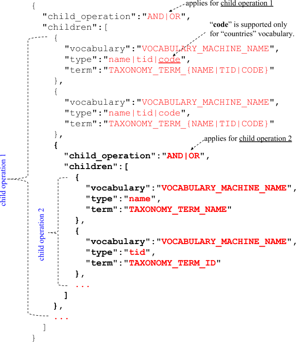
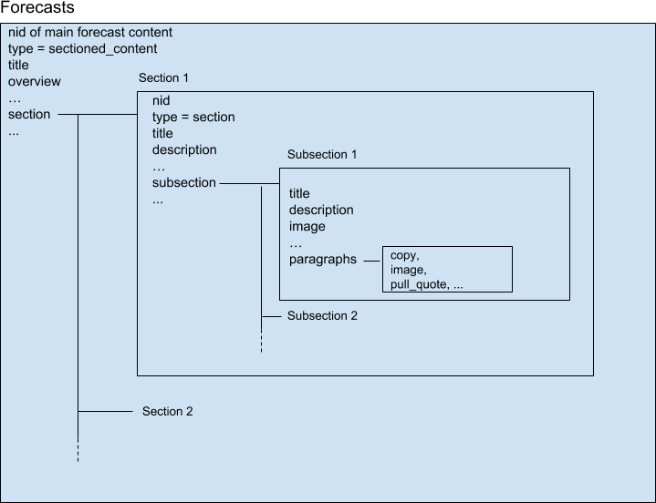

# Overview

Stratfor provides global awareness and guidance to individuals, governments and businesses around the world. We use a unique, intel-based approach to analyze world affairs.

This API reference provides information on available endpoints and how to interact with it.

**Base URL:** https://api.stratfor.com

## Content Types

[https://www.drupal.org/docs/7/understanding-drupal/content-types](https://www.drupal.org/docs/7/understanding-drupal/content-types)

*A single web site could contain many types of content, such as informational pages, news items, polls, blog posts, real estate listings, etc. In Drupal, each item of content is called a node, and each node belongs to a single content type, which defines various default settings for nodes of that type, such as whether the node is published automatically and whether comments are permitted. (Note that in previous versions of Drupal, content types were known as node types.)*

**These are the available content types for Worldview:**

Content type name | Machine name | Description
--- | --- | ---
Article | article | Stratfor articles, which include long-form assessments, multimedia, external contributor perspectives, columns and more.
Situation Reports | stratfor_sitrep | Swift and succinct accounts of breaking events and matters of geopolitical significance.
Sectioned Content | sectioned_content | Sectioned content includes our forecasts and research reports.
Stratfor Store Reports | position_paper | All research reports published in the Stratfor Store.


<br />

### *Article (article)* content type
*Article* content type is categorized into five article types by using the [**article_type**](#taxonomy-for-categorizing) taxonomy.

<ul>
  <li>
    <strong>Assessments</strong>
    <br />
    <em>From a foundational report to the most detailed analysis, our assessments cover every corner of the world. Reflections on daily events, guidance for the week ahead and forward-looking geopolitical evaluations are found here.</em>
    <br /><br />
    <em>Assessments</em> is further categorized into two types by using the <strong>Assessments Type (assessments_type)</strong> taxonomy.
    <br />
    <ul>
      <li>
        <strong>Reflections</strong>
        <br />
        <em>It can be difficult to separate the important from unimportant on any given day. Reflections mean to do exactly that — by thinking about what happened today, we can consider what might happen tomorrow.</em>
      </li>
      <li>
        <strong>Guidance</strong>
        <br />
        <em>Stratfor's geopolitical guidance provides insight on what we’re watching out for in the week ahead.</em>
      </li>
    </ul>
    <br />
  </li>
  <li>
    <strong>Media</strong>
    <br />
    <em>A compendium of Stratfor videos, maps, infographics and interactive content.</em>
    <br /><br />
    <em>Media</em> is further categorized into seven types by using the <strong>Media Type (media_type)</strong> taxonomy.
    <br />
    <ul>
      <li>Graphics</li>
      <li>Videos</li>
      <li>Interactives</li>
      <li>Podcast</li>
      <li>Maps</li>
      <li>Charts</li>
      <li>Infographics</li>
    </ul>
    <br />
  </li>
  <li>
    <strong>Global Perspectives</strong>
    <br />
    <em>World-class analyses from Stratfor’s external Board of Contributors, network of global experts and international partners.</em>
    <br /><br />
    <em>Global Perspectives</em> is further categorized into two types by using the <strong>Global Perspectives Type (global_perspectives_type)</strong> taxonomy.
    <br />
    <ul>
      <li>
        <strong>Contributor Perspectives</strong>
        <br />
        <em>Contributor Perspectives offer insight, analysis and commentary from Stratfor’s Board of Contributors and guest contributors who are distinguished leaders in their fields of expertise.</em>
      </li>
      <li>
        <strong>Partner Perspectives</strong>
        <br />
        <em>Partner Perspectives are a collection of high-quality analyses and commentary produced by organizations around the world. Though Stratfor does not necessarily endorse the views expressed here -- and may even disagree with them -- we respect the rigorous and innovative thought that their unique points of view inspire.</em>
      </li>
    </ul>
    <br />
  </li>
  <li>
    <strong>Snapshots</strong>
    <br />
    <em>These concise, timely reports shape our broader assessments. They identify the importance of singular events and explain how they fit into the bigger picture.</em>
    <br />
    <br />
  </li>
  <li>
    <strong>Columns</strong>
    <br />
    <em>Written by Stratfor's senior analysts, columns put our weekly reports into the proper context.</em>
    <br /><br />
    <em>Columns</em> is further categorized into four types by using the <strong>Columns Type (columns_type)</strong> taxonomy.
    <br />
    <ul>
      <li>
        <strong>On Security</strong>
        <br />
        <em>Produced by senior analysts from Stratfor Threat Lens, this column showcases high-level insight on matters of global security and terrorism.</em>
      </li>
      <li>
        <strong>On Stratfor</strong>
        <br />
        <em>In this column, we take a look behind the curtain at Stratfor's unique worldview and proprietary methodology, written by the people that understand it the most.</em>
      </li>
      <li>
        <strong>On the Road</strong>
        <br />
        <em>This periodic column shares dispatches from Stratfor personnel on the ground, in addition to reports focused on a specific locale or theme.</em>
      </li>
      <li>
        <strong>On Geopolitics</strong>
        <br />
        <em>Each week, Stratfor's most senior analysts explore an issue or subject from a high-level geopolitical perspective, revealing insights, revelations and new ways of looking at the world.</em>
      </li>
    </ul>
  </li>
</ul>

<br />

### *Sectioned Content (sectioned_content)* content type
*Sectioned Content* content type is categorized by using the [**sectioned_content_type**](#taxonomy-for-categorizing) taxonomy.

<ul>
  <li>
    <strong>Forecasts</strong>
    <br />
    <em>Forecasts provide a glimpse into the future by predicting what’s coming over months, years and decades.</em>
    <br /><br />
    <em>Forecasts</em> is further categorized into three types by using the <strong>Forecast Type (forecast_type)</strong> taxonomy.
    <br />
    <ul>
      <li>
        <strong>Annual</strong>
        <br />
        <em>Stratfor’s annual forecasts identify the global trends that will shape the year ahead.</em>
      </li>
      <li>
        <strong>Quarterly</strong>
        <br />
        <em>Stratfor’s quarterly forecasts update the annual forecasts by tracking new developments throughout the year.</em>
      </li>
      <li>
        <strong>Decade</strong>
        <br />
        <em>Stratfor’s decade forecasts take an even longer-term view of geopolitical trends. What shapes the world in the next ten years can be found here.</em>
      </li>
    </ul>
  </li>
</ul>

## Taxonomy (for categorizing)

These taxonomy vocabulary and terms are used for **categorizing** the contents:

Taxonomy vocabulary name | Vocabulary machine name | Taxonomy terms
--- | --- | ---
Article Type | article_type | **Taxonomy terms:**<ul><li>Assessments</li><li>Media</li><li>Global Perspectives</li><li>Snapshots</li><li>Columns</li></ul>
Assessments Type | assessments_type | **Taxonomy terms:**<ul><li>Reflections</li><li>Guidance</li></ul>
Media Type | media_type | **Taxonomy terms:**<ul><li>Graphics</li><li>Videos</li><li>Interactives</li><li>Podcast</li><li>Maps</li><li>Charts</li><li>Infographics</li></ul>
Global Perspectives Type | global_perspectives_type | **Taxonomy terms:**<ul><li>Contributor Perspectives</li><li>Partner Perspectives</li></ul>
Columns Type | columns_type | **Taxonomy terms:**<ul><li>On Security</li><li>On Stratfor</li><li>On the Road</li><li>On Geopolitics</li></ul>
Sectioned Content Type | sectioned_content_type | **Taxonomy terms:**<ul><li>Forecasts</li><li>...</li></ul>
Forecast Type | incident_target | **Taxonomy terms:**<ul><li>Annual</li><li>Quarterly</li><li>Decade</li></ul>

## Taxonomy (for tagging)

These taxonomy vocabulary and terms are used for **tagging** the contents:

Taxonomy vocabulary name | Vocabulary machine name | Taxonomy terms
--- | --- | ---
Regions and Countries | countries | **Taxonomy terms:**<br /><ul><li>South Sudan</li><li>Angola</li><li>Benin</li><li>[Click here](https://worldview.stratfor.com/region) to see a list of all available regions and countries.</li></ul>
Themes | wv_themes | **Taxonomy terms:**<ul><li>The U.S. and the Balance of Power</li><li>The Importance of Mexico</li><li>North America Unrivaled</li><li>[Click here](https://worldview.stratfor.com/themes) to see a list of all available themes.</li></ul>
Topics | wv_topics | **Taxonomy terms:**<ul><li>Agriculture and Technology</li><li>The Post-Apartheid Era Ends</li><li>The Geopolitics of Disease</li><li>[Click here](https://worldview.stratfor.com/topic) to see a list of all available topics.</li></ul>
Series | wv_series | **Taxonomy terms:**<ul><li>Considering NATO</li><li>Handling A Nuclear North Korea</li><li>Monographs</li><li>[Click here](https://worldview.stratfor.com/series) to see a list of all available series.</li></ul>

**vid**: Taxonomy Vocabulary ID

**tid**: Taxonomy Term ID

# Authentication

Stratfor utilizes API keys to allow access to the API.

The API expects for the API key to be included in all API requests to the server in either:

* A header that takes the following format: **`apiKey: YOUR_API_KEY`**
* A query string parameter that takes the following format: **`?apiKey=YOUR_API_KEY`**

<aside class="notice">
You must replace <code>YOUR_API_KEY</code> with your actual API key.
</aside>

# Content API

## List all contents

> **Example 1:**<br />Get a list of latest 10 worldview contents.

```shell
curl --request POST \
  --url 'https://api.stratfor.com/api/v3/content/list' \
  --header 'apiKey: YOUR_API_KEY' \
  --header 'Content-Type: application/json' \
  --data '{
      "site": "worldview"
    }'
```

```shell
curl --request GET \
  --url 'https://api.stratfor.com/api/v3/content?site=worldview' \
  --header 'apiKey: YOUR_API_KEY' \
  --header 'Content-Type: application/json' \
  --globoff
```

```php
<?php
$curl = curl_init();

$post_fields = array(
  "site" => "worldview"
);

curl_setopt_array($curl, array(
  CURLOPT_CUSTOMREQUEST => "POST",
  CURLOPT_URL => "https://api.stratfor.com/api/v3/content/list",
  CURLOPT_HTTPHEADER => array(
    "apiKey: YOUR_API_KEY",
    "Content-Type: application/json"
  ),
  CURLOPT_POSTFIELDS => json_encode($post_fields),
  CURLOPT_RETURNTRANSFER => true,
));

$response = curl_exec($curl);
$err = curl_error($curl);

curl_close($curl);

if ($err) {
  echo "cURL Error #:" . $err;
}
else {
  echo $response;
}
```

> **Example 2:**<br />Get a list of latest 20 worldview contents.

```shell
curl --request POST \
  --url 'https://api.stratfor.com/api/v3/content/list' \
  --header 'apiKey: YOUR_API_KEY' \
  --header 'Content-Type: application/json' \
  --data '{
      "site": "worldview",
      "page": 0,
      "limit": 20
    }'
```

```shell
curl --request GET \
  --url 'https://api.stratfor.com/api/v3/content?site=worldview&page=0&limit=20' \
  --header 'apiKey: YOUR_API_KEY' \
  --header 'Content-Type: application/json' \
  --globoff
```

```php
<?php
$curl = curl_init();

$post_fields = array(
  "site" => "worldview",
  "page" => 0,
  "limit" => 10
);

curl_setopt_array($curl, array(
  CURLOPT_CUSTOMREQUEST => "POST",
  CURLOPT_URL => "https://api.stratfor.com/api/v3/content/list",
  CURLOPT_HTTPHEADER => array(
    "apiKey: YOUR_API_KEY",
    "Content-Type: application/json"
  ),
  CURLOPT_POSTFIELDS => json_encode($post_fields),
  CURLOPT_RETURNTRANSFER => true,
));

$response = curl_exec($curl);
$err = curl_error($curl);

curl_close($curl);

if ($err) {
  echo "cURL Error #:" . $err;
}
else {
  echo $response;
}
```

> **Example 3:**<br />Get a list of oldest 20 worldview contents.

```shell
curl --request POST \
  --url 'https://api.stratfor.com/api/v3/content/list' \
  --header 'apiKey: YOUR_API_KEY' \
  --header 'Content-Type: application/json' \
  --data '{
      "site": "worldview",
      "page": 0,
      "limit": 20,
      "sort_by": ["created", "ASC"]
    }'
```

```php
<?php
$curl = curl_init();

$post_fields = array(
  "site" => "worldview",
  "page" => 0,
  "limit" => 10,
  "sort_by" => array("created", "ASC")
);

curl_setopt_array($curl, array(
  CURLOPT_CUSTOMREQUEST => "POST",
  CURLOPT_URL => "https://api.stratfor.com/api/v3/content/list",
  CURLOPT_HTTPHEADER => array(
    "apiKey: YOUR_API_KEY",
    "Content-Type: application/json"
  ),
  CURLOPT_POSTFIELDS => json_encode($post_fields),
  CURLOPT_RETURNTRANSFER => true,
));

$response = curl_exec($curl);
$err = curl_error($curl);

curl_close($curl);

if ($err) {
  echo "cURL Error #:" . $err;
}
else {
  echo $response;
}
```

> **Example 4:**<br />Get a list of "Article" contents.

```shell
curl --request POST \
  --url 'https://api.stratfor.com/api/v3/content/list' \
  --header 'apiKey: YOUR_API_KEY' \
  --header 'Content-Type: application/json' \
  --data '{
      "site": "worldview",
      "page": 0,
      "limit": 10,
      "type": [
        "article"
      ]
    }'
```

```php
<?php
$curl = curl_init();

$post_fields = array(
  "site" => "worldview",
  "page" => 0,
  "limit" => 10,
  "type" => array(
    "article"
  )
);

curl_setopt_array($curl, array(
  CURLOPT_CUSTOMREQUEST => "POST",
  CURLOPT_URL => "https://api.stratfor.com/api/v3/content/list",
  CURLOPT_HTTPHEADER => array(
    "apiKey: YOUR_API_KEY",
    "Content-Type: application/json"
  ),
  CURLOPT_POSTFIELDS => json_encode($post_fields),
  CURLOPT_RETURNTRANSFER => true,
));

$response = curl_exec($curl);
$err = curl_error($curl);

curl_close($curl);

if ($err) {
  echo "cURL Error #:" . $err;
}
else {
  echo $response;
}
```

> **Example 5:**<br />Get a list of "Article" and "Situation Reports" contents.

```shell
curl --request POST \
  --url 'https://api.stratfor.com/api/v3/content/list' \
  --header 'apiKey: YOUR_API_KEY' \
  --header 'Content-Type: application/json' \
  --data '{
      "site": "worldview",
      "page": 0,
      "limit": 10,
      "type": [
        "article",
        "stratfor_sitrep"
      ]
    }'
```

```php
<?php
$curl = curl_init();

$post_fields = array(
  "site" => "worldview",
  "page" => 0,
  "limit" => 10,
  "type" => array(
    "article",
    "stratfor_sitrep"
  )
);

curl_setopt_array($curl, array(
  CURLOPT_CUSTOMREQUEST => "POST",
  CURLOPT_URL => "https://api.stratfor.com/api/v3/content/list",
  CURLOPT_HTTPHEADER => array(
    "apiKey: YOUR_API_KEY",
    "Content-Type: application/json"
  ),
  CURLOPT_POSTFIELDS => json_encode($post_fields),
  CURLOPT_RETURNTRANSFER => true,
));

$response = curl_exec($curl);
$err = curl_error($curl);

curl_close($curl);

if ($err) {
  echo "cURL Error #:" . $err;
}
else {
  echo $response;
}
```

> **Example 6:**<br />Get a list of "Assessments" contents.

```shell
curl --request POST \
  --url 'https://api.stratfor.com/api/v3/content/list' \
  --header 'apiKey: YOUR_API_KEY' \
  --header 'Content-Type: application/json' \
  --data '{
      "site": "worldview",
      "page": 0,
      "limit": 10,
      "type": [
        "article"
      ],
      "taxonomy": {
        "child_operation": "OR",
        "children": [
          {
            "vocabulary": "article_type",
            "type": "name",
            "term": "Assessments"
          }
        ]
      }
    }'
```

```shell
curl --request POST \
  --url 'https://api.stratfor.com/api/v3/content?site=worldview&page=0&limit=10&type[0]=article&taxonomy[child_operation]=OR&taxonomy[children][0][vocabulary]=article_type&taxonomy[children][0][type]=name&taxonomy[children][0][term]=Assessments' \
  --header 'apiKey: YOUR_API_KEY' \
  --header 'Content-Type: application/json' \
  --globoff
```

```php
<?php
$curl = curl_init();

$post_fields = array(
  "site" => "worldview",
  "page" => 0,
  "limit" => 10,
  "type" => array(
    "article"
  ),
  "taxonomy" => array(
    "child_operation" => "OR",
    "children" => array(
      array(
        "vocabulary": "article_type",
        "type": "name",
        "term": "Assessments"
      )
    )
  )
);

curl_setopt_array($curl, array(
  CURLOPT_CUSTOMREQUEST => "POST",
  CURLOPT_URL => "https://api.stratfor.com/api/v3/content/list",
  CURLOPT_HTTPHEADER => array(
    "apiKey: YOUR_API_KEY",
    "Content-Type: application/json"
  ),
  CURLOPT_POSTFIELDS => json_encode($post_fields),
  CURLOPT_RETURNTRANSFER => true,
));

$response = curl_exec($curl);
$err = curl_error($curl);

curl_close($curl);

if ($err) {
  echo "cURL Error #:" . $err;
}
else {
  echo $response;
}
```

> **Example 7:**<br />Get a list of "Assessments", "Snapshots" or "Global Perspectives" contents.

```shell
curl --request POST \
  --url 'https://api.stratfor.com/api/v3/content/list' \
  --header 'apiKey: YOUR_API_KEY' \
  --header 'Content-Type: application/json' \
  --data '{
      "site": "worldview",
      "page": 0,
      "limit": 10,
      "type": [
        "article"
      ],
      "taxonomy": {
        "child_operation": "OR",
        "children": [
          {
            "vocabulary": "article_type",
            "type": "name",
            "term": "Assessments"
          },
          {
            "vocabulary": "article_type",
            "type": "name",
            "term": "Snapshots"
          },
          {
            "vocabulary": "article_type",
            "type": "name",
            "term": "Global Perspectives"
          }
        ]
      }
    }'
```

```shell
curl --request POST \
  --url 'https://api.stratfor.com/api/v3/content?site=worldview&page=0&limit=10&type[0]=article&taxonomy[child_operation]=OR&taxonomy[children][0][vocabulary]=article_type&taxonomy[children][0][type]=name&taxonomy[children][0][term]=Assessments&taxonomy[children][1][vocabulary]=article_type&taxonomy[children][1][type]=name&taxonomy[children][1][term]=Snapshots&taxonomy[children][2][vocabulary]=article_type&taxonomy[children][2][type]=name&taxonomy[children][2][term]=Global Perspectives' \
  --header 'apiKey: YOUR_API_KEY' \
  --header 'Content-Type: application/json' \
  --globoff
```

```php
<?php
$curl = curl_init();

$post_fields = array(
  "site" => "worldview",
  "page" => 0,
  "limit" => 10,
  "type" => array(
    "article"
  ),
  "taxonomy" => array(
    "child_operation" => "OR",
    "children" => array(
      array(
        "vocabulary": "article_type",
        "type": "name",
        "term": "Assessments"
      ),
      array(
        "vocabulary": "article_type",
        "type": "name",
        "term": "Snapshots"
      ),
      array(
        "vocabulary": "article_type",
        "type": "name",
        "term": "Global Perspectives"
      )
    )
  )
);

curl_setopt_array($curl, array(
  CURLOPT_CUSTOMREQUEST => "POST",
  CURLOPT_URL => "https://api.stratfor.com/api/v3/content/list",
  CURLOPT_HTTPHEADER => array(
    "apiKey: YOUR_API_KEY",
    "Content-Type: application/json"
  ),
  CURLOPT_POSTFIELDS => json_encode($post_fields),
  CURLOPT_RETURNTRANSFER => true,
));

$response = curl_exec($curl);
$err = curl_error($curl);

curl_close($curl);

if ($err) {
  echo "cURL Error #:" . $err;
}
else {
  echo $response;
}
```

> **Example 8:**<br />Get a list of "Assessments" or "Situation Reports"" contents.<br />**Note:** Since "Situation Reports" content type does not have "**article_type**" field, we have set it to "**undefined**".

```shell
curl --request POST \
  --url 'https://api.stratfor.com/api/v3/content/list' \
  --header 'apiKey: YOUR_API_KEY' \
  --header 'Content-Type: application/json' \
  --data '{
      "site": "worldview",
      "page": 0,
      "limit": 10,
      "type": [
        "article",
        "stratfor_sitrep"
      ],
      "taxonomy": {
        "child_operation": "OR",
        "children": [
          {
            "vocabulary": "article_type",
            "type": "name",
            "term": "Assessments"
          },
          {
            "vocabulary": "article_type",
            "type": "name",
            "term": "undefined"
          }
        ]
      }
    }'
```

```php
<?php
$curl = curl_init();

$post_fields = array(
  "site" => "worldview",
  "page" => 0,
  "limit" => 10,
  "type" => array(
    "article",
    "stratfor_sitrep"
  ),
  "taxonomy" => array(
    "child_operation" => "OR",
    "children" => array(
      array(
        "vocabulary": "article_type",
        "type": "name",
        "term": "Assessments"
      ),
      array(
        "vocabulary": "article_type",
        "type": "name",
        "term": "undefined"
      )
    )
  )
);

curl_setopt_array($curl, array(
  CURLOPT_CUSTOMREQUEST => "POST",
  CURLOPT_URL => "https://api.stratfor.com/api/v3/content/list",
  CURLOPT_HTTPHEADER => array(
    "apiKey: YOUR_API_KEY",
    "Content-Type: application/json"
  ),
  CURLOPT_POSTFIELDS => json_encode($post_fields),
  CURLOPT_RETURNTRANSFER => true,
));

$response = curl_exec($curl);
$err = curl_error($curl);

curl_close($curl);

if ($err) {
  echo "cURL Error #:" . $err;
}
else {
  echo $response;
}
```

> **Example 9:**<br />Get a list of "Reflections" contents.

```shell
curl --request POST \
  --url 'https://api.stratfor.com/api/v3/content/list' \
  --header 'apiKey: YOUR_API_KEY' \
  --header 'Content-Type: application/json' \
  --data '{
      "site": "worldview",
      "page": 0,
      "limit": 10,
      "type": [
        "article"
      ],
      "taxonomy": {
        "child_operation": "AND",
        "children": [
          {
            "vocabulary": "article_type",
            "type": "name",
            "term": "Assessments"
          },
          {
            "vocabulary": "assessments_type",
            "type": "name",
            "term": "Reflections"
          }
        ]
      }
    }'
```

```php
<?php
$curl = curl_init();

$post_fields = array(
  "site" => "worldview",
  "page" => 0,
  "limit" => 10,
  "type" => array(
    "article"
  ),
  "taxonomy" => array(
    "child_operation" => "AND",
    "children" => array(
      array(
        "vocabulary": "article_type",
        "type": "name",
        "term": "Assessments"
      ),
      array(
        "vocabulary": "article_type",
        "type": "name",
        "term": "Reflections"
      )
    )
  )
);

curl_setopt_array($curl, array(
  CURLOPT_CUSTOMREQUEST => "POST",
  CURLOPT_URL => "https://api.stratfor.com/api/v3/content/list",
  CURLOPT_HTTPHEADER => array(
    "apiKey: YOUR_API_KEY",
    "Content-Type: application/json"
  ),
  CURLOPT_POSTFIELDS => json_encode($post_fields),
  CURLOPT_RETURNTRANSFER => true,
));

$response = curl_exec($curl);
$err = curl_error($curl);

curl_close($curl);

if ($err) {
  echo "cURL Error #:" . $err;
}
else {
  echo $response;
}
```

> **Example 10:**<br />Get a list of "Reflections" or "Situation Reports" contents.<br />**Note:** Since "Situation Reports" content type does not have "**article_type**" field, we have set it to "**undefined**".

```shell
curl --request POST \
  --url 'https://api.stratfor.com/api/v3/content/list' \
  --header 'apiKey: YOUR_API_KEY' \
  --header 'Content-Type: application/json' \
  --data '{
      "site": "worldview",
      "page": 0,
      "limit": 10,
      "type": [
        "article",
        "stratfor_sitrep"
      ],
      "taxonomy": {
        "child_operation": "OR",
        "children": [
          {
            "vocabulary": "article_type",
            "type": "name",
            "term": "undefined"
          },
          {
            "child_operation": "AND",
            "children": [
              {
                "vocabulary": "article_type",
                "type": "name",
                "term": "Assessments"
              },
              {
                "vocabulary": "assessments_type",
                "type": "name",
                "term": "Reflections"
              }
            ]
          }
        ]
      }
    }'
```

```php
<?php
$curl = curl_init();

$post_fields = array(
  "site" => "worldview",
  "page" => 0,
  "limit" => 10,
  "type" => array(
    "article",
    "stratfor_sitrep"
  ),
  "taxonomy" => array(
    "child_operation" => "OR",
    "children" => array(
      array(
        "vocabulary": "article_type",
        "type": "name",
        "term": "undefined"
      ),
      array(
        "child_operation" => "AND",
        "children" => array(
          array(
            "vocabulary": "article_type",
            "type": "name",
            "term": "Assessments"
          ),
          array(
            "vocabulary": "article_type",
            "type": "name",
            "term": "Reflections"
          )
        )
      )
    )
  )
);

curl_setopt_array($curl, array(
  CURLOPT_CUSTOMREQUEST => "POST",
  CURLOPT_URL => "https://api.stratfor.com/api/v3/content/list",
  CURLOPT_HTTPHEADER => array(
    "apiKey: YOUR_API_KEY",
    "Content-Type: application/json"
  ),
  CURLOPT_POSTFIELDS => json_encode($post_fields),
  CURLOPT_RETURNTRANSFER => true,
));

$response = curl_exec($curl);
$err = curl_error($curl);

curl_close($curl);

if ($err) {
  echo "cURL Error #:" . $err;
}
else {
  echo $response;
}
```

> **Example 11:**<br />Get a list of "Forecasts" contents.

```shell
curl --request POST \
  --url 'https://api.stratfor.com/api/v3/content/list' \
  --header 'apiKey: YOUR_API_KEY' \
  --header 'Content-Type: application/json' \
  --data '{
      "site": "worldview",
      "page": 0,
      "limit": 10,
      "type": [
        "sectioned_content"
      ],
      "taxonomy": {
        "child_operation": "OR",
        "children": [
          {
            "vocabulary": "sectioned_content_type",
            "type": "name",
            "term": "Forecasts"
          }
        ]
      }
    }'
```

```php
<?php
$curl = curl_init();

$post_fields = array(
  "site" => "worldview",
  "page" => 0,
  "limit" => 10,
  "type" => array(
    "sectioned_content"
  ),
  "taxonomy" => array(
    "child_operation" => "OR",
    "children" => array(
      array(
        "vocabulary": "sectioned_content_type",
        "type": "name",
        "term": "Forecasts"
      )
    )
  )
);

curl_setopt_array($curl, array(
  CURLOPT_CUSTOMREQUEST => "POST",
  CURLOPT_URL => "https://api.stratfor.com/api/v3/content/list",
  CURLOPT_HTTPHEADER => array(
    "apiKey: YOUR_API_KEY",
    "Content-Type: application/json"
  ),
  CURLOPT_POSTFIELDS => json_encode($post_fields),
  CURLOPT_RETURNTRANSFER => true,
));

$response = curl_exec($curl);
$err = curl_error($curl);

curl_close($curl);

if ($err) {
  echo "cURL Error #:" . $err;
}
else {
  echo $response;
}
```

> **Example 12:**<br />Get a list of "Quarterly Forecasts" contents.

```shell
curl --request POST \
  --url 'https://api.stratfor.com/api/v3/content/list' \
  --header 'apiKey: YOUR_API_KEY' \
  --header 'Content-Type: application/json' \
  --data '{
      "site": "worldview",
      "page": 0,
      "limit": 10,
      "type": [
        "sectioned_content"
      ],
      "taxonomy": {
        "child_operation": "AND",
        "children": [
          {
            "vocabulary": "sectioned_content_type",
            "type": "name",
            "term": "Forecasts"
          },
          {
            "vocabulary": "forecast_type",
            "type": "name",
            "term": "Quarterly"
          }
        ]
      }
    }'
```

```php
<?php
$curl = curl_init();

$post_fields = array(
  "site" => "worldview",
  "page" => 0,
  "limit" => 10,
  "type" => array(
    "sectioned_content"
  ),
  "taxonomy" => array(
    "child_operation" => "AND",
    "children" => array(
      array(
        "vocabulary": "sectioned_content_type",
        "type": "name",
        "term": "Forecasts"
      ),
      array(
        "vocabulary": "forecast_type",
        "type": "name",
        "term": "Quarterly"
      )
    )
  )
);

curl_setopt_array($curl, array(
  CURLOPT_CUSTOMREQUEST => "POST",
  CURLOPT_URL => "https://api.stratfor.com/api/v3/content/list",
  CURLOPT_HTTPHEADER => array(
    "apiKey: YOUR_API_KEY",
    "Content-Type: application/json"
  ),
  CURLOPT_POSTFIELDS => json_encode($post_fields),
  CURLOPT_RETURNTRANSFER => true,
));

$response = curl_exec($curl);
$err = curl_error($curl);

curl_close($curl);

if ($err) {
  echo "cURL Error #:" . $err;
}
else {
  echo $response;
}
```

> **Example 13:**<br />Get a list of "Quarterly" or "Annual" Forecasts contents.

```shell
curl --request POST \
  --url 'https://api.stratfor.com/api/v3/content/list' \
  --header 'apiKey: YOUR_API_KEY' \
  --header 'Content-Type: application/json' \
  --data '{
      "site": "worldview",
      "page": 0,
      "limit": 10,
      "type": [
        "sectioned_content"
      ],
      "taxonomy": {
        "child_operation": "AND",
        "children": [
          {
            "vocabulary": "sectioned_content_type",
            "type": "name",
            "term": "Forecasts"
          },
          {
            "child_operation": "OR",
            "children":[
              {
                "vocabulary":"forecast_type",
                "type":"name",
                "term":"Quarterly"
              },
              {
                "vocabulary":"forecast_type",
                "type":"name",
                "term":"Annual"
              }
            ]
          }
        ]
      }
    }'
```

```php
<?php
$curl = curl_init();

$post_fields = array(
  "site" => "worldview",
  "page" => 0,
  "limit" => 10,
  "type" => array(
    "sectioned_content"
  ),
  "taxonomy" => array(
    "child_operation" => "AND",
    "children" => array(
      array(
        "vocabulary": "sectioned_content_type",
        "type": "name",
        "term": "Forecasts"
      ),
      array(
        "child_operation" => "OR",
        "children" => array(
          array(
            "vocabulary": "forecast_type",
            "type": "name",
            "term": "Quarterly"
          ),
          array(
            "vocabulary": "forecast_type",
            "type": "name",
            "term": "Annual"
          )
        )
      )
    )
  )
);

curl_setopt_array($curl, array(
  CURLOPT_CUSTOMREQUEST => "POST",
  CURLOPT_URL => "https://api.stratfor.com/api/v3/content/list",
  CURLOPT_HTTPHEADER => array(
    "apiKey: YOUR_API_KEY",
    "Content-Type: application/json"
  ),
  CURLOPT_POSTFIELDS => json_encode($post_fields),
  CURLOPT_RETURNTRANSFER => true,
));

$response = curl_exec($curl);
$err = curl_error($curl);

curl_close($curl);

if ($err) {
  echo "cURL Error #:" . $err;
}
else {
  echo $response;
}
```

> **Example 14:**<br />Get a list of "Forecasts", "Article", "Situation Reports" or "Stratfor Store Reports" contents.<br /><br />**Note:**<br />To get the "Forecasts", we have to filter by "sectioned_content_type" taxonomy.<br />Since "Article", "Situation Reports" and "Stratfor Store Reports" content types do not have "**sectioned_content_type**" field, we have set the "sectioned_content_type" to "**undefined**".

```shell
curl --request POST \
  --url 'https://api.stratfor.com/api/v3/content/list' \
  --header 'apiKey: YOUR_API_KEY' \
  --header 'Content-Type: application/json' \
  --data '{
      "site": "worldview",
      "page": 0,
      "limit": 10,
      "type": [
        "article",
        "stratfor_sitrep",
        "position_paper",
        "sectioned_content"
      ],
      "taxonomy": {
        "child_operation": "OR",
        "children": [
          {
            "vocabulary": "sectioned_content_type",
            "type": "name",
            "term": "Forecasts"
          },
          {
            "vocabulary": "sectioned_content_type",
            "type": "name",
            "term": "undefined"
          }
        ]
      }
    }'
```

```php
<?php
$curl = curl_init();

$post_fields = array(
  "site" => "worldview",
  "page" => 0,
  "limit" => 10,
  "type" => array(
    "article",
    "stratfor_sitrep",
    "position_paper",
    "sectioned_content"
  ),
  "taxonomy" => array(
    "child_operation" => "AND",
    "children" => array(
      array(
        "vocabulary": "sectioned_content_type",
        "type": "name",
        "term": "Forecasts"
      ),
      array(
        "vocabulary": "sectioned_content_type",
        "type": "name",
        "term": "undefined"
      )
    )
  )
);

curl_setopt_array($curl, array(
  CURLOPT_CUSTOMREQUEST => "POST",
  CURLOPT_URL => "https://api.stratfor.com/api/v3/content/list",
  CURLOPT_HTTPHEADER => array(
    "apiKey: YOUR_API_KEY",
    "Content-Type: application/json"
  ),
  CURLOPT_POSTFIELDS => json_encode($post_fields),
  CURLOPT_RETURNTRANSFER => true,
));

$response = curl_exec($curl);
$err = curl_error($curl);

curl_close($curl);

if ($err) {
  echo "cURL Error #:" . $err;
}
else {
  echo $response;
}
```

> **Example 15:**<br />Get a list of contents tagged with "United States" country term.

```shell
curl --request POST \
  --url 'https://api.stratfor.com/api/v3/content/list' \
  --header 'apiKey: YOUR_API_KEY' \
  --header 'Content-Type: application/json' \
  --data '{
      "site": "worldview",
      "page": 0,
      "limit": 10,
      "taxonomy": {
        "child_operation": "OR",
        "children": [
          {
            "vocabulary": "countries",
            "type": "name",
            "term": "United States"
          }
        ]
      }
    }'
```

```php
<?php
$curl = curl_init();

$post_fields = array(
  "site" => "worldview",
  "page" => 0,
  "limit" => 10,
  "taxonomy" => array(
    "child_operation" => "OR",
    "children" => array(
      array(
        "vocabulary": "countries",
        "type": "name",
        "term": "United States"
      )
    )
  )
);

curl_setopt_array($curl, array(
  CURLOPT_CUSTOMREQUEST => "POST",
  CURLOPT_URL => "https://api.stratfor.com/api/v3/content/list",
  CURLOPT_HTTPHEADER => array(
    "apiKey: YOUR_API_KEY",
    "Content-Type: application/json"
  ),
  CURLOPT_POSTFIELDS => json_encode($post_fields),
  CURLOPT_RETURNTRANSFER => true,
));

$response = curl_exec($curl);
$err = curl_error($curl);

curl_close($curl);

if ($err) {
  echo "cURL Error #:" . $err;
}
else {
  echo $response;
}
```

> **Example 16:**<br />Get a list of contents tagged with "A Crude Recovery" themes term.

```shell
curl --request POST \
  --url 'https://api.stratfor.com/api/v3/content/list' \
  --header 'apiKey: YOUR_API_KEY' \
  --header 'Content-Type: application/json' \
  --data '{
      "site": "worldview",
      "page": 0,
      "limit": 10,
      "taxonomy": {
        "child_operation": "OR",
        "children": [
          {
            "vocabulary": "wv_themes",
            "type": "name",
            "term": "A Crude Recovery"
          }
        ]
      }
    }'
```

```php
<?php
$curl = curl_init();

$post_fields = array(
  "site" => "worldview",
  "page" => 0,
  "limit" => 10,
  "taxonomy" => array(
    "child_operation" => "OR",
    "children" => array(
      array(
        "vocabulary": "wv_themes",
        "type": "name",
        "term": "A Crude Recovery"
      )
    )
  )
);

curl_setopt_array($curl, array(
  CURLOPT_CUSTOMREQUEST => "POST",
  CURLOPT_URL => "https://api.stratfor.com/api/v3/content/list",
  CURLOPT_HTTPHEADER => array(
    "apiKey: YOUR_API_KEY",
    "Content-Type: application/json"
  ),
  CURLOPT_POSTFIELDS => json_encode($post_fields),
  CURLOPT_RETURNTRANSFER => true,
));

$response = curl_exec($curl);
$err = curl_error($curl);

curl_close($curl);

if ($err) {
  echo "cURL Error #:" . $err;
}
else {
  echo $response;
}
```

> **Example 17:**<br />Get a list of contents tagged with "Brexit And Beyond" topics term.

```shell
curl --request POST \
  --url 'https://api.stratfor.com/api/v3/content/list' \
  --header 'apiKey: YOUR_API_KEY' \
  --header 'Content-Type: application/json' \
  --data '{
      "site": "worldview",
      "page": 0,
      "limit": 10,
      "taxonomy": {
        "child_operation": "OR",
        "children": [
          {
            "vocabulary": "wv_topics",
            "type": "name",
            "term": "Brexit And Beyond"
          }
        ]
      }
    }'
```

```php
<?php
$curl = curl_init();

$post_fields = array(
  "site" => "worldview",
  "page" => 0,
  "limit" => 10,
  "taxonomy" => array(
    "child_operation" => "OR",
    "children" => array(
      array(
        "vocabulary": "wv_topics",
        "type": "name",
        "term": "Brexit And Beyond"
      )
    )
  )
);

curl_setopt_array($curl, array(
  CURLOPT_CUSTOMREQUEST => "POST",
  CURLOPT_URL => "https://api.stratfor.com/api/v3/content/list",
  CURLOPT_HTTPHEADER => array(
    "apiKey: YOUR_API_KEY",
    "Content-Type: application/json"
  ),
  CURLOPT_POSTFIELDS => json_encode($post_fields),
  CURLOPT_RETURNTRANSFER => true,
));

$response = curl_exec($curl);
$err = curl_error($curl);

curl_close($curl);

if ($err) {
  echo "cURL Error #:" . $err;
}
else {
  echo $response;
}
```

> **Example 18:**<br />Get a list of contents tagged with "Considering NATO" country term.

```shell
curl --request POST \
  --url 'https://api.stratfor.com/api/v3/content/list' \
  --header 'apiKey: YOUR_API_KEY' \
  --header 'Content-Type: application/json' \
  --data '{
      "site": "worldview",
      "page": 0,
      "limit": 10,
      "taxonomy": {
        "child_operation": "OR",
        "children": [
          {
            "vocabulary": "wv_series",
            "type": "name",
            "term": "Considering NATO"
          }
        ]
      }
    }'
```

```php
<?php
$curl = curl_init();

$post_fields = array(
  "site" => "worldview",
  "page" => 0,
  "limit" => 10,
  "taxonomy" => array(
    "child_operation" => "OR",
    "children" => array(
      array(
        "vocabulary": "wv_series",
        "type": "name",
        "term": "Considering NATO"
      )
    )
  )
);

curl_setopt_array($curl, array(
  CURLOPT_CUSTOMREQUEST => "POST",
  CURLOPT_URL => "https://api.stratfor.com/api/v3/content/list",
  CURLOPT_HTTPHEADER => array(
    "apiKey: YOUR_API_KEY",
    "Content-Type: application/json"
  ),
  CURLOPT_POSTFIELDS => json_encode($post_fields),
  CURLOPT_RETURNTRANSFER => true,
));

$response = curl_exec($curl);
$err = curl_error($curl);

curl_close($curl);

if ($err) {
  echo "cURL Error #:" . $err;
}
else {
  echo $response;
}
```

> **Example 19:**<br />Get a list of "Article" or "Situation Reports" contents tagged with "Iran" country term AND "A Crude Recovery" themes term.

```shell
curl --request POST \
  --url 'https://api.stratfor.com/api/v3/content/list' \
  --header 'apiKey: YOUR_API_KEY' \
  --header 'Content-Type: application/json' \
  --data '{
      "site": "worldview",
      "page": 0,
      "limit": 10,
      "type": [
        "article",
        "stratfor_sitrep"
      ],
      "taxonomy": {
        "child_operation": "AND",
        "children": [
          {
            "vocabulary": "countries",
            "type": "name",
            "term": "Iran"
          },
          {
            "vocabulary": "wv_themes",
            "type": "name",
            "term": "A Crude Recovery"
          }
        ]
      }
    }'
```

```php
<?php
$curl = curl_init();

$post_fields = array(
  "site" => "worldview",
  "page" => 0,
  "limit" => 10,
  "type" => array(
    "article",
    "stratfor_sitrep"
  ),
  "taxonomy" => array(
    "child_operation" => "AND",
    "children" => array(
      array(
        "vocabulary": "countries",
        "type": "name",
        "term": "Iran"
      ),
      array(
        "vocabulary": "wv_themes",
        "type": "name",
        "term": "A Crude Recovery"
      )
    )
  )
);

curl_setopt_array($curl, array(
  CURLOPT_CUSTOMREQUEST => "POST",
  CURLOPT_URL => "https://api.stratfor.com/api/v3/content/list",
  CURLOPT_HTTPHEADER => array(
    "apiKey: YOUR_API_KEY",
    "Content-Type: application/json"
  ),
  CURLOPT_POSTFIELDS => json_encode($post_fields),
  CURLOPT_RETURNTRANSFER => true,
));

$response = curl_exec($curl);
$err = curl_error($curl);

curl_close($curl);

if ($err) {
  echo "cURL Error #:" . $err;
}
else {
  echo $response;
}
```

> Response body:

```json
{
  "total_count": "43097",
  "nodes": [
    {
      "nid": "290185",
      "type": "article",
      "title": "Peaceful Coexistence: China's Path",
      "promo_image": {
        "uri": "public://china-trump-diplomacy.jpg",
        "alt": "U.S. President Donald Trump and Chinese President Xi Jinping sit center-stage, flanked by their wives, during a tour of Beijing's Forbidden City in November 2017. ",
        "title": "U.S. President Donald Trump and Chinese President Xi Jinping sit center-stage, flanked by their wives, during a tour of Beijing's Forbidden City in November 2017. ",
        "caption": "<p>U.S. President Donald Trump and Chinese President Xi Jinping sit center-stage, flanked by their wives, during a tour of Beijing&#39;s Forbidden City in November 2017.</p>",
        "credit": "(JIM WATSON/AFP/Getty Images)",
        "sizes": {
          "16x9": {
            "tiny": "16x9_tiny/public/china-trump-diplomacy.jpg?itok=z4HTDmoU",
            "small": "16x9_small/public/china-trump-diplomacy.jpg?itok=aBSE1nP5",
            "medium": "16x9_medium/public/china-trump-diplomacy.jpg?itok=JqZn00tS",
            "large": "16x9_large/public/china-trump-diplomacy.jpg?itok=sbKGgfPj",
            "full": "16x9_full/public/china-trump-diplomacy.jpg?itok=AxGB3r6o"
          },
          "square": {
            "tiny": "square_tiny/public/china-trump-diplomacy.jpg?itok=XcB6x-fn",
            "small": "square_small/public/china-trump-diplomacy.jpg?itok=i8KXvU4s",
            "medium": "square_medium/public/china-trump-diplomacy.jpg?itok=3XfwqdIT",
            "large": "square_large/public/china-trump-diplomacy.jpg?itok=b1HbRmKj",
            "full": "square_full/public/china-trump-diplomacy.jpg?itok=8bQuO7nR"
          },
          "article": {
            "tiny": "article_tiny/public/china-trump-diplomacy.jpg?itok=bd4n8OF2",
            "small": "article_small/public/china-trump-diplomacy.jpg?itok=sp54X1Hw",
            "medium": "article_medium/public/china-trump-diplomacy.jpg?itok=vBBJj6rr",
            "large": "article_large/public/china-trump-diplomacy.jpg?itok=ztFs5Uxq",
            "full": "article_full/public/china-trump-diplomacy.jpg?itok=aF2GlxZ2"
          },
          "2x1": {
            "tiny": "2x1_tiny/public/china-trump-diplomacy.jpg?itok=VNmVw3hF",
            "small": "2x1_small/public/china-trump-diplomacy.jpg?itok=cXVfKe2P",
            "medium": "2x1_medium/public/china-trump-diplomacy.jpg?itok=s2I1maoM",
            "large": "2x1_large/public/china-trump-diplomacy.jpg?itok=WEzEIndw",
            "full": "2x1_full/public/china-trump-diplomacy.jpg?itok=bFKgBjHQ"
          },
          "metatag": "https://www.stratfor.com:443/sites/default/files/styles/16x9_small/public/china-trump-diplomacy.jpg?itok=aBSE1nP5"
        }
      },
      "teaser_body": "China's former ambassador to Bahrain describes China's regional security goals, its position in the trade dispute with the United States and the role of diplomacy to defuse international tension.",
      "overview": "",
      "youtube_video_url": "",
      "created": "1530610200",
      "created_formatted": "Jul 3, 2018 | 09:30 GMT",
      "changed": "1530610202",
      "changed_formatted": "Jul 3, 2018 | 09:30 GMT",
      "path_alias": "article/peaceful-coexistence-chinas-path",
      "article_type": {
        "tid": "504",
        "vid": "30",
        "name": "Global Perspectives"
      },
      "assessments_type": [],
      "column_type": [],
      "media_type": [],
      "global_perspectives_type": {
        "tid": "599",
        "vid": "36",
        "name": "Partner Perspectives"
      },
      "sectioned_content_type": [],
      "forecast_type": [],
      "www_public_postings_type": [],
      "source": "",
      "www_site_page_type": [],
      "taxonomy": [
        {
          "tid": "195",
          "vid": "5",
          "v_name": "countries",
          "name": "China",
          "code": "CN",
          "path_alias": "/region/asia-pacific/china"
        }
      ],
      "author": [],
      "pdf": "",
      "status": 1
    },
    {
      "nid": "290223",
      "type": "stratfor_sitrep",
      "title": "Russia: U.S. Lawmakers Visit Ahead of Trump, Putin Summit",
      "promo_image": "",
      "teaser_body": "Five U.S. senators and one congresswoman have arrived in Russia for meetings with high-ranking officials, including Foreign Minister Sergei Lavrov and the speaker of Russia's lower house of parliament, ahead of a summit between U.S. President Donald Trump and Russian President Vladimir Putin, AP reported July 3.",
      "mailout": "",
      "overview": "",
      "youtube_video_url": "",
      "created": "1530634694",
      "created_formatted": "Jul 3, 2018 | 16:18 GMT",
      "changed": "1530636251",
      "changed_formatted": "Jul 3, 2018 | 16:44 GMT",
      "path_alias": "situation-report/russia-us-lawmakers-visit-ahead-trump-putin-summit",
      "article_type": [],
      "assessments_type": [],
      "column_type": [],
      "media_type": [],
      "global_perspectives_type": [],
      "sectioned_content_type": [],
      "forecast_type": [],
      "www_public_postings_type": [],
      "source": "",
      "www_site_page_type": [],
      "taxonomy": [
        {
          "tid": "59",
          "vid": "5",
          "v_name": "countries",
          "name": "United States",
          "code": "US",
          "path_alias": "/region/americas/united-states"
        },
        {
          "tid": "110",
          "vid": "5",
          "v_name": "countries",
          "name": "Russia",
          "code": "RU",
          "path_alias": "/region/eurasia/russia"
        },
        {
          "tid": "582",
          "vid": "34",
          "v_name": "wv_themes",
          "name": "Echoes of the Cold War",
          "path_alias": "/themes/echoes-cold-war"
        }
      ],
      "author": [],
      "pdf": "",
      "status": 1
    },
    {
      "nid": "289681",
      "type": "position_paper",
      "title": "The Brexit Negotiations Scenario Planning",
      "promo_image": {
        "uri": "public://P1 Brexit Scenario Planning - Stratfor Store.jpg",
        "alt": "The Brexit Negotiations Scenario Planning",
        "title": "The Brexit Negotiations Scenario Planning",
        "caption": "",
        "credit": "",
        "sizes": {
          "16x9": {
            "tiny": "16x9_tiny/public/P1%20Brexit%20Scenario%20Planning%20-%20Stratfor%20Store.jpg?itok=376Zm3G-",
            "small": "16x9_small/public/P1%20Brexit%20Scenario%20Planning%20-%20Stratfor%20Store.jpg?itok=25t5SqGE",
            "medium": "16x9_medium/public/P1%20Brexit%20Scenario%20Planning%20-%20Stratfor%20Store.jpg?itok=9KSUbVEx",
            "large": "16x9_large/public/P1%20Brexit%20Scenario%20Planning%20-%20Stratfor%20Store.jpg?itok=YHTHF1VE",
            "full": "16x9_full/public/P1%20Brexit%20Scenario%20Planning%20-%20Stratfor%20Store.jpg?itok=HgvsGk2K"
          },
          "square": {
            "tiny": "square_tiny/public/P1%20Brexit%20Scenario%20Planning%20-%20Stratfor%20Store.jpg?itok=FNMoBsYe",
            "small": "square_small/public/P1%20Brexit%20Scenario%20Planning%20-%20Stratfor%20Store.jpg?itok=n2HMOmZG",
            "medium": "square_medium/public/P1%20Brexit%20Scenario%20Planning%20-%20Stratfor%20Store.jpg?itok=ywXs-Oyp",
            "large": "square_large/public/P1%20Brexit%20Scenario%20Planning%20-%20Stratfor%20Store.jpg?itok=EqQsp-8W",
            "full": "square_full/public/P1%20Brexit%20Scenario%20Planning%20-%20Stratfor%20Store.jpg?itok=Uosx9Hwd"
          },
          "article": {
            "tiny": "article_tiny/public/P1%20Brexit%20Scenario%20Planning%20-%20Stratfor%20Store.jpg?itok=CGiqZCSf",
            "small": "article_small/public/P1%20Brexit%20Scenario%20Planning%20-%20Stratfor%20Store.jpg?itok=k1TQ17Nn",
            "medium": "article_medium/public/P1%20Brexit%20Scenario%20Planning%20-%20Stratfor%20Store.jpg?itok=4yAIcUZx",
            "large": "article_large/public/P1%20Brexit%20Scenario%20Planning%20-%20Stratfor%20Store.jpg?itok=Tv5hZAk9",
            "full": "article_full/public/P1%20Brexit%20Scenario%20Planning%20-%20Stratfor%20Store.jpg?itok=rP171VdN"
          },
          "2x1": {
            "tiny": "2x1_tiny/public/P1%20Brexit%20Scenario%20Planning%20-%20Stratfor%20Store.jpg?itok=PzXnZvDM",
            "small": "2x1_small/public/P1%20Brexit%20Scenario%20Planning%20-%20Stratfor%20Store.jpg?itok=bkTy4OxT",
            "medium": "2x1_medium/public/P1%20Brexit%20Scenario%20Planning%20-%20Stratfor%20Store.jpg?itok=ig40f0xK",
            "large": "2x1_large/public/P1%20Brexit%20Scenario%20Planning%20-%20Stratfor%20Store.jpg?itok=B1wSygOu",
            "full": "2x1_full/public/P1%20Brexit%20Scenario%20Planning%20-%20Stratfor%20Store.jpg?itok=jUWmvZhY"
          },
          "metatag": "https://www.stratfor.com:443/sites/default/files/styles/16x9_small/public/P1%20Brexit%20Scenario%20Planning%20-%20Stratfor%20Store.jpg?itok=25t5SqGE"
        }
      },
      "teaser_body": "The ongoing Brexit negotiations between the United Kingdom and the European Union could lead to at least six scenarios after March 2019, the date when Britain will officially leave the continental bloc. Although all of these scenarios are possible, based on Stratfor’s methodology for assessing geopolitical risks and trends, our team of analysts considers that some are more probable than others. ",
      "mailout": "",
      "overview": "",
      "youtube_video_url": "",
      "created": "1527800136",
      "created_formatted": "May 31, 2018 | 20:55 GMT",
      "changed": "1527800136",
      "changed_formatted": "May 31, 2018 | 20:55 GMT",
      "path_alias": "position-paper/brexit-negotiations-scenario-planning",
      "article_type": [],
      "assessments_type": [],
      "column_type": [],
      "media_type": [],
      "global_perspectives_type": [],
      "sectioned_content_type": [],
      "forecast_type": [],
      "www_public_postings_type": [],
      "source": "",
      "www_site_page_type": [],
      "taxonomy": [],
      "author": [],
      "pdf": "https://www.stratfor.com:443/system/files/P1%20Brexit%20Scenario%20Planning%20-%20Stratfor%20Store.pdf",
      "status": 1
    },
    {
      "nid": "289798",
      "type": "sectioned_content",
      "title": "2018 Third-Quarter Forecast",
      "promo_image": {
        "uri": "public://forecast_collage(2).jpg",
        "alt": "Stratfor's 2018 Third-Quarter Forecast, looking ahead at the coming months. ",
        "title": "It promises to be an eventful third quarter. ",
        "caption": "<p>It promises to be an especially fractious quarter as the United States continues to spar not only with adversaries but allies as well. The simmering trade dispute with China will continue, Russia will struggle to break its stalemate with the West, Europe has a litany of problems to address, and anything could happen on the Korean Peninsula.&nbsp; &nbsp;</p>",
        "credit": "(ALY SONG-POL/JOHANNES EISELE/HULTON ARCHIVE/MLADEN ANTONOV/TIMOTHY A. CLARY/ABID KATIB/KATJA BUCHHOLZ/DAVID MCNEW/ATTA KENARE/F",
        "sizes": {
          "16x9": {
            "tiny": "16x9_tiny/public/forecast_collage%282%29.jpg?itok=BVLZdKdx",
            "small": "16x9_small/public/forecast_collage%282%29.jpg?itok=hJ2N2aof",
            "medium": "16x9_medium/public/forecast_collage%282%29.jpg?itok=ByBvfw_D",
            "large": "16x9_large/public/forecast_collage%282%29.jpg?itok=UwKx_vA5",
            "full": "16x9_full/public/forecast_collage%282%29.jpg?itok=rbQnv8A_"
          },
          "square": {
            "tiny": "square_tiny/public/forecast_collage%282%29.jpg?itok=mAO5J9dk",
            "small": "square_small/public/forecast_collage%282%29.jpg?itok=Bct4tpa9",
            "medium": "square_medium/public/forecast_collage%282%29.jpg?itok=BGy-eq3q",
            "large": "square_large/public/forecast_collage%282%29.jpg?itok=TJ0BSs_j",
            "full": "square_full/public/forecast_collage%282%29.jpg?itok=aQRExpI_"
          },
          "article": {
            "tiny": "article_tiny/public/forecast_collage%282%29.jpg?itok=TqIJAYjL",
            "small": "article_small/public/forecast_collage%282%29.jpg?itok=xt2df7zB",
            "medium": "article_medium/public/forecast_collage%282%29.jpg?itok=KYu99_Je",
            "large": "article_large/public/forecast_collage%282%29.jpg?itok=5_KFXlpj",
            "full": "article_full/public/forecast_collage%282%29.jpg?itok=VjYP-j8k"
          },
          "2x1": {
            "tiny": "2x1_tiny/public/forecast_collage%282%29.jpg?itok=r_cRmphp",
            "small": "2x1_small/public/forecast_collage%282%29.jpg?itok=MRsnCRsa",
            "medium": "2x1_medium/public/forecast_collage%282%29.jpg?itok=RWjm5RDL",
            "large": "2x1_large/public/forecast_collage%282%29.jpg?itok=CiWncvJA",
            "full": "2x1_full/public/forecast_collage%282%29.jpg?itok=5eJ2YKkR"
          },
          "metatag": "https://www.stratfor.com:443/sites/default/files/styles/16x9_small/public/forecast_collage%282%29.jpg?itok=hJ2N2aof"
        }
      },
      "teaser_body": "It promises to be an especially fractious quarter as the United States continues to spar not only with adversaries but allies as well. The simmering trade dispute with China will continue, Russia will struggle to break its stalemate with the West, Europe has a litany of problems to address, and anything could happen on the Korean Peninsula.   ",
      "mailout": "As the United States enters the long summer stretch before midterm congressional elections in the fall, the midpoint of Donald Trump's presidency will also come into sight this quarter. And after a particularly suspenseful spring of sanctions, tariffs, Cabinet changes and summit surprises, the U.S. president has only reaffirmed to the world his reputation for bending constraints toward a particular policy end -- even if the means to that end cause considerable collateral damage at home and abroad.\r\n\r\nAnd so, with several negotiations still pending -- including discussions over the fate of the Korean Peninsula and high-stakes trade talks -- a world weary from grappling with the fitful superpower is bracing itself for another quarter of whiplash from White House maneuvers.",
      "overview": "<p>&nbsp;</p><p><strong>China Remains in the U.S. Crosshairs.</strong> The United States will impose tariffs, sanctions and blocks on investment and research in a bid to frustrate China&#39;s development of strategic technologies. China not only has the tools to manage the economic blow, but will also accelerate efforts to lessen its reliance on foreign-sourced technological components.</p><p><strong>Trade Battles Fall Short of a Full-Fledged War. </strong>Trade frictions will remain high this quarter as the White House continues on an economic warpath in the name of national security. U.S. tariffs will invite countermeasures from trading partners targeting U.S. agricultural and industrial goods. As Congress attempts to reclaim trade authority, the White House will refrain from escalating these trade battles into an all-out trade war.</p><p><strong>Taking the First Big Step with North Korea.</strong> Drama will inevitably surround the negotiation, but the United States and North Korea have a decent shot at making progress toward a political agreement this quarter, something that will set the stage for much thornier and lengthier technical discussions on denuclearization. Even if talks appear to break down in the coming months, Pyongyang will avoid more aggressive measures in the near term while working to maintain diplomatic and economic momentum with China and South Korea.</p><p><strong>Tremors in Europe. </strong>The new Euroskeptic government in Rome will hold off on threats to leave the eurozone for now, but will be seeking allies in southern Europe to battle Brussels on fiscal deficit and debt rules. Divisions within the British government will meanwhile raise the potential for Parliament to take more control of the Brexit process to keep the UK in the customs union.</p><p><strong>All Eyes on Riyadh. </strong>As Iran&#39;s major European and Asian clients negotiate waivers with the United States in return for reducing oil exports from Iran, Washington will be looking to Saudi Arabia to coordinate with major oil producers to make up the supply gap. Riyadh will nonetheless be cautious in planning a market intervention as it aims for a higher price band in anticipation of the Saudi Aramco IPO.</p><p>&nbsp;</p><center><iframe allow=\"autoplay; encrypted-media\" allowfullscreen=\"\" frameborder=\"0\" height=\"315\" src=\"https://www.youtube.com/embed/FN9h3sjJ-4Y\" width=\"560\"></iframe></center><p>&nbsp;</p><p><strong>Moscow Tries to Break a Stalemate with Washington.</strong> Poland and other borderland states will make appeals for stronger security guarantees from Washington while they still have the United States&#39; attention. Russia will try to break a negotiating stalemate with the United States to talk sanctions, military build-ups and arms control by promoting its mediation in the Syrian conflict and its potential utility in North Korean denuclearization. Don&#39;t hold your breath for a breakthrough, though.</p><p><strong>Polarizing Allies.</strong> In harnessing the power of tariffs and extraterritoriality in sanctions, the United States will polarize many of its security allies in Europe and Asia -- strategic partners that Washington needs to counterbalance the emerging threat from China and Russia. Attempts to target Russia&#39;s strategic relationships will call into question the long-term reliability of the United States as a defense partner and invite heavy pushback from Turkey, Vietnam, Germany and India, in particular.</p><p><strong>Iran&#39;s Return to the &#39;Resistance Economy.&#39;</strong> As the limits of EU economic safeguards are exposed, Tehran will cautiously walk back its commitments to the nuclear deal while seeking out willing partners to circumvent sanctions. Russia will take advantage of Iran&#39;s rising vulnerability to deepen its military ties with Tehran while mediating between Iran and Israel in Syria.</p><p><strong>The Big Turkish Gamble. </strong>Turkey will be a big feature of the third quarter following a precarious electoral gamble by Turkish President Recep Tayyip Erdogan. Erdogan has the tools to eke out a win and whip up a nationalist reaction to any outside questioning of the vote, but the highly polarized country will remain on shaky economic ground amid worsening relations with the West.</p><p><strong>Votes Against the Status Quo.</strong> Mexico&#39;s populist candidate stands a chance of winning big in July elections, which could pose a threat to energy and education reforms while further complicating NAFTA talks. A strong anti-establishment current will also be on display in Colombia, where the FARC peace deal is under threat, and in Brazil and Argentina, where the appetite for economic reform will plummet.</p>",
      "youtube_video_url": "https://www.youtube.com/watch?v=FN9h3sjJ-4Y&feature=youtu.be",
      "created": "1528672692",
      "created_formatted": "Jun 10, 2018 | 23:18 GMT",
      "changed": "1528750070",
      "changed_formatted": "Jun 11, 2018 | 20:47 GMT",
      "path_alias": "article/2018-third-quarter-forecast-geopolitics-global-events-risk",
      "article_type": [],
      "assessments_type": [],
      "column_type": [],
      "media_type": [],
      "global_perspectives_type": [],
      "sectioned_content_type": {
        "tid": "513",
        "vid": "32",
        "name": "Forecasts"
      },
      "forecast_type": {
        "tid": "270",
        "vid": "10",
        "name": "Quarterly"
      },
      "www_public_postings_type": [],
      "source": "",
      "www_site_page_type": [],
      "taxonomy": [],
      "author": [],
      "pdf": "",
      "status": 1
    },
    ... another node object here ...
  ]
}
```

This endpoint returns a list of all Worldview contents.
<br />
[Click here](#content-types) to see a list of all available Worldview content types.

### HTTP Request

<a href="#list-all-contents" class="method post">POST</a> `/api/v3/content/list`
<br />
or,
<br />
<a href="#list-all-contents" class="method get">GET</a> `/api/v3/content`

We can use either `POST` or `GET` version of the API to get a list of contents. Both of them returns the same result.

**Note:**
Most of the examples are using the `POST` version of API. Make sure to convert the request body to query parameters if you want to use the `GET` version of API.

For example:

POST version:<br />
`curl --request POST --url 'https://api.stratfor.com/api/v3/content/list' --header 'apiKey: YOUR_API_KEY' --header 'Content-Type: application/json' --data '{ "site": "worldview", "page": 0, "limit": 20, "sort_by": ["created", "ASC"]}'`

Equivalent GET version:<br />
`curl --request GET --url 'https://api.stratfor.com/api/v3/content?site=worldview&page=0&limit=10&sort_by[0]=created&sort_by[1]=ASC' --header 'apiKey: YOUR_API_KEY' --header 'Content-Type: application/json' --globoff`

### Request body parameters

Parameter | Default | Description
--- | --- | ---
site<br />*`integer, required`* | worldview | "**site**" parameter must be set to "**worldview**" for Worldview site.
page<br />*`integer, optional`* | 0 | The page number to start with.<br />0 = First page<br />1 = Second page<Br />and, so on.
limit<br />*`integer, optional`* | 10 | The number of items to return in the response.
type<br />*`array, optional`* | | Worldview content types.<br />**Available content types for Worldview:**<ul><li>article</li><li>stratfor_sitrep</li><li>sectioned_content</li><li>position_paper</li></ul>If **type** parameter is not specified, it returns contents from all available content types.<br />**Note:** Use *machine name* of the content type.<br />[Click here](#content-types) to get more details about content types.
taxonomy<br />*`object, optional`* | | Filter by taxonomy terms.<br />[Click here](#taxonomy) to get more details about taxonomy vocabulary and terms.
sort_by<br />*`array, optional`* | ["created", "DESC"] | Sort the list of contents.<br />**Available options:**<br />["created", "DESC"]<br />["created", "ASC"]<br />["changed", "DESC"]<br />["changed", "ASC"]<br />["nid", "DESC"]<br />["nid", "ASC"]

**Note for promo_image field in the response body:**<br />Prepend the value in promo image field with “https://www.stratfor.com/sites/default/files/styles/” to get the complete URL of the promo image.

### Format of "taxonomy" filter:



**Simple taxonomy filter = (A and B):**
<br />
<code>
{
  "child_operation":"AND",
  "children":[
    A,
    B
  ]
}
</code>

**Complex taxonomy filter (two levels) =  (A or B or (C and D)):**
<br />

<code>
{
  "child_operation":"OR",
  "children":[
    A,
    B,
    {
      "child_operation":"AND",
      "children":[
        C,
        D
      ]
    }
  ]
}
</code>

<br />

**article_type = undefined**, for stratfor_sitrep, position_paper and sectioned_content content types.

**sectioned_content_type =undefined**, for article, stratfor_sitrep and position_paper content types.

<br />

**Examples:**

1. Get a list of latest 10 worldview contents.
2. Get a list of latest 20 worldview contents.
3. Get a list of oldest 20 worldview contents.
4. Get a list of "Article" contents.
5. Get a list of "Article" and "Situation Reports" contents.
6. Get a list of "Assessments" contents.
7. Get a list of "Assessments", "Snapshots" or "Global Perspectives" contents.
8. Get a list of "Assessments" or "Situation Reports"" contents.
9. Get a list of "Reflections" contents.
10. Get a list of "Reflections" or "Situation Reports" contents.
11. Get a list of "Forecasts" contents.
12. Get a list of "Quarterly Forecasts" contents.
13. Get a list of "Quarterly" or "Annual" Forecasts contents.
14. Get a list of "Forecasts", "Article", "Situation Reports" or "Stratfor Store Reports" contents.
15. Get a list of contents tagged with "United States" country term.
16. Get a list of contents tagged with "A Crude Recovery" themes term.
17. Get a list of contents tagged with "Brexit And Beyond" topics term.
18. Get a list of contents tagged with "Considering NATO" country term.
19. Get a list of "Article" or "Situation Reports" contents tagged with "Iran" country term AND "A Crude Recovery" themes term.

## Retrieve full content

```shell
curl --request GET \
  --url 'https://api.stratfor.com/api/v3/content/290185?site=worldview' \
  --header 'apiKey: YOUR_API_KEY' \
  --header 'Content-Type: application/json'
```

```shell
curl --request GET \
  --url 'https://api.stratfor.com/api/v3/content/article%252Fpeaceful-coexistence-chinas-path?site=worldview' \
  --header 'apiKey: YOUR_API_KEY' \
  --header 'Content-Type: application/json'
```

```php
<?php
$curl = curl_init();

curl_setopt_array($curl, array(
  CURLOPT_CUSTOMREQUEST => "GET",
  CURLOPT_URL => "https://api.stratfor.com/api/v3/content/290185?site=worldview",
  CURLOPT_HTTPHEADER => array(
    "apiKey: YOUR_API_KEY",
    "Content-Type: application/json"
  ),
  CURLOPT_RETURNTRANSFER => true,
));

$response = curl_exec($curl);
$err = curl_error($curl);

curl_close($curl);

if ($err) {
  echo "cURL Error #:" . $err;
}
else {
  echo $response;
}
```

> Response body:

```json
{
  "nid": 290185,
  "type": "article",
  "title": "Peaceful Coexistence: China's Path",
  "teaser_body": "China's former ambassador to Bahrain describes China's regional security goals, its position in the trade dispute with the United States and the role of diplomacy to defuse international tension.",
  "promo_image": {
    "uri": "public://china-trump-diplomacy.jpg",
    "alt": "U.S. President Donald Trump and Chinese President Xi Jinping sit center-stage, flanked by their wives, during a tour of Beijing's Forbidden City in November 2017. ",
    "title": "U.S. President Donald Trump and Chinese President Xi Jinping sit center-stage, flanked by their wives, during a tour of Beijing's Forbidden City in November 2017. ",
    "caption": "<p>U.S. President Donald Trump and Chinese President Xi Jinping sit center-stage, flanked by their wives, during a tour of Beijing&#39;s Forbidden City in November 2017.</p>",
    "credit": "(JIM WATSON/AFP/Getty Images)",
    "sizes": {
      "16x9": {
        "tiny": "16x9_tiny/public/china-trump-diplomacy.jpg?itok=z4HTDmoU",
        "small": "16x9_small/public/china-trump-diplomacy.jpg?itok=aBSE1nP5",
        "medium": "16x9_medium/public/china-trump-diplomacy.jpg?itok=JqZn00tS",
        "large": "16x9_large/public/china-trump-diplomacy.jpg?itok=sbKGgfPj",
        "full": "16x9_full/public/china-trump-diplomacy.jpg?itok=AxGB3r6o"
      },
      "square": {
        "tiny": "square_tiny/public/china-trump-diplomacy.jpg?itok=XcB6x-fn",
        "small": "square_small/public/china-trump-diplomacy.jpg?itok=i8KXvU4s",
        "medium": "square_medium/public/china-trump-diplomacy.jpg?itok=3XfwqdIT",
        "large": "square_large/public/china-trump-diplomacy.jpg?itok=b1HbRmKj",
        "full": "square_full/public/china-trump-diplomacy.jpg?itok=8bQuO7nR"
      },
      "article": {
        "tiny": "article_tiny/public/china-trump-diplomacy.jpg?itok=bd4n8OF2",
        "small": "article_small/public/china-trump-diplomacy.jpg?itok=sp54X1Hw",
        "medium": "article_medium/public/china-trump-diplomacy.jpg?itok=vBBJj6rr",
        "large": "article_large/public/china-trump-diplomacy.jpg?itok=ztFs5Uxq",
        "full": "article_full/public/china-trump-diplomacy.jpg?itok=aF2GlxZ2"
      },
      "2x1": {
        "tiny": "2x1_tiny/public/china-trump-diplomacy.jpg?itok=VNmVw3hF",
        "small": "2x1_small/public/china-trump-diplomacy.jpg?itok=cXVfKe2P",
        "medium": "2x1_medium/public/china-trump-diplomacy.jpg?itok=s2I1maoM",
        "large": "2x1_large/public/china-trump-diplomacy.jpg?itok=WEzEIndw",
        "full": "2x1_full/public/china-trump-diplomacy.jpg?itok=bFKgBjHQ"
      },
      "metatag": "https://www.stratfor.com:443/sites/default/files/styles/16x9_small/public/china-trump-diplomacy.jpg?itok=aBSE1nP5"
    }
  },
  "summary": {
    "title": "Highlights",
    "description": "..."
  },
  "paragraph": [
    {
      "bundle": "copy",
      "description": "<p><strong>By Ambassador Qi Zhenhong for the Australian Institute of International Affairs</strong></p><p><em>In an eventful month with the Kim-Trump Summit, what are China&#39;s long-term security goals in the Indo-Pacific region? What are the threats to the US-China trade relationship? And what role can public diplomacy play in times of tension?</em></p><h3>Have US and China Have Managed to Avoid a Trade War?</h3><p>When China and US established diplomatic relations almost 40 years ago, the bilateral trade volume was only USD$ 2.5 billion (AUD$ 3.4 billion), and last year it reached USD$ 580 billion, 232 times more, which suggests that the reciprocal nature of the China-US trade relations has not changed. China-US economic cooperation and trade will continue to ensure that bilateral ties keep moving forward in a steady way.</p>..."
    },
    {
      "bundle": "image",
      "image": {
        "alt": "This map shows the approximate locations of U.S. Carrier Strike Groups and Amphibious Ready Groups.",
        "title": "U.S. Naval Update Map: July 5, 2018",
        "caption": "",
        "credit": "",
        "sizes": {
          "tiny": "https://www.stratfor.com/sites/default/files/styles/wv_tiny/public/naval-update-070518_0.png?itok=2Am4lPZY",
          "small": "https://www.stratfor.com/sites/default/files/styles/wv_small/public/naval-update-070518_0.png?itok=SvtgP5ci",
          "medium": "https://www.stratfor.com/sites/default/files/styles/wv_medium/public/naval-update-070518_0.png?itok=MWT4dbv7",
          "large": "https://www.stratfor.com/sites/default/files/styles/wv_large/public/naval-update-070518_0.png?itok=xltD1Xjg",
          "full": "https://www.stratfor.com/sites/default/files/naval-update-070518_0.png"
        }
      },
      "image_style": "wide"
    },
    {
      "bundle": "editors_note",
      "title": "Editor's Note",
      "note": "<p>One of the best parts about summer is sitting outside and reading a good book. At Stratfor, our analysts can tell you that from experience. If you want to get inside their heads and see how they interpret the world, a great place to start is to check out what they&#39;re reading. For this list, they&#39;ve curated some awesome books that examine or embrace geopolitical concepts in a variety of interesting ways. Though they&#39;re bound to keep you glued to the page, these aren&#39;t your average beach reads!&nbsp;</p><p>Whether you&#39;re spending vacation time poolside with a pina colada in one hand and a book in the other or setting up a staycation in the comfort of your own air-conditioned home (it gets hot here in Texas!), the list below will provide you with enough reading material to keep you engaged and enlightened through the summer months.&nbsp;</p>"
    },
    {
      "bundle": "youtube_video",
      "url": "https://www.youtube.com/watch?v=-hkqEJNxM4A",
      "style": "inline"
    },
    {
      "bundle": "interactive",
      "url": "https://media.stratfor.net/problem-with-airports/",
      "width": "",
      "height": ""
    },
    {
      "bundle": "podcast",
      "url": "https://player.backtracks.fm/stratfor/stratfor-podcast/m/spy-master-with-author-brad-thor"
    },
    {
      "bundle": "pull_quote",
      "quote": "Companies have a legal \"duty of care\" responsibility to warn employees about potential threats. "
    },
    {
      "bundle": "forecast_update",
      "title": "The Big Picture",
      "forecast": "<p>As the world stands on the threshold of a new era in energy, Stratfor is tracking the mining and development of metals that are critical to the batteries that power high-tech products. In so doing, we are examining the strategies that the great economic powers are using to secure the energy-storage supply chains that will be crucial for electric vehicles over the next 15 years.</p>",
      "sectioned_content": [
        {
          "nid": "286201",
          "type": "sectioned_content",
          "title": "2018 Annual Forecast",
          "promo_image": {
            "uri": "public://forecast-2018-v2.jpg",
            "alt": "Though the threat of war on the Korean Peninsula can't be ruled out, the United States will probably try to avoid a costly preventive strike against the North's nuclear weapons program that would plunge the global economy back into recession.",
            "title": "Deepening collaboration between China and Russia will pose a strategic threat to the United States, spurring Washington to try to check the budding partnership by reinforcing its own allies in the Eurasian borderlands.",
            "caption": "<p>As the specter of war looms in the Asia-Pacific, global alliances will form and transform, and the United States will crack down even harder on Iran -- as well as its own trade partners.</p>",
            "credit": "(FAYEZ NURELDINE/LINTAO ZHANG/SEAN GALLUP/ALEXEY NIKOLSKY/SERTS/PINGEBAT/MHNEWMEDIA/IIAP/AFP/iStock/Getty Images)",
            "sizes": {
              "16x9": {
                "tiny": "16x9_tiny/public/forecast-2018-v2.jpg?itok=7TZYJkB5",
                "small": "16x9_small/public/forecast-2018-v2.jpg?itok=scY3rj7I",
                "medium": "16x9_medium/public/forecast-2018-v2.jpg?itok=D3TcHWmB",
                "large": "16x9_large/public/forecast-2018-v2.jpg?itok=1oyyGttP",
                "full": "16x9_full/public/forecast-2018-v2.jpg?itok=YgSW8J5a"
              },
              "square": {
                "tiny": "square_tiny/public/forecast-2018-v2.jpg?itok=7xhwY6Hn",
                "small": "square_small/public/forecast-2018-v2.jpg?itok=beP77f5_",
                "medium": "square_medium/public/forecast-2018-v2.jpg?itok=7ZQSzWPM",
                "large": "square_large/public/forecast-2018-v2.jpg?itok=Kna3Pfc8",
                "full": "square_full/public/forecast-2018-v2.jpg?itok=-ZbfHepf"
              },
              "article": {
                "tiny": "article_tiny/public/forecast-2018-v2.jpg?itok=hZgwM1SL",
                "small": "article_small/public/forecast-2018-v2.jpg?itok=UAcCSmyX",
                "medium": "article_medium/public/forecast-2018-v2.jpg?itok=uMkTDKxR",
                "large": "article_large/public/forecast-2018-v2.jpg?itok=ACKvd2HG",
                "full": "article_full/public/forecast-2018-v2.jpg?itok=EfNCXzBk"
              },
              "2x1": {
                "tiny": "2x1_tiny/public/forecast-2018-v2.jpg?itok=toum37yC",
                "small": "2x1_small/public/forecast-2018-v2.jpg?itok=qLgZw1x6",
                "medium": "2x1_medium/public/forecast-2018-v2.jpg?itok=JyaTtsMT",
                "large": "2x1_large/public/forecast-2018-v2.jpg?itok=mJ0FGD2K",
                "full": "2x1_full/public/forecast-2018-v2.jpg?itok=5hk7T8EM"
              },
              "metatag": "https://www.stratfor.com/sites/default/files/styles/16x9_small/public/forecast-2018-v2.jpg?itok=scY3rj7I"
            }
          },
          "teaser_body": "North Korea's likely achievement of a viable nuclear deterrent next year will give rise to a new and more unstable era of containment. As the specter of war looms in the Asia-Pacific, China and Russia will band together while the United States cracks down even harder on Iran -- as well as its own trade partners.",
          "mailout": "North Korea's likely achievement of a viable nuclear deterrent next year will give rise to a new and more unstable era of containment. As the specter of war looms in the Asia-Pacific, China and Russia will band together while the United States cracks down even harder on Iran -- as well as its own trade partners.",
          "overview": "<p><strong>Reckoning With North Korea: </strong>Though the threat of war on the Korean Peninsula can&#39;t be ruled out, the United States will probably try to avoid a costly preventive strike against the North&#39;s nuclear weapons program that would plunge the global economy back into recession. Instead, Pyongyang&#39;s demonstration of a viable nuclear deterrent next year will spawn a new and more unstable era of containment.</p><p><strong>Hedging All Around:</strong> Deepening collaboration between China and Russia will pose a strategic threat to the United States, spurring Washington to try to check the budding partnership by reinforcing its own allies in the Eurasian borderlands. The fluidity of alignments among great powers will increasingly define the international system as Moscow and Beijing balance against each other, just as many U.S. allies hedge their relationships with Washington.</p><p><strong>Putting Trade Ties to the Test:</strong> The White House will forge ahead with an aggressive trade agenda that targets China, Mexico, South Korea and Japan. While the U.S. trade agreement with South Korea hangs by a thread, congressional and legal checks on U.S. executive power will have a better chance of keeping the North American Free Trade Agreement intact. The United States&#39; increasing unilateralism in trade will expose the weaknesses of the World Trade Organization, but it won&#39;t shatter the bloc or trigger a trade war.</p><p><strong>Revisiting Iran:</strong> North Korea&#39;s nuclear weapons achievements will fuel a hard-line U.S. policy toward Iran, jeopardizing the Joint Comprehensive Plan of Action. As the United States, Saudi Arabia and Israel close ranks against Iran, proxy battles across the Middle East will intensify. But Iran won&#39;t walk away from its nuclear deal with the West. Russia will nevertheless exploit the tension mounting between Washington and Tehran, as well as its advantage on the Syrian battlefield, to expand its influence in the Middle East at the United States&#39; expense.</p><p><strong>Managing an Oil Exit Strategy:</strong> Major oil producers hope to stay on track to rebalance the global oil market in 2018. As the expiration of their pact to limit production and draw down inventories approaches, compliance will slip among OPEC and non-OPEC participants alike. Even so, Saudi Arabia and Russia may be able to work together to counteract an expected uptick in U.S. shale output.</p><p><strong>The Next Phase of China&#39;s Reform: </strong>Chinese President Xi Jinping will take on entrenched local interests as the central government tackles the next phase of its reform agenda: wealth redistribution. A slowing property sector and corporate debt maturities will compound financial pressures on China&#39;s northeastern rust belt in 2018, but Beijing has the tools it needs to prevent a systemic debt crisis.</p><p><strong>France Finds Its Voice: </strong>France will find itself on more equal footing with Germany next year as it defends Southern European interests and debates eurozone reform. The possibility of a more Euroskeptic government emerging in Italy will send jitters through financial markets, but the country won&#39;t leave the currency zone.</p><p><strong>Populism Persists in Latin America:</strong> Popular frustration with the political establishment will make for a more competitive election season in three of Latin America&#39;s biggest economies: Mexico, Brazil and Colombia. Should a populist president take office in Mexico, Congress will block him from enacting any sweeping policy changes. Meanwhile, Brazil and Argentina will have a narrow window in which to implement domestic reforms and push ahead with trade talks in the Common Market of the South before political constraints start piling up against them.</p><p>&nbsp;</p><center><iframe allow=\"encrypted-media\" allowfullscreen=\"\" frameborder=\"0\" gesture=\"media\" height=\"315\" src=\"https://www.youtube.com/embed/64CeV3vWxkU\" width=\"560\"></iframe></center><p>&nbsp;</p>",
          "youtube_video_url": "",
          "created": "1514289439",
          "created_formatted": "Dec 26, 2017 | 11:57 GMT",
          "changed": "1527098352",
          "changed_formatted": "May 23, 2018 | 17:59 GMT",
          "path_alias": "article/2018-annual-forecast",
          "article_type": [],
          "assessments_type": [],
          "column_type": [],
          "media_type": [],
          "global_perspectives_type": [],
          "sectioned_content_type": {
            "tid": "513",
            "vid": "32",
            "name": "Forecasts"
          },
          "forecast_type": {
            "tid": "268",
            "vid": "10",
            "name": "Annual"
          },
          "www_public_postings_type": [],
          "source": "",
          "www_site_page_type": [],
          "taxonomy": [],
          "author": [],
          "pdf": "",
          "status": 1
        }
      ],
      "section": [
        {
          "nid": "286213",
          "type": "section",
          "title": "Asia-Pacific",
          "created": "1513890569",
          "created_formatted": "Dec 21, 2017 | 21:09 GMT",
          "path_alias": "article/2018-annual-forecast/asia-pacific",
          "status": 1,
          "parent": {
            "nid": "286201",
            "type": "sectioned_content",
            "title": "2018 Annual Forecast",
            "created": "1514289439",
            "created_formatted": "Dec 26, 2017 | 11:57 GMT",
            "path_alias": "article/2018-annual-forecast",
            "status": 1
          }
        }
      ],
      "themes": [],
      "topics": []
    }
  ],
  "article_type": {
    "tid": "504",
    "vid": "30",
    "name": "Global Perspectives"
  },
  "assessments_type": [],
  "column_type": [],
  "media_type": [],
  "global_perspectives_type": {
    "tid": "599",
    "vid": "36",
    "name": "Partner Perspectives"
  },
  "taxonomy": [
    {
      "tid": "195",
      "vid": "5",
      "v_name": "countries",
      "name": "China",
      "code": "CN",
      "path_alias": "/region/asia-pacific/china"
    }
  ],
  "author": [
    {
      "nid": "212091",
      "full_name": "Ben Sheen",
      "first_name": "Ben",
      "last_name": "Sheen",
      "type_of_profile": [],
      "column_type": [],
      "template_id": "",
      "summary": "Ben Sheen is Stratfor's Editorial Director and oversees the company's publishing department. He has a bachelor's degree in journalism from Southampton Solent University. Mr. Sheen worked in journalism before he commissioned into the British Army as an infantry officer in 2004. He specialized in armored warfare, intelligence, surveillance, target acquisition and reconnaissance, urban operations and counterinsurgency. He deployed multiple times to Iraq and Afghanistan and was an instructor at the world-renowned Royal Military Academy, Sandhurst.",
      "biography": "<div>Ben Sheen is Stratfor&#39;s Editorial Director and oversees the company&#39;s publishing department. He has a bachelor&#39;s degree in journalism from Southampton Solent University. Mr. Sheen worked in journalism before he commissioned into the British Army as an infantry officer in 2004. He specialized in armored warfare, intelligence, surveillance, target acquisition and reconnaissance, urban operations and counterinsurgency. He deployed multiple times to Iraq and Afghanistan and was an instructor at the world-renowned Royal Military Academy, Sandhurst.</div>",
      "photo": "http://stratpublish.dd:8083/sites/default/files/profiles/photos/Ben-Sheen.jpg",
      "job_title": "Editorial Director",
      "organization": null,
      "organization_link": "",
      "created": "1415298930",
      "created_formatted": "Nov 6, 2014 | 18:35 GMT",
      "changed": "1511151083",
      "changed_formatted": "Nov 20, 2017 | 04:11 GMT",
      "path_alias": "people/212091",
      "status": 1
    }
  ],
  "source": {
    "title": "Stratfor",
    "url": "https://www.stratfor.com"
  },
  "created": 1530610200,
  "created_formatted": "Jul 3, 2018 | 09:30 GMT",
  "changed": 1530610202,
  "changed_formatted": "Jul 3, 2018 | 09:30 GMT",
  "path_alias": "article/peaceful-coexistence-chinas-path",
  "status": 1
}
```

> Response body (Stratfor Stratfor Report content):

```json
{
  "nid": 283776,
  "type": "position_paper",
  "title": "The Geopolitics of Germany",
  "teaser_body": "Geography has blessed Germany, the wealthiest portion of a capital-rich region, with navigable waterways and arable land. This has helped put Germany at the center of the European system for much of the past two centuries. But as this report will show, geography has also cursed Germany by leaving it exposed on the North European Plain.",
  "promo_image": {
    "alt": "Geopolitics of Germany Stratfor Worldview Stratfor Store Report",
    "title": "The Geopolitics of Germany",
    "caption": "",
    "credit": "",
    "sizes": {
      "16x9": {
        "tiny": "16x9_tiny/public/The%20Geopolitics%20of%20Germany.jpg?itok=IEtlS4W5",
        "small": "16x9_small/public/The%20Geopolitics%20of%20Germany.jpg?itok=rk9mYwLb",
        "medium": "16x9_medium/public/The%20Geopolitics%20of%20Germany.jpg?itok=1eA9F0eA",
        "large": "16x9_large/public/The%20Geopolitics%20of%20Germany.jpg?itok=pGRSglET",
        "full": "16x9_full/public/The%20Geopolitics%20of%20Germany.jpg?itok=n6Bw8VDr"
      },
      "square": {
        "tiny": "square_tiny/public/The%20Geopolitics%20of%20Germany.jpg?itok=DH6aZCnL",
        "small": "square_small/public/The%20Geopolitics%20of%20Germany.jpg?itok=jYUsCMv2",
        "medium": "square_medium/public/The%20Geopolitics%20of%20Germany.jpg?itok=xMLqU7ux",
        "large": "square_large/public/The%20Geopolitics%20of%20Germany.jpg?itok=kJGr8_hF",
        "full": "square_full/public/The%20Geopolitics%20of%20Germany.jpg?itok=JG77l1wz"
      },
      "article": {
        "tiny": "article_tiny/public/The%20Geopolitics%20of%20Germany.jpg?itok=EsMim3_U",
        "small": "article_small/public/The%20Geopolitics%20of%20Germany.jpg?itok=I51NS2tm",
        "medium": "article_medium/public/The%20Geopolitics%20of%20Germany.jpg?itok=Zim7pvy9",
        "large": "article_large/public/The%20Geopolitics%20of%20Germany.jpg?itok=svZxmkjT",
        "full": "article_full/public/The%20Geopolitics%20of%20Germany.jpg?itok=ma0oY93N"
      },
      "2x1": {
        "tiny": "2x1_tiny/public/The%20Geopolitics%20of%20Germany.jpg?itok=lYXoREep",
        "small": "2x1_small/public/The%20Geopolitics%20of%20Germany.jpg?itok=IJOTkB8M",
        "medium": "2x1_medium/public/The%20Geopolitics%20of%20Germany.jpg?itok=AefiZVtf",
        "large": "2x1_large/public/The%20Geopolitics%20of%20Germany.jpg?itok=2lGJHt0O",
        "full": "2x1_full/public/The%20Geopolitics%20of%20Germany.jpg?itok=IeBFG5kz"
      }
    }
  },
  "pdf": "http://stratpublish.dd:8083/sites/default/files/The%20Geopolitics%20of%20Germany.pdf",
  "created": 1506116534,
  "created_formatted": "Sep 22, 2017 | 21:42 GMT",
  "changed": 1506116534,
  "changed_formatted": "Sep 22, 2017 | 21:42 GMT",
  "path_alias": "position-paper/geopolitics-germany",
  "status": 1
}
```

> Response body (Forecasts content):

```json
{
  "nid": "287694",
  "type": "sectioned_content",
  "title": "2018 Second-Quarter Forecast",
  "teaser_body": "All eyes will be fixed on the White House this quarter as it launches a trade offensive whose collateral damage will span the globe. As economic and political pressure mounts against China, North Korea will use a temporary detente with the South to undermine the United States' containment strategy against it.",
  "promo_image": {
    "uri": "public://Display-Forecast-Feb2018 v2.jpg",
    "alt": "The White House will bump up against the laws of the United States and the central tenets of the World Trade Organization as it launches a global trade offensive in the name of national security. ",
    "title": "Building on a brief detente, South Korea will try to persuade the United States and North Korea to reconcile their mostly intractable positions on the issue of denuclearization. ",
    "caption": "<p>As economic and political pressure mounts against China this quarter, North Korea will use a temporary detente with the South to undermine the United States&#39; containment strategy against it.</p>",
    "credit": "(GOH CHAI HIN/MLADEN ANTONOV/SAUL LOEB/JOE RAEDLE/TOM MIHALEK/FENG LI/TAB1962/DONVICTORIO/KEVIND/STR/AFP/Getty Images) ",
    "sizes": {
      "16x9": {
        "tiny": "16x9_tiny/public/Display-Forecast-Feb2018%20v2.jpg?itok=MmKIP7rl",
        "small": "16x9_small/public/Display-Forecast-Feb2018%20v2.jpg?itok=TNqdhIT5",
        "medium": "16x9_medium/public/Display-Forecast-Feb2018%20v2.jpg?itok=P8M02bmA",
        "large": "16x9_large/public/Display-Forecast-Feb2018%20v2.jpg?itok=FCC0if8s",
        "full": "16x9_full/public/Display-Forecast-Feb2018%20v2.jpg?itok=JqYNxmCl"
      },
      "square": {
        "tiny": "square_tiny/public/Display-Forecast-Feb2018%20v2.jpg?itok=d8zotArs",
        "small": "square_small/public/Display-Forecast-Feb2018%20v2.jpg?itok=5MxJiDCR",
        "medium": "square_medium/public/Display-Forecast-Feb2018%20v2.jpg?itok=iYn-8f-r",
        "large": "square_large/public/Display-Forecast-Feb2018%20v2.jpg?itok=6yO4H96a",
        "full": "square_full/public/Display-Forecast-Feb2018%20v2.jpg?itok=vmptL1hE"
      },
      "article": {
        "tiny": "article_tiny/public/Display-Forecast-Feb2018%20v2.jpg?itok=M2f5Ws8j",
        "small": "article_small/public/Display-Forecast-Feb2018%20v2.jpg?itok=4z8Give9",
        "medium": "article_medium/public/Display-Forecast-Feb2018%20v2.jpg?itok=KcTss0N9",
        "large": "article_large/public/Display-Forecast-Feb2018%20v2.jpg?itok=Oyt0A1BH",
        "full": "article_full/public/Display-Forecast-Feb2018%20v2.jpg?itok=QjPq4X-W"
      },
      "2x1": {
        "tiny": "2x1_tiny/public/Display-Forecast-Feb2018%20v2.jpg?itok=ZBSXkAnV",
        "small": "2x1_small/public/Display-Forecast-Feb2018%20v2.jpg?itok=TtQOj9G_",
        "medium": "2x1_medium/public/Display-Forecast-Feb2018%20v2.jpg?itok=SWMzngnG",
        "large": "2x1_large/public/Display-Forecast-Feb2018%20v2.jpg?itok=qn9QHFFs",
        "full": "2x1_full/public/Display-Forecast-Feb2018%20v2.jpg?itok=1wG5Ezd0"
      },
      "metatag": "https://www.stratfor.com/sites/default/files/styles/16x9_small/public/Display-Forecast-Feb2018%20v2.jpg?itok=TNqdhIT5"
    }
  },
  "sectioned_content_type": {
    "tid": "513",
    "vid": "32",
    "name": "Forecasts"
  },
  "forecast_type": {
    "tid": "270",
    "vid": "10",
    "name": "Quarterly"
  },
  "overview": "<p>&nbsp;</p><p><strong>The White House Takes on the World:</strong> The White House will bump up against the laws of the United States and the central tenets of the World Trade Organization as it launches a global trade offensive in the name of national security. U.S. production costs will rise in response, and countries will target America&#39;s politically sensitive sectors in retaliation.</p><p><strong>Trade, Technology and Taiwan:</strong> Tension between the United States and China will spike, putting businesses caught in the fray at risk. While the White House targets Chinese trade and investment with its protectionist policies, Congress will rouse Beijing&#39;s ire by upgrading U.S. ties with Taiwan.</p><p><strong>A Race to the Cutting Edge:</strong> As the United States turns its attention toward its competition with China and Russia, the development of disruptive weapons technology among the great powers will further degrade the world&#39;s arms control treaties. Beijing will funnel state funds toward artificial intelligence research in hopes of catching up with its American adversary while the West struggles to navigate antitrust and data privacy concerns.</p><p><strong>The Stubborn Problem of Nuclear Proliferation:</strong> Building on a brief detente, South Korea will try to persuade the United States and North Korea to reconcile their mostly intractable positions on the issue of denuclearization. Meanwhile, Iran will rely on Europe&#39;s support to keep its nuclear deal alive as Saudi Arabia uses the same agreement to negotiate a civilian nuclear program of its own.</p><p>&nbsp;</p><center><iframe allow=\"encrypted-media\" allowfullscreen=\"\" frameborder=\"0\" gesture=\"media\" height=\"315\" src=\"https://www.youtube.com/embed/MyT1D73pHrM\" width=\"560\"></iframe></center><p>&nbsp;</p><p><strong>Fighting for the Future of Europe:</strong> Headed by a divided Germany and an emboldened France, the debate over eurozone reforms will expose the deeper divides threatening Continental unity as Italy stands ready to flout any rules-based regime that Berlin and its northern allies propose.</p><p><strong>Balancing Oil and Building Batteries: </strong>Global oil producers, led by Saudi Arabia and Russia, will extend and adjust their agreed-upon production cuts to counter U.S. shale output over the long run. In the alternative energies sector, battery developers will have to contend with the Democratic Republic of the Congo&#39;s attempt to rake in more revenue as the world&#39;s demand for cobalt grows.</p><p><strong>Trouble Brews in the Americas: </strong>Mexico will let Canada take the lead in confronting the United States on trade issues during NAFTA negotiations. Trade tension will likewise mar Washington&#39;s rocky relationship with Brazil as the two remain at odds over how to manage Venezuela&#39;s economic crisis and its regional spillover.</p><p><strong>India Protects Its Periphery:</strong> China&#39;s deep pockets and wide maritime reach will draw India into closer defense cooperation with the United States, Japan and Australia as it works to balance against its increasingly powerful neighbor.</p><p><strong>Ankara&#39;s Ambitions Take Center Stage:</strong> A rising power in its own right, Turkey will push its troops deeper into northern Syria and Iraq while laying claim to the eastern Mediterranean Sea, upsetting Cyprus&#39; plans for the energy resources that lie beneath the disputed waters.</p>",
  "youtube_video_url": "https://www.youtube.com/watch?v=MyT1D73pHrM",
  "section": [
    {
      "nid": "287824",
      "type": "section",
      "section_type": "custom",
      "countries": [],
      "topics": [],
      "themes": [],
      "title": "Global Trends",
      "description": "In today's world, nations are becoming increasingly interconnected by air, land, sea and cyberspace. As globalization has knitted countries and continents closer together, the borders of the map and the barriers of geography have been rendered, in some ways, obsolete. Now events in one region can more easily have consequences in another, at times even rippling across the globe. We explore those with the greatest impact on international decision-making during the forecast period below.",
      "image": {
        "uri": "public://nasa-global-overview-trends_3.jpg",
        "alt": "The White House's trade policy will fuel market volatility in the second quarter.",
        "title": "The White House is ready to take aim at the global economy this quarter, and the bull's-eye is sitting squarely on Beijing. ",
        "caption": "<p>As U.S. President Donald Trump&#39;s 2018 trade agenda put it, &quot;these are exciting times for U.S. trade policy.&quot; That may be the understatement of the year.</p>",
        "credit": "(NASA/Newsmakers)",
        "sizes": {
          "16x9": {
            "tiny": "16x9_tiny/public/nasa-global-overview-trends_3.jpg?itok=7E9Rwpoo",
            "small": "16x9_small/public/nasa-global-overview-trends_3.jpg?itok=bAkTZJAc",
            "medium": "16x9_medium/public/nasa-global-overview-trends_3.jpg?itok=jkJc74Ji",
            "large": "16x9_large/public/nasa-global-overview-trends_3.jpg?itok=V2H336I2",
            "full": "16x9_full/public/nasa-global-overview-trends_3.jpg?itok=wF8e5icb"
          },
          "square": {
            "tiny": "square_tiny/public/nasa-global-overview-trends_3.jpg?itok=NJP2tQqz",
            "small": "square_small/public/nasa-global-overview-trends_3.jpg?itok=C1ey7K-F",
            "medium": "square_medium/public/nasa-global-overview-trends_3.jpg?itok=n2l6uW3K",
            "large": "square_large/public/nasa-global-overview-trends_3.jpg?itok=ypJq9rAM",
            "full": "square_full/public/nasa-global-overview-trends_3.jpg?itok=N5fKOylz"
          },
          "article": {
            "tiny": "article_tiny/public/nasa-global-overview-trends_3.jpg?itok=t8_PoSFK",
            "small": "article_small/public/nasa-global-overview-trends_3.jpg?itok=x-FmfQbz",
            "medium": "article_medium/public/nasa-global-overview-trends_3.jpg?itok=nQLTQZKl",
            "large": "article_large/public/nasa-global-overview-trends_3.jpg?itok=gcp-34sh",
            "full": "article_full/public/nasa-global-overview-trends_3.jpg?itok=ziLvF13t"
          },
          "2x1": {
            "tiny": "2x1_tiny/public/nasa-global-overview-trends_3.jpg?itok=1w36x4zN",
            "small": "2x1_small/public/nasa-global-overview-trends_3.jpg?itok=vslfGicJ",
            "medium": "2x1_medium/public/nasa-global-overview-trends_3.jpg?itok=XLzOUlks",
            "large": "2x1_large/public/nasa-global-overview-trends_3.jpg?itok=xeuIYtIK",
            "full": "2x1_full/public/nasa-global-overview-trends_3.jpg?itok=pV3x7_R-"
          },
          "metatag": "https://www.stratfor.com/sites/default/files/styles/16x9_small/public/nasa-global-overview-trends_3.jpg?itok=bAkTZJAc"
        }
      },
      "highlights": "<ul><li><em>The White House&#39;s economic assault against China will cause collateral damage around the globe, but on their own, tariffs will likely do little to solve the United States&#39; perceived trade deficit problem.</em></li><li><em>As concerns about data privacy and corporate monopolies give rise to new regulations in the West, China will pump its resources into the development of strategic technologies to try to catch up with the United States.</em></li><li><em>Cryptocurrency regulations will proceed apace while more and more countries experiment with the perks of state-backed cryptocurrencies, including insulation from sanctions and diversification away from the dollar.</em></li><li><em>United in their goal of countering the rise of U.S. shale, global producers led by Saudi Arabia and Russia will extend their production cuts and work toward a more enduring cooperation deal.</em></li></ul>",
      "subsection": [
        {
          "section_type": "custom",
          "countries": [],
          "topics": [],
          "themes": [],
          "title": "The Bull in the China Shop",
          "description": "",
          "image": [],
          "paragraph": [
            {
              "bundle": "copy",
              "description": "<p>As U.S. President Donald Trump&#39;s 2018 trade agenda put it, &quot;these are exciting times for U.S. trade policy.&quot; That may be the understatement of the year. The White House is ready to take aim at the global economy this quarter, and the bull&#39;s-eye is sitting squarely on Beijing.</p><p>Trump is convinced that China&#39;s economic rise poses a national security threat. And when it comes to China&#39;s penchant for dumping goods, enacting unfair subsidy regimes, distorting the market and violating intellectual property rights, many countries in the developed world would agree. The United States, however, isn&#39;t willing to wait around for the European Union and Japan to address these challenges in a managed, multilateral forum. Instead it will follow an &quot;act now, talk later&quot; strategy that it believes &mdash; rightly or wrongly &mdash; will coerce Beijing into coming to the negotiating table on Washington&#39;s terms. The United States also hopes its tactics will galvanize free-trade advocates to reform institutions like the World Trade Organization (WTO) so that they, too, can bring China in line with international trade and investment norms. That&#39;s the idea, anyway.</p><p>But just as the United States claims that China benefits from <a class=\"connectedContentTrigger\" href=\"/themes/globalization-evolved\" data-tid=\"620\" type=\"Themes\" title=\"Globalization, Evolved\">a rules-based global trade order</a> by refusing to play by those rules, the White House is bending many of them to make its point. For instance, <a class=\"connectedContentTrigger\" href=\"/article/trumps-trade-challenges-revisited-steel-aluminum-tariffs\" data-nid=\"287686\" type=\"Guidance\" title=\"Trump's Trade Challenges, Revisited\" data-timestamp=\"1519948949\">the sweeping tariffs on steel and aluminum</a>&nbsp;that Washington will use to combat overcapacity in the name of national security will produce a litany of legal challenges within the United States and at the WTO, as affected countries &mdash; including members of the European Union, China, Brazil, Japan and South Korea &mdash; protest the measures. In fact, many will retaliate with anti-dumping and countervailing duties of their own against the United States, taking care to target politically sensitive sectors like agriculture ahead of midterm elections in November. These reprisals may even take on an anti-American tone: The European Union has already threatened to crack down on iconic American imports, including Harley Davidson motorcycles, bourbon and blue jeans.</p>"
            },
            {
              "bundle": "image",
              "image": {
                "alt": "U.S. Steel Imports",
                "title": "U.S. Steel Imports",
                "caption": "",
                "credit": "",
                "sizes": {
                  "tiny": "https://www.stratfor.com/sites/default/files/styles/wv_tiny/public/china-us-steel-imports-030118_0.png?itok=hdGcp_DJ",
                  "small": "https://www.stratfor.com/sites/default/files/styles/wv_small/public/china-us-steel-imports-030118_0.png?itok=e_wNep_V",
                  "medium": "https://www.stratfor.com/sites/default/files/styles/wv_medium/public/china-us-steel-imports-030118_0.png?itok=KyuzgFHY",
                  "large": "https://www.stratfor.com/sites/default/files/styles/wv_large/public/china-us-steel-imports-030118_0.png?itok=DhObcc1T",
                  "full": "https://www.stratfor.com/sites/default/files/china-us-steel-imports-030118_0.png"
                }
              },
              "image_style": "inline"
            },
            {
              "bundle": "copy",
              "description": "<p>By using creative arguments to wield the most powerful trade weapons in its arsenal, the United States will&nbsp;<a class=\"connectedContentTrigger\" href=\"/article/why-united-states-wary-wto\" data-nid=\"286044\" type=\"Reflections\" title=\"Why the United States Is Wary of the WTO\" data-timestamp=\"1513288571\">back the WTO into a corner.</a>&nbsp;Legal challenges in the organization take years to play out, but if the arbitration ends in Washington&#39;s favor, it will endorse a dangerous precedent of invoking national security to justify economic protectionism. Should the WTO rule against the United States, the White House could opt to ignore the decision altogether by citing American sovereignty, undermining the institution&#39;s credibility in the process. (Notably, the White House will also&nbsp;<a class=\"connectedContentTrigger\" href=\"/article/trumps-disruptive-approach-trade\" data-nid=\"275465\" type=\"Reflections\" title=\"Trump's Disruptive Approach to Trade\" data-timestamp=\"1488416919\">continue to paralyze the WTO&#39;s arbitration system</a>&nbsp;by blocking new appointments to the appellate body.)</p><p>In the meantime, steel and aluminum consumers in the United States will have to bear higher input costs. Contrary to Trump&#39;s logic that higher tariffs will reduce trade deficits, they aren&#39;t guaranteed to make Chinese steel less competitive in the United States. Metals exporters subject to U.S. tariffs will divert their goods to other markets around the world, which in turn will cause big metals importers to throw up barriers to protect their markets from a flood of foreign products. Amid the ensuing trade scramble, <a class=\"connectedContentTrigger\" href=\"/themes/us-and-balance-power\" data-tid=\"572\" type=\"Themes\" title=\"The U.S. and the Balance of Power\">the United States</a> hopes to persuade the European Union and Japan to join its crusade to counter excess global steel capacity. But Washington&#39;s partners may instead choose to stand up to its blatant protectionism and push back against the United States under the auspices of the WTO.</p><p>The United States&#39; opening trade move may be to target overcapacity, but intellectual property will be high on its list of concerns as well. Under a Section 301 investigation into whether China&#39;s technology transfer and investment requirements of American firms operating inside its borders are discriminatory, Washington will take action against Beijing &mdash; both within and beyond the bounds of the WTO. (The investigation must wrap up by August, but Washington may release its findings before then.) The United States is already entertaining some legally questionable moves, such as&nbsp;<a class=\"connectedContentTrigger\" href=\"/article/who-would-lose-more-us-china-war-reciprocity\" data-nid=\"286736\" type=\"Assessments\" title=\"Who Would Lose More in a U.S.-China War of Reciprocity?\" data-timestamp=\"1516235334\">declaring a national emergency</a>&nbsp;in response to China&#39;s intellectual property violations, to impose punitive measures and erect safeguards around certain U.S. industries like consumer electronics, household appliances and automotives. Along with Europe, it will also continue to block Chinese investments in the tech sector as it sees fit, pointing to national security as its motive.</p>"
            },
            {
              "bundle": "image",
              "image": {
                "alt": "China's Foreign Direct Investment Worldwide",
                "title": "China's Foreign Direct Investment Worldwide",
                "caption": "",
                "credit": "",
                "sizes": {
                  "tiny": "https://www.stratfor.com/sites/default/files/styles/wv_tiny/public/china-investment-worldwide-percent-020218.png?itok=McXZeby4",
                  "small": "https://www.stratfor.com/sites/default/files/styles/wv_small/public/china-investment-worldwide-percent-020218.png?itok=6vYdrb8d",
                  "medium": "https://www.stratfor.com/sites/default/files/styles/wv_medium/public/china-investment-worldwide-percent-020218.png?itok=_MsGsJyp",
                  "large": "https://www.stratfor.com/sites/default/files/styles/wv_large/public/china-investment-worldwide-percent-020218.png?itok=bn-eAXej",
                  "full": "https://www.stratfor.com/sites/default/files/china-investment-worldwide-percent-020218.png"
                }
              },
              "image_style": "inline"
            },
            {
              "bundle": "copy",
              "description": "<p>China, of course, won&#39;t take Trump&#39;s trade jabs lying down. In addition to imposing its own restrictions on some U.S. agricultural goods, Beijing is likely to selectively apply regulatory pressure on American companies with stakes in China. And when the time comes for Beijing to negotiate with Washington, it will have a handful of concessions &mdash; expanding U.S. access to the Chinese market and boosting Chinese imports of U.S. goods in certain sectors, to name a few &mdash; to offer. The external pressure mounting against China&#39;s economy may even accelerate the country&#39;s ongoing attempts to tackle overcapacity at home.</p><p>Though the White House may be willing to stomach the political risk attached to tariffs that ratchet up metals prices for U.S. industrial consumers, it will show more caution as it navigates North American trade negotiations. The ongoing NAFTA talks will stretch beyond this quarter, thanks to major sticking points on rules of origin requirements for the auto sector and to Canada&#39;s more assertive stance against the United States. So far, domestic political checks on Trump&#39;s actions have dissuaded the president from abruptly withdrawing from the pact. As he leans on more aggressive trade measures in the months ahead, overruling defenders of free trade within his administration, Congress will take on a more assertive role in regulating the country&#39;s commerce abroad. Though U.S. lawmakers will have greater room to insulate existing free trade agreements, including NAFTA, their ability to counter unilateral tariffs leveled by the executive branch will be limited.</p><p>The White House&#39;s trade policy will be one of several factors&nbsp;<a class=\"connectedContentTrigger\" href=\"/article/after-decade-calm-bigger-waves-may-batter-markets\" data-nid=\"287187\" type=\"Reflections\" title=\"After a Decade of Calm, Bigger Waves May Batter the Markets\" data-timestamp=\"1517964479\">fueling market volatility</a>&nbsp;in the second quarter. Any uptick in expectations of inflation could lead to four hikes in U.S. interest rates this year instead of three. While by no means certain, this outcome would cause overvalued asset prices in U.S. equity markets to deflate. Higher interest rates could also strengthen the dollar and put more pressure on the central banks of the eurozone, Japan and China to tighten their monetary policies as they guard against the outflow of capital &mdash; with consequences for economic growth that could ripple across the globe.</p>"
            }
          ]
        },
        {
          "section_type": "custom",
          "countries": [],
          "topics": [],
          "themes": [],
          "title": "Reining in Rogues and Rivals",
          "description": "",
          "image": [],
          "paragraph": [
            {
              "bundle": "copy",
              "description": "<p>The president&#39;s approach to trade offers yet another example of his willingness to override the concerns of national security professionals within his administration on certain issues. Many have called for a more measured and targeted approach to avoid entrapping strategic U.S. allies and increasing the costs of U.S. defense. Still, as long as these voices remain in the White House, they will continue to restrain Trump&#39;s responses to thornier foreign policy matters.</p><p>Among them will be nuclear containment. Despite worsening military friction between the United States and North Korea this quarter, a U.S. strike on the Korean Peninsula will remain an unlikely prospect &mdash; particularly given the promised summit between Trump and North Korean leader Kim Jong Un. Meanwhile, even as the United States urges Europe to threaten Iran with sanctions related to its ballistic missile program, Washington will stop short of tearing up Tehran&#39;s nuclear deal altogether. But new nuclear proliferation concerns are emerging in the Middle East. Having already secured Russia&#39;s stamp of approval for a preliminary roadmap, Saudi Arabia will use the Joint Comprehensive Plan of Action between Iran and global powers as a framework for a deal on a civilian nuclear program in the kingdom that includes domestic enrichment rights. Though it won&#39;t be thrilled with the idea, the United States will work to ensure that it &mdash; rather than a rival like Russia &mdash; is best positioned to partner with allies in the Arab world that seek civilian nuclear programs of their own.</p><p>As it fends off <a class=\"connectedContentTrigger\" href=\"/themes/rebalancing-power-middle-east\" data-tid=\"616\" type=\"Themes\" title=\"Rebalancing Power in the Middle East\">Moscow&#39;s encroachment in the Middle East</a>, Washington will prepare for a more fundamental competition with Russia and China. At the beginning of the year, a series of U.S. defense reviews all but confirmed this by dubbing the two eastern giants the main strategic threats to the United States today. As <a class=\"connectedContentTrigger\" href=\"/article/arms-race-toward-global-instability\" data-nid=\"287464\" type=\"On Geopolitics\" title=\"An Arms Race Toward Global Instability\" data-timestamp=\"1519146012\">the great power competition</a>&nbsp;takes shape, countries caught in the middle will have no choice but to adapt. Some, like Ukraine and Taiwan, will use the contest to fortify their alliances with the United States. Others, like the Philippines, will find it increasingly difficult to balance their relationships with both sides.</p><p>Spurred by their rivalry, the United States, China and Russia will continue to develop disruptive weapons technology. But rather than force all parties into compliance with existing arms treaties, this dangerous race is more likely to <a class=\"connectedContentTrigger\" href=\"/article/changing-rulebook-tame-new-global-arms-race\" data-nid=\"278333\" type=\"On Geopolitics\" title=\"A Changing Rulebook to Tame the New Global Arms Race\" data-timestamp=\"1490688012\">further degrade the deals</a>&nbsp;as time goes on. Accusations of violations will continue to fly between the United States and Russia as the pivotal Intermediate-Range Nuclear Forces Treaty steadily falls apart, undermining talks on the extension of the New Strategic Arms Reduction Treaty in the process.</p>"
            }
          ]
        },
        ... another subsection here ...
      ],
      "created": "1520534033",
      "created_formatted": "Mar 8, 2018 | 18:33 GMT",
      "changed": "1528399858",
      "changed_formatted": "Jun 7, 2018 | 19:30 GMT",
      "path_alias": "article/2018-second-quarter-forecast/global-trends",
      "status": 1,
    },
    .. another section here ...
  ],
  "created": "1520806295",
  "created_formatted": "Mar 11, 2018 | 22:11 GMT",
  "changed": "1528399858",
  "changed_formatted": "Jun 7, 2018 | 19:30 GMT",
  "path_alias": "article/2018-second-quarter-forecast",
  "status": 1
}
```

This endpoint retrieves a full content details.

### HTTP Request

<a href="#retrieve-full-content" class="method get">GET</a> `/api/v3/content/{nid}?site=worldview`
<br />
or,
<br />
<a href="#retrieve-full-content" class="method get">GET</a> `/api/v3/content/{path_alias}?site=worldview`

### Request path parameters

Parameter | Type | Default | Required | Description
--- | --- | --- | --- | ---
nid | integer | | Yes | Node ID. Also called as "Content ID".
path_alias | string | | Yes | Path alias of the content.

**Note:**
<br />
Use either `nid` or `path_alias` to retrieve the full content.

If `path_alias` is used, `/` character must be double encoded to `%252F`.

For example:
<br />
path alias = article/test-test
<br />
double encoded path alias = article%252Ftest-test

### Request query parameters

Parameter | Type | Default | Required | Description
--- | --- | --- | --- | ---
site | string | worldview | Yes | "**site**" parameter must be set to "**worldview**" for Worldview site.

### Response Fields

<aside class="notice">
  Response fields of <strong>Article (article)</strong> content type are listed below:
</aside>

Field | Data type | Description
--- | --- | ---
nid | integer | Node ID or Content ID.
type | string | Machine name of content type.
title | string | Main title of the content.
teaser_body | string | Short description of the content.
promo_image | object | Promo image of content.
summary | object | Summary of the article.<br />**Format of summary field:**<br /><br />If summary does not exist, it returns an empty object.
paragraph | array | Main content body.<br />The "paragraph" field contains an array of one or more paragraph bundles (or content blocks).<br />If the user is not authenticated or if the paragraph bundles does not exist, it return an empty array.
article_type | object | Type of article content.<br />**Format of article_type field:**<br /><br />tid = Taxonomy Term ID<br />vid = Taxonomy Vocabulary ID<br />name = Taxonomy term name
assessments_type | object | Format is similar to that of 'article_type' field.<br />This field is available only if article_type is **Assessments**. Else, returns empty object.
column_type | object | Format is similar to that of 'article_type' field.<br />This field is available only if article_type is **Columns**. Else, returns empty object.
media_type | object | Format is similar to that of 'article_type' field.<br />This field is available only if article_type is **Media**. Else, returns empty object.
global_perspectives_type | object | Format is similar to that of 'article_type' field.<br />This field is available only if article_type is **Global Perspectives**. Else, returns empty object.
taxonomy | array | Contains an array of taxonomy objects that has been tagged to a content.<br />**Format of taxonomy field:**<br />
author | array | Contains an array of author object.<br />**Format of author field:**<br /><br />If author does not exist, it returns an empty array.
source | object | Source of content<br />**Format of source field:**<br /><br />If source does not exist, it returns an empty object.
created | integer | Unix timestamp of content created date.
created_formatted | string | Formatted content created date.
changed | integer | Unix timestamp of content last modified date.
changed_formatted | string | Formatted content last modified date.
path_alias | string | Path alias.
status | integer | Status of the content.<br />1 = Published<br />0 = Not published

<aside class="notice">
  Response fields of <strong>Situation Reports (stratfor_sitrep)</strong> content type are listed below:
</aside>

Field | Data type | Description
--- | --- | ---
nid | integer | Node ID or Content ID.
type | string | Machine name of content type.
title | string | Main title of the content.
teaser_body | string | Short description of the content.
paragraph | array | Main content body.<br />The "paragraph" field contains an array of one or more paragraph bundles (or content blocks).<br />If the user is not authenticated or if the paragraph bundles does not exist, it return an empty array.
taxonomy | array | Contains an array of taxonomy objects that has been tagged to a content.<br />**Format of taxonomy field:**<br />
created | integer | Unix timestamp of content created date.
created_formatted | string | Formatted content created date.
changed | integer | Unix timestamp of content last modified date.
changed_formatted | string | Formatted content last modified date.
path_alias | string | Path alias.
status | integer | Status of the content.<br />1 = Published<br />0 = Not published

<aside class="notice">
  Response fields of <strong>Stratfor Store Reports (position_paper)</strong> content type are listed below:
</aside>

Field | Data type | Description
--- | --- | ---
nid | integer | Node ID or Content ID.
type | string | Machine name of content type.
title | string | Main title of the content.
teaser_body | string | Short description of the content.
pdf | string | Link to the PDF file.
created | integer | Unix timestamp of content created date.
created_formatted | string | Formatted content created date.
changed | integer | Unix timestamp of content last modified date.
changed_formatted | string | Formatted content last modified date.
path_alias | string | Path alias.
status | integer | Status of the content.<br />1 = Published<br />0 = Not published

<aside class="notice">
  Response fields of <strong>Sectioned Content (sectioned_content)</strong> content type are listed below:
</aside>

Field | Data type | Description
--- | --- | ---
nid | integer | Node ID or Content ID.
type | string | Machine name of content type.
title | string | Main title of the content.
teaser_body | string | Short description of the content.
overview | string | Overview of the content.
youtube_video_url | string | Link to youtube video.
section | array | Main content body.<br />The "section" field contains an array of one or more sections.<br />If the user is not authenticated or if the paragraph bundles does not exist, it return an empty array.
sectioned_content_type | object | Type of sectioned content.<br />For forecasts contents, sectioned_content_type=Forecasts<br/>**Format of sectioned_content_type field:**<br />
forecast_type | object | Type of forecast content.<br />**Format of forecast_type field:**<br />
taxonomy | array | Contains an array of taxonomy objects that has been tagged to a content.<br />**Format of taxonomy field:**<br />
author | array | Contains an array of author object.<br />**Format of author field:**<br /><br />If author does not exist, it returns an empty array.
created | integer | Unix timestamp of content created date.
created_formatted | string | Formatted content created date.
changed | integer | Unix timestamp of content last modified date.
changed_formatted | string | Formatted content last modified date.
path_alias | string | Path alias.
status | integer | Status of the content.<br />1 = Published<br />0 = Not published

### These fields are not needed and can be ignored.

Field | Type | Description
--- | --- | ---
www_public_postings_type | object | ...
www_site_page_type | object | ...
mailout | string | ...
metatag | object | ...
opencalais | object | ...
bibblio_id | string | ...
bibblio_catalogues | object | ...
uuid | string |...

The **paragraph** field in the response body contains multiple paragraph bundles (also called as "content blocks").

Available paragraph bundles (or, content blocks):
<ul>
  <li>copy</li>
  <li>image</li>
  <li>pull_quote</li>
  <li>youtube_video</li>
  <li>interactive</li>
  <li>editors_note</li>
  <li>podcast</li>
  <li>forecast_update</li>
</ul>

<br />

The response format of **Forecasts** content is different than Article contents.
<br />
This is the response format of Forecasts contents:



# Taxonomy API

## List taxonomy

> **Example 1:**<br />List all "Themes" taxonomy terms.

```shell
curl --request GET \
  --url 'https://api.stratfor.com/api/v3/taxonomy?vocabulary[type]=machine_name&vocabulary[data][0]=wv_themes' \
  --header 'apiKey: YOUR_API_KEY' \
  --header 'Content-Type: application/json' \
  --globoff
```

```php
<?php
$curl = curl_init();

curl_setopt_array($curl, array(
  CURLOPT_CUSTOMREQUEST => "GET",
  CURLOPT_URL => "https://api.stratfor.com/api/v3/taxonomy?vocabulary[type]=machine_name&vocabulary[data][0]=wv_themes",
  CURLOPT_HTTPHEADER => array(
    "apiKey: YOUR_API_KEY",
    "Content-Type: application/json"
  ),
  CURLOPT_RETURNTRANSFER => true,
));

$response = curl_exec($curl);
$err = curl_error($curl);

curl_close($curl);

if ($err) {
  echo "cURL Error #:" . $err;
}
else {
  echo $response;
}
```

> **Example 2:**<br />List all "Topics" taxonomy terms ordered by weight in descending order.

```shell
curl --request GET \
  --url 'https://api.stratfor.com/api/v3/taxonomy?vocabulary[type]=machine_name&vocabulary[data][0]=wv_topics&sort_by[0]=weight&sort_by[1]=DESC' \
  --header 'apiKey: YOUR_API_KEY' \
  --header 'Content-Type: application/json' \
  --globoff
```

```php
<?php
$curl = curl_init();

curl_setopt_array($curl, array(
  CURLOPT_CUSTOMREQUEST => "GET",
  CURLOPT_URL => "https://api.stratfor.com/api/v3/taxonomy?vocabulary[type]=machine_name&vocabulary[data][0]=wv_topics&sort_by[0]=weight&sort_by[1]=DESC",
  CURLOPT_HTTPHEADER => array(
    "apiKey: YOUR_API_KEY",
    "Content-Type: application/json"
  ),
  CURLOPT_RETURNTRANSFER => true,
));

$response = curl_exec($curl);
$err = curl_error($curl);

curl_close($curl);

if ($err) {
  echo "cURL Error #:" . $err;
}
else {
  echo $response;
}
```

> **Example 3:**<br />List all "Themes" and "Topics" taxonomy terms.

```shell
curl --request GET \
  --url 'https://api.stratfor.com/api/v3/taxonomy?vocabulary[type]=machine_name&vocabulary[data][0]=wv_themes&vocabulary[data][1]=wv_topics' \
  --header 'apiKey: YOUR_API_KEY' \
  --header 'Content-Type: application/json' \
  --globoff
```

```php
<?php
$curl = curl_init();

curl_setopt_array($curl, array(
  CURLOPT_CUSTOMREQUEST => "GET",
  CURLOPT_URL => "https://api.stratfor.com/api/v3/taxonomy?vocabulary[type]=machine_name&vocabulary[data][0]=wv_themes&vocabulary[data][1]=wv_topics",
  CURLOPT_HTTPHEADER => array(
    "apiKey: YOUR_API_KEY",
    "Content-Type: application/json"
  ),
  CURLOPT_RETURNTRANSFER => true,
));

$response = curl_exec($curl);
$err = curl_error($curl);

curl_close($curl);

if ($err) {
  echo "cURL Error #:" . $err;
}
else {
  echo $response;
}
```

> **Example 4:**<br />List all "Themes", "Topics" and "Series" taxonomy terms grouped by vocabulary.

```shell
curl --request GET \
  --url 'https://api.stratfor.com/api/v3/taxonomy?vocabulary[type]=machine_name&vocabulary[data][0]=wv_themes&vocabulary[data][1]=wv_topics&vocabulary[data][1]=wv_series&options[group_by_vocabulary]=1' \
  --header 'apiKey: YOUR_API_KEY' \
  --header 'Content-Type: application/json' \
  --globoff
```

```php
<?php
$curl = curl_init();

curl_setopt_array($curl, array(
  CURLOPT_CUSTOMREQUEST => "GET",
  CURLOPT_URL => "https://api.stratfor.com/api/v3/taxonomy?vocabulary[type]=machine_name&vocabulary[data][0]=wv_themes&vocabulary[data][1]=wv_topics&vocabulary[data][1]=wv_series&options[group_by_vocabulary]=1",
  CURLOPT_HTTPHEADER => array(
    "apiKey: YOUR_API_KEY",
    "Content-Type: application/json"
  ),
  CURLOPT_RETURNTRANSFER => true,
));

$response = curl_exec($curl);
$err = curl_error($curl);

curl_close($curl);

if ($err) {
  echo "cURL Error #:" . $err;
}
else {
  echo $response;
}
```

> **Example 5:**<br />List all "Themes" and "Topics" taxonomies by Vocabulary ID.

```shell
curl --request GET \
  --url 'https://api.stratfor.com/api/v3/taxonomy?vocabulary[type]=vid&vocabulary[data][0]=34&vocabulary[data][1]=33' \
  --header 'apiKey: YOUR_API_KEY' \
  --header 'Content-Type: application/json' \
  --globoff
```

```php
<?php
$curl = curl_init();

curl_setopt_array($curl, array(
  CURLOPT_CUSTOMREQUEST => "GET",
  CURLOPT_URL => "https://api.stratfor.com/api/v3/taxonomy?vocabulary[type]=vid&vocabulary[data][0]=34&vocabulary[data][1]=33",
  CURLOPT_HTTPHEADER => array(
    "apiKey: YOUR_API_KEY",
    "Content-Type: application/json"
  ),
  CURLOPT_RETURNTRANSFER => true,
));

$response = curl_exec($curl);
$err = curl_error($curl);

curl_close($curl);

if ($err) {
  echo "cURL Error #:" . $err;
}
else {
  echo $response;
}
```

> Response body (not grouped by vocabulary):

```json
[
  {
    "tid": "572",
    "vid": "34",
    "vocabulary_machine_name": "wv_themes",
    "term_name": "The U.S. and the Balance of Power",
    "path_alias": "/themes/us-and-balance-power",
    "description": "The United States is an empire, albeit a reluctant one. So vast are its interests that it is invariably drawn into conflicts, even difficult, faraway conflicts, it might otherwise avoid were it a weaker nation. But the United States cannot involve itself in every situation that impinges on its power; doing so would exhaust its resources and leave it vulnerable to challenges from potential rivals. It will instead use its military, economic and political influence to exploit regional rivalries around the world, rivalries that will keep larger countries consumed with one another rather than unified in their efforts to undermine the United States. Managing the interests of competing powers in volatile regions can be messy business, but such is the business of empire.",
    "synopsis": "",
    "image": {
      "uri": "public://8-usbalance_0.jpg",
      "alt": "The United States cannot involve itself in every situation that impinges on its power; doing so would exhaust its resources and leave it vulnerable to challenges from potential rivals. ",
      "title": "The United States is an empire, albeit a reluctant one.",
      "caption": "The United States is an empire, albeit a reluctant one.",
      "credit": "(Win McNamee/Getty Images)",
      "sizes": {
        "16x9": {
          "tiny": "16x9_tiny/public/8-usbalance_0.jpg?itok=oNQTdVzQ",
          "small": "16x9_small/public/8-usbalance_0.jpg?itok=KTVTyP9m",
          "medium": "16x9_medium/public/8-usbalance_0.jpg?itok=JT5O7cye",
          "large": "16x9_large/public/8-usbalance_0.jpg?itok=O4yJjWlL",
          "full": "16x9_full/public/8-usbalance_0.jpg?itok=ZmezTlxX"
        },
        "square": {
          "tiny": "square_tiny/public/8-usbalance_0.jpg?itok=JE1Fcv59",
          "small": "square_small/public/8-usbalance_0.jpg?itok=5uO7JXZt",
          "medium": "square_medium/public/8-usbalance_0.jpg?itok=5T8RKcUR",
          "large": "square_large/public/8-usbalance_0.jpg?itok=q5lv5YzK",
          "full": "square_full/public/8-usbalance_0.jpg?itok=nZb-ZtOx"
        },
        "article": {
          "tiny": "article_tiny/public/8-usbalance_0.jpg?itok=uQ1tUUp5",
          "small": "article_small/public/8-usbalance_0.jpg?itok=9o3KRKWh",
          "medium": "article_medium/public/8-usbalance_0.jpg?itok=jBWBXUt4",
          "large": "article_large/public/8-usbalance_0.jpg?itok=KsuyOjV1",
          "full": "article_full/public/8-usbalance_0.jpg?itok=vM_o3nVK"
        },
        "2x1": {
          "tiny": "2x1_tiny/public/8-usbalance_0.jpg?itok=5uUAki9f",
          "small": "2x1_small/public/8-usbalance_0.jpg?itok=PKxNWoNg",
          "medium": "2x1_medium/public/8-usbalance_0.jpg?itok=6ZP-98DX",
          "large": "2x1_large/public/8-usbalance_0.jpg?itok=HsFZxWuX",
          "full": "2x1_full/public/8-usbalance_0.jpg?itok=BDHV3m5A"
        },
        "metatag": "https://www.stratfor.com/sites/default/files/styles/16x9_small/public/8-usbalance_0.jpg?itok=KTVTyP9m"
      }
    }
  },
  {
    "tid": "593",
    "vid": "34",
    "vocabulary_machine_name": "wv_themes",
    "term_name": "The Importance of Mexico",
    "path_alias": "/themes/importance-mexico",
    "description": "Mexico’s geography is a blessing and a curse. Its proximity to the United States has given it a rich, powerful and stalwart trading partner right across its northern border. But this has made Mexico dependent on the United States — vulnerable, in other words, to changes in U.S. policy. And changes over immigration and trade policies may well be in the offing. The more protectionist the United States becomes, the more it will aggravate tensions with Mexico. But ties between the two countries are simply too tight to unravel. North America will continue to thrive from its integration, of which Mexico is an important part.",
    "synopsis": "",
    "image": {
      "uri": "public://importance-mexico.jpg",
      "alt": "Mexico's proximity to the United States has given it a rich, powerful and stalwart trading partner right across its northern border. But this has made Mexico dependent on the United States — vulnerable, in other words, to changes in U.S. policy.",
      "title": "Mexico's proximity to the United States has given it a rich, powerful and stalwart trading partner right across its northern border. But this has made Mexico dependent on the United States — vulnerable, in other words, to changes in U.S. policy.",
      "caption": "Mexico's proximity to the United States has given it a rich, powerful and stalwart trading partner right across its northern border. But this has made Mexico dependent on the United States — vulnerable, in other words, to changes in U.S. policy.",
      "credit": "(Diego Grandi/Shutterstock.com)",
      "sizes": {
        "16x9": {
          "tiny": "16x9_tiny/public/importance-mexico.jpg?itok=KEl-Jym1",
          "small": "16x9_small/public/importance-mexico.jpg?itok=jbJ_SgYd",
          "medium": "16x9_medium/public/importance-mexico.jpg?itok=vNAHu0i4",
          "large": "16x9_large/public/importance-mexico.jpg?itok=hP5sVSU_",
          "full": "16x9_full/public/importance-mexico.jpg?itok=_KZ9jYp6"
        },
        "square": {
          "tiny": "square_tiny/public/importance-mexico.jpg?itok=p3bwnRHv",
          "small": "square_small/public/importance-mexico.jpg?itok=X9x_A_yS",
          "medium": "square_medium/public/importance-mexico.jpg?itok=NVqgibC_",
          "large": "square_large/public/importance-mexico.jpg?itok=PqWq_nFX",
          "full": "square_full/public/importance-mexico.jpg?itok=cHWfuIAx"
        },
        "article": {
          "tiny": "article_tiny/public/importance-mexico.jpg?itok=MXTjSa_9",
          "small": "article_small/public/importance-mexico.jpg?itok=4aStMhwE",
          "medium": "article_medium/public/importance-mexico.jpg?itok=ioADygG7",
          "large": "article_large/public/importance-mexico.jpg?itok=eAhRP8Ki",
          "full": "article_full/public/importance-mexico.jpg?itok=hBB9OF5c"
        },
        "2x1": {
          "tiny": "2x1_tiny/public/importance-mexico.jpg?itok=oHDAaZax",
          "small": "2x1_small/public/importance-mexico.jpg?itok=_R7ApImb",
          "medium": "2x1_medium/public/importance-mexico.jpg?itok=7s9rQbmW",
          "large": "2x1_large/public/importance-mexico.jpg?itok=XtkE6VJ-",
          "full": "2x1_full/public/importance-mexico.jpg?itok=FiRU2HMj"
        },
        "metatag": "https://www.stratfor.com/sites/default/files/styles/16x9_small/public/importance-mexico.jpg?itok=jbJ_SgYd"
      }
    }
  },
  ... another theme object ...
]
```

> Response body (grouped by vocabulary):

```json
[
  {
    "vid": "34",
    "vocabulary_name": "WV Themes",
    "vocabulary_machine_name": "wv_themes",
    "terms": [
      {
        "tid": "572",
        "term_name": "The U.S. and the Balance of Power",
        "path_alias": "/themes/us-and-balance-power",
        "description": "The United States is an empire, albeit a reluctant one. So vast are its interests that it is invariably drawn into conflicts, even difficult, faraway conflicts, it might otherwise avoid were it a weaker nation. But the United States cannot involve itself in every situation that impinges on its power; doing so would exhaust its resources and leave it vulnerable to challenges from potential rivals. It will instead use its military, economic and political influence to exploit regional rivalries around the world, rivalries that will keep larger countries consumed with one another rather than unified in their efforts to undermine the United States. Managing the interests of competing powers in volatile regions can be messy business, but such is the business of empire.",
        "synopsis": "",
        "image": {
          "uri": "public://8-usbalance_0.jpg",
          "alt": "The United States cannot involve itself in every situation that impinges on its power; doing so would exhaust its resources and leave it vulnerable to challenges from potential rivals. ",
          "title": "The United States is an empire, albeit a reluctant one.",
          "caption": "The United States is an empire, albeit a reluctant one.",
          "credit": "(Win McNamee/Getty Images)",
          "sizes": {
            "16x9": {
              "tiny": "16x9_tiny/public/8-usbalance_0.jpg?itok=oNQTdVzQ",
              "small": "16x9_small/public/8-usbalance_0.jpg?itok=KTVTyP9m",
              "medium": "16x9_medium/public/8-usbalance_0.jpg?itok=JT5O7cye",
              "large": "16x9_large/public/8-usbalance_0.jpg?itok=O4yJjWlL",
              "full": "16x9_full/public/8-usbalance_0.jpg?itok=ZmezTlxX"
            },
            "square": {
              "tiny": "square_tiny/public/8-usbalance_0.jpg?itok=JE1Fcv59",
              "small": "square_small/public/8-usbalance_0.jpg?itok=5uO7JXZt",
              "medium": "square_medium/public/8-usbalance_0.jpg?itok=5T8RKcUR",
              "large": "square_large/public/8-usbalance_0.jpg?itok=q5lv5YzK",
              "full": "square_full/public/8-usbalance_0.jpg?itok=nZb-ZtOx"
            },
            "article": {
              "tiny": "article_tiny/public/8-usbalance_0.jpg?itok=uQ1tUUp5",
              "small": "article_small/public/8-usbalance_0.jpg?itok=9o3KRKWh",
              "medium": "article_medium/public/8-usbalance_0.jpg?itok=jBWBXUt4",
              "large": "article_large/public/8-usbalance_0.jpg?itok=KsuyOjV1",
              "full": "article_full/public/8-usbalance_0.jpg?itok=vM_o3nVK"
            },
            "2x1": {
              "tiny": "2x1_tiny/public/8-usbalance_0.jpg?itok=5uUAki9f",
              "small": "2x1_small/public/8-usbalance_0.jpg?itok=PKxNWoNg",
              "medium": "2x1_medium/public/8-usbalance_0.jpg?itok=6ZP-98DX",
              "large": "2x1_large/public/8-usbalance_0.jpg?itok=HsFZxWuX",
              "full": "2x1_full/public/8-usbalance_0.jpg?itok=BDHV3m5A"
            },
            "metatag": "https://www.stratfor.com/sites/default/files/styles/16x9_small/public/8-usbalance_0.jpg?itok=KTVTyP9m"
          }
        }
      },
      {
        "tid": "593",
        "term_name": "The Importance of Mexico",
        "path_alias": "/themes/importance-mexico",
        "description": "Mexico’s geography is a blessing and a curse. Its proximity to the United States has given it a rich, powerful and stalwart trading partner right across its northern border. But this has made Mexico dependent on the United States — vulnerable, in other words, to changes in U.S. policy. And changes over immigration and trade policies may well be in the offing. The more protectionist the United States becomes, the more it will aggravate tensions with Mexico. But ties between the two countries are simply too tight to unravel. North America will continue to thrive from its integration, of which Mexico is an important part.",
        "synopsis": "",
        "image": {
          "uri": "public://importance-mexico.jpg",
          "alt": "Mexico's proximity to the United States has given it a rich, powerful and stalwart trading partner right across its northern border. But this has made Mexico dependent on the United States — vulnerable, in other words, to changes in U.S. policy.",
          "title": "Mexico's proximity to the United States has given it a rich, powerful and stalwart trading partner right across its northern border. But this has made Mexico dependent on the United States — vulnerable, in other words, to changes in U.S. policy.",
          "caption": "Mexico's proximity to the United States has given it a rich, powerful and stalwart trading partner right across its northern border. But this has made Mexico dependent on the United States — vulnerable, in other words, to changes in U.S. policy.",
          "credit": "(Diego Grandi/Shutterstock.com)",
          "sizes": {
            "16x9": {
              "tiny": "16x9_tiny/public/importance-mexico.jpg?itok=KEl-Jym1",
              "small": "16x9_small/public/importance-mexico.jpg?itok=jbJ_SgYd",
              "medium": "16x9_medium/public/importance-mexico.jpg?itok=vNAHu0i4",
              "large": "16x9_large/public/importance-mexico.jpg?itok=hP5sVSU_",
              "full": "16x9_full/public/importance-mexico.jpg?itok=_KZ9jYp6"
            },
            "square": {
              "tiny": "square_tiny/public/importance-mexico.jpg?itok=p3bwnRHv",
              "small": "square_small/public/importance-mexico.jpg?itok=X9x_A_yS",
              "medium": "square_medium/public/importance-mexico.jpg?itok=NVqgibC_",
              "large": "square_large/public/importance-mexico.jpg?itok=PqWq_nFX",
              "full": "square_full/public/importance-mexico.jpg?itok=cHWfuIAx"
            },
            "article": {
              "tiny": "article_tiny/public/importance-mexico.jpg?itok=MXTjSa_9",
              "small": "article_small/public/importance-mexico.jpg?itok=4aStMhwE",
              "medium": "article_medium/public/importance-mexico.jpg?itok=ioADygG7",
              "large": "article_large/public/importance-mexico.jpg?itok=eAhRP8Ki",
              "full": "article_full/public/importance-mexico.jpg?itok=hBB9OF5c"
            },
            "2x1": {
              "tiny": "2x1_tiny/public/importance-mexico.jpg?itok=oHDAaZax",
              "small": "2x1_small/public/importance-mexico.jpg?itok=_R7ApImb",
              "medium": "2x1_medium/public/importance-mexico.jpg?itok=7s9rQbmW",
              "large": "2x1_large/public/importance-mexico.jpg?itok=XtkE6VJ-",
              "full": "2x1_full/public/importance-mexico.jpg?itok=FiRU2HMj"
            },
            "metatag": "https://www.stratfor.com/sites/default/files/styles/16x9_small/public/importance-mexico.jpg?itok=jbJ_SgYd"
          }
        }
      },
      ... another themes object here ...
    ]
  },
  {
    "vid": "33",
    "vocabulary_name": "WV Topics",
    "vocabulary_machine_name": "wv_topics",
    "terms": [
      {
        "tid": "514",
        "term_name": "Agriculture and Technology",
        "path_alias": "/topic/agriculture-and-technology",
        "description": "Cattle, cotton, corn — anything humans need to survive and thrive is inherently geopolitical. Fluctuations in crop harvests, for example, can help or harm broader trade relations among states, some of which lack the resources to be agriculturally independent. As resources become scarcer, though, these governments will have to use better, more sophisticated tools, techniques and technologies to provide for their people. Global food production, and therefore global food security, will depend on governments’ ability to do more with less.",
        "synopsis": "",
        "image": {
          "uri": "public://agriculture_0.jpg",
          "alt": "As resources become scarcer, governments will have to use better, more sophisticated tools, techniques and technologies to provide for their people.",
          "title": "As resources become scarcer, governments will have to use better, more sophisticated tools, techniques and technologies to provide for their people.",
          "caption": "As resources become scarcer, governments will have to use better, more sophisticated tools, techniques and technologies to provide for their people.",
          "credit": "(Nicole Harrington)",
          "sizes": {
            "16x9": {
              "tiny": "16x9_tiny/public/agriculture_0.jpg?itok=kuHUXm88",
              "small": "16x9_small/public/agriculture_0.jpg?itok=_Yet6a1C",
              "medium": "16x9_medium/public/agriculture_0.jpg?itok=OR17aerp",
              "large": "16x9_large/public/agriculture_0.jpg?itok=Bu0HzxaI",
              "full": "16x9_full/public/agriculture_0.jpg?itok=2-RROIyz"
            },
            "square": {
              "tiny": "square_tiny/public/agriculture_0.jpg?itok=HuNZqnuA",
              "small": "square_small/public/agriculture_0.jpg?itok=uYDj4VMH",
              "medium": "square_medium/public/agriculture_0.jpg?itok=D4VeXQ1g",
              "large": "square_large/public/agriculture_0.jpg?itok=f-pco_iW",
              "full": "square_full/public/agriculture_0.jpg?itok=vbhZbSnF"
            },
            "article": {
              "tiny": "article_tiny/public/agriculture_0.jpg?itok=XU1nvVsg",
              "small": "article_small/public/agriculture_0.jpg?itok=Wq-rVlGS",
              "medium": "article_medium/public/agriculture_0.jpg?itok=VMqdT3V4",
              "large": "article_large/public/agriculture_0.jpg?itok=ERt618XV",
              "full": "article_full/public/agriculture_0.jpg?itok=z1akaid-"
            },
            "2x1": {
              "tiny": "2x1_tiny/public/agriculture_0.jpg?itok=bQsojcF4",
              "small": "2x1_small/public/agriculture_0.jpg?itok=2ssfSIdV",
              "medium": "2x1_medium/public/agriculture_0.jpg?itok=6DeYkVRy",
              "large": "2x1_large/public/agriculture_0.jpg?itok=CKU9pwT4",
              "full": "2x1_full/public/agriculture_0.jpg?itok=CJ1R4wRN"
            },
            "metatag": "https://www.stratfor.com/sites/default/files/styles/16x9_small/public/agriculture_0.jpg?itok=_Yet6a1C"
          }
        }
      },
      {
        "tid": "621",
        "term_name": "The Post-Apartheid Era Ends",
        "path_alias": "/topic/post-apartheid-era-ends",
        "description": "The African National Congress has ruled South Africa since Nelson Mandela became the country’s first president of the post-apartheid era. But its support is dwindling, thanks in part to generational changes, structural economic issues, and the rise of a black middle class that demands improved service delivery and governance. And while it will continue to be the first among equals in South African politics, the cracks that have emerged in its base may force the ANC to revert to the more socialist policies of its founding. Were that to happen, it would be less inclined to accommodate the businesses that keep its economy afloat.",
        "synopsis": "",
        "image": {
          "uri": "public://post-apartheid-era-ends.jpg",
          "alt": "The African National Congress has ruled South Africa since Nelson Mandela became the country’s first president of the post-Apartheid era, but its support is dwindling.",
          "title": "The African National Congress has ruled South Africa since Nelson Mandela became the country’s first president of the post-Apartheid era, but its support is dwindling.",
          "caption": "The African National Congress has ruled South Africa since Nelson Mandela became the country’s first president of the post-Apartheid era, but its support is dwindling.",
          "credit": "(JOHN WESSELS/AFP/Getty Images)",
          "sizes": {
            "16x9": {
              "tiny": "16x9_tiny/public/post-apartheid-era-ends.jpg?itok=4dR4pOEy",
              "small": "16x9_small/public/post-apartheid-era-ends.jpg?itok=qUqhZmLq",
              "medium": "16x9_medium/public/post-apartheid-era-ends.jpg?itok=09UVZtzj",
              "large": "16x9_large/public/post-apartheid-era-ends.jpg?itok=f6dr4WGb",
              "full": "16x9_full/public/post-apartheid-era-ends.jpg?itok=JwQ4EIk2"
            },
            "square": {
              "tiny": "square_tiny/public/post-apartheid-era-ends.jpg?itok=4VIu76TC",
              "small": "square_small/public/post-apartheid-era-ends.jpg?itok=bF52fHdV",
              "medium": "square_medium/public/post-apartheid-era-ends.jpg?itok=gbuZFWeb",
              "large": "square_large/public/post-apartheid-era-ends.jpg?itok=UU88L-9w",
              "full": "square_full/public/post-apartheid-era-ends.jpg?itok=hsJ_Dpg8"
            },
            "article": {
              "tiny": "article_tiny/public/post-apartheid-era-ends.jpg?itok=cNJq4PtD",
              "small": "article_small/public/post-apartheid-era-ends.jpg?itok=OdhGoIX6",
              "medium": "article_medium/public/post-apartheid-era-ends.jpg?itok=vnfCIBRu",
              "large": "article_large/public/post-apartheid-era-ends.jpg?itok=O9NeAVkO",
              "full": "article_full/public/post-apartheid-era-ends.jpg?itok=eGpTPvHE"
            },
            "2x1": {
              "tiny": "2x1_tiny/public/post-apartheid-era-ends.jpg?itok=l-JEJZBj",
              "small": "2x1_small/public/post-apartheid-era-ends.jpg?itok=WhO_A-Rl",
              "medium": "2x1_medium/public/post-apartheid-era-ends.jpg?itok=HqPbNzaH",
              "large": "2x1_large/public/post-apartheid-era-ends.jpg?itok=vMFBUsc0",
              "full": "2x1_full/public/post-apartheid-era-ends.jpg?itok=RjGgeJ4g"
            },
            "metatag": "https://www.stratfor.com/sites/default/files/styles/16x9_small/public/post-apartheid-era-ends.jpg?itok=qUqhZmLq"
          }
        }
      },
      ... another topics object here ...
    ]
  }
]
```

This endpoint returns a list of taxonomy terms in a vocabulary.

### HTTP Request

<a href="#list-taxonomy" class="method get">GET</a> `/api/v3/taxonomy`

### Request query parameters

Parameter | Default | Description
--- | --- | --- | --- | ---
vocabulary<br />`array, required` | | List taxonomy terms of a vocabulary<br /><br />**Format:**<br />vocabulary[type]=`vid` or `machine_name`<br />vocabulary[data][0]=wv_themes<br />vocabulary[data][1]=countries<br />...<br /><br />If vocabulary[type] = machine_name, add an array of vocabulary machine names in vocabulary[data].<br /><br />If vocabulary[type] = vid, add an array of vocabulary IDs in vocabulary[data].<br /><br />[Click here](#taxonomy-for-tagging) to see a list of all available taxonomy terms.
sort_by<br />`array, optional` | sort_by[0]=weight<br />sort_by[1]=ASC | Sort the taxonomy list. <br />Available options for sort_by[0]:<br /><ul><li>created</li><li>changed</li><li>weight</li></ul>Available options for sort_by[1]:<br /><ul><li>ASC</li><li>DESC</li></ul>
options<br />`array, optional` | | Additional options

### Additional options

options[group_by_vocabulary]=1 <= Group taxonomy terms by vocabulary.

## Get taxonomy term data

```shell
curl --request GET \
  --url 'https://api.stratfor.com/api/v3/taxonomy_meta/183' \
  --header 'apiKey: YOUR_API_KEY' \
  --header 'Content-Type: application/json' \
  --globoff
```

```shell
curl --request GET \
  --url 'https://api.stratfor.com/api/v3/taxonomy_meta/region%252Fsub-saharan-africa%252Fsouth-sudan' \
  --header 'apiKey: YOUR_API_KEY' \
  --header 'Content-Type: application/json' \
  --globoff
```

```php
<?php
$curl = curl_init();

$url = "https://api.stratfor.com/api/v3/taxonomy_meta/183";
// or,
// $url = "https://api.stratfor.com/api/v3/taxonomy_meta/region%252Fsub-saharan-africa%252Fsouth-sudan;"

curl_setopt_array($curl, array(
  CURLOPT_CUSTOMREQUEST => "GET",
  CURLOPT_URL => $url,
  CURLOPT_HTTPHEADER => array(
    "apiKey: YOUR_API_KEY",
    "Content-Type: application/json"
  ),
  CURLOPT_RETURNTRANSFER => true,
));

$response = curl_exec($curl);
$err = curl_error($curl);

curl_close($curl);

if ($err) {
  echo "cURL Error #:" . $err;
}
else {
  echo $response;
}
```

> Response body:

```json
{
    "tid": "183",
    "vid": "5",
    "name": "South Sudan",
    "path_alias": "/region/sub-saharan-africa/south-sudan",
    "description": "",
    "synopsis": "",
    "vocabulary_machine_name": "countries",
    "vocabulary_name": "Countries",
    "image": {
        "uri": "public://south-sudan_0.jpg",
        "alt": "South Sudan",
        "title": "South Sudan",
        "caption": "South Sudan",
        "credit": "(Frontpage/Shutterstock.com)",
        "sizes": {
            "16x9": {
                "tiny": "16x9_tiny/public/south-sudan_0.jpg?itok=2bydVTsR",
                "small": "16x9_small/public/south-sudan_0.jpg?itok=WTXYO3wg",
                "medium": "16x9_medium/public/south-sudan_0.jpg?itok=zvKe6OxP",
                "large": "16x9_large/public/south-sudan_0.jpg?itok=VRMoHzXV",
                "full": "16x9_full/public/south-sudan_0.jpg?itok=zrtIe2TD"
            },
            "square": {
                "tiny": "square_tiny/public/south-sudan_0.jpg?itok=MWDOwvQZ",
                "small": "square_small/public/south-sudan_0.jpg?itok=rqRoDjmT",
                "medium": "square_medium/public/south-sudan_0.jpg?itok=Oj4lwhW1",
                "large": "square_large/public/south-sudan_0.jpg?itok=8pvnhTG9",
                "full": "square_full/public/south-sudan_0.jpg?itok=6uK8gvMY"
            },
            "article": {
                "tiny": "article_tiny/public/south-sudan_0.jpg?itok=WKyYeuQz",
                "small": "article_small/public/south-sudan_0.jpg?itok=Iarf_Qmb",
                "medium": "article_medium/public/south-sudan_0.jpg?itok=giCVqAu0",
                "large": "article_large/public/south-sudan_0.jpg?itok=10RgGzyZ",
                "full": "article_full/public/south-sudan_0.jpg?itok=4ugNTAOq"
            },
            "2x1": {
                "tiny": "2x1_tiny/public/south-sudan_0.jpg?itok=aLc2B5to",
                "small": "2x1_small/public/south-sudan_0.jpg?itok=dybEmXyT",
                "medium": "2x1_medium/public/south-sudan_0.jpg?itok=Rhi8Nlzo",
                "large": "2x1_large/public/south-sudan_0.jpg?itok=Ct0R0_zZ",
                "full": "2x1_full/public/south-sudan_0.jpg?itok=ZL1XEtF4"
            },
            "metatag": "http://stratpublish.dd:8083/sites/default/files/styles/16x9_small/public/south-sudan_0.jpg?itok=WTXYO3wg"
        }
    },
    "code": "SS",
    "parent_tid": "16",
    "parent_vid": "5",
    "parent_name": "Sub-Saharan Africa",
    "taxonomy": [],
    "template_id": "template12",
    "entityqueue": []
}
```

This endpoint returns taxonomy term details.

### HTTP Request

<a href="#get-taxonomy-term-data" class="method get">GET</a> `/api/v3/taxonomy_meta/{tid}`
<br />
or,
<br />
<a href="#get-taxonomy-term-data" class="method get">GET</a> `/api/v3/taxonomy_meta/{path_alias}`

### Request path parameters

Parameter | Type | Default | Required | Description
--- | --- | --- | --- | ---
tid | integer | | Yes | Taxonomy term ID.
path_alias | string | | Yes | Path alias of a taxonomy term.

**Note:**
<br />
Use either `tid` or `path_alias` to get the taxonomy term details.

If `path_alias` is used, `/` character must be double encoded to `%252F`.

For example:
<br />
path alias = region/sub-saharan-africa/south-sudan
<br />
double encoded path alias = region%252Fsub-saharan-africa%252Fsouth-sudan

# Search API

## Get search results

> **Example 1:**<br />Return search results for "europe" keyword, sort by relevance.

```shell
curl --request POST \
  --url 'https://api.stratfor.com/api/v3/search/param' \
  --header 'apiKey: YOUR_API_KEY' \
  --header 'Content-Type: application/json' \
  --data '{
    "lens_type": "Worldview",
    "keywords_include": "europe",
    "page": 0,
    "limit": 10,
    "sort_by": ["score", "desc"]
  }'
```

```php
<?php
$curl = curl_init();

$post_fields = array(
  "lens_type" => "Worldview",
  "keywords_include" => "europe",
  "page" => 0,
  "limit" => 10,
  "sort_by" => array("score", "desc")
);

curl_setopt_array($curl, array(
  CURLOPT_CUSTOMREQUEST => "POST",
  CURLOPT_URL => "https://api.stratfor.com/api/v3/search/param",
  CURLOPT_HTTPHEADER => array(
    "apiKey: YOUR_API_KEY",
    "Content-Type: application/json"
  ),
  CURLOPT_POSTFIELDS => json_encode($post_fields),
  CURLOPT_RETURNTRANSFER => true,
));

$response = curl_exec($curl);
$err = curl_error($curl);

curl_close($curl);

if ($err) {
  echo "cURL Error #:" . $err;
}
else {
  echo $response;
}
```

> **Example 2:**<br />Return search results for "europe" keyword, newest first.<br />Response format = drupal_nodes

```shell
curl --request POST \
  --url 'https://api.stratfor.com/api/v3/search/param' \
  --header 'apiKey: YOUR_API_KEY' \
  --header 'Content-Type: application/json' \
  --data '{
    "lens_type": "Worldview",
    "keywords_include": "europe",
    "page": 0,
    "limit": 10,
    "sort_by": ["created", "desc"],
    "format": "drupal_nodes"
  }'
```

```php
<?php
$curl = curl_init();

$post_fields = array(
  "lens_type" => "Worldview",
  "keywords_include" => "europe",
  "page" => 0,
  "limit" => 10,
  "sort_by" => array("created", "desc"),
  "format" => "drupal_nodes"
);

curl_setopt_array($curl, array(
  CURLOPT_CUSTOMREQUEST => "POST",
  CURLOPT_URL => "https://api.stratfor.com/api/v3/search/param",
  CURLOPT_HTTPHEADER => array(
    "apiKey: YOUR_API_KEY",
    "Content-Type: application/json"
  ),
  CURLOPT_POSTFIELDS => json_encode($post_fields),
  CURLOPT_RETURNTRANSFER => true,
));

$response = curl_exec($curl);
$err = curl_error($curl);

curl_close($curl);

if ($err) {
  echo "cURL Error #:" . $err;
}
else {
  echo $response;
}
```

> Response body (`format` not specified in request body):

```json
{
  "total_count": 7364,
  "nodes": [
    {
      "id": "hak4nf/taxonomy_term/85",
      "entity_type": "taxonomy_term",
      "bundle": "countries",
      "label": "Luxembourg",
      "teaser": " Criminal Activity- Low Luxembourg is considered an extremely safe country with a low violent crime rate and little property crime. The main criminal threat in Luxembourg is white-collar crimes that stem from the country&#039;s lax regulatory environment. With Luxembourg&#039;s reputation as a",
      "ds_created": "2018-07-03T18:07:45Z",
      "ds_changed": "2018-07-03T18:07:45Z",
      "score": 1.7226264,
      "nid": 85
    },
    {
      "id": "hak4nf/node/290099",
      "entity_type": "node",
      "bundle": "stratfor_sitrep",
      "label": "Europe: Mercosur Trade Bloc Offers to Halve Tariffs on EU Vehicles",
      "teaser": "The Common Market of the South (Mercosur) trade bloc has offered to halve import tariffs on EU cars as part of the ongoing negotiations for a trade agreement between the two blocs, Reuters reported June 26.",
      "is_uid": 241914,
      "ds_created": "2018-06-26T16:57:33Z",
      "ds_changed": "2018-06-26T17:25:00Z",
      "score": 1.5603344,
      "nid": 290099
    },
    ... another node object here ...
  ]
}
```

> Response body (format = drupal_nodes)

```json
{
  "total_count": 7364,
  "nodes": [
    {
      "nid": "290242",
      "uuid": "bf34f495-948c-4ce2-99a5-3492f2da4b82",
      "type": "stratfor_sitrep",
      "title": "EU: Copyright Reform Voted Down",
      "teaser_body": "The European Parliament voted against a bill on copyright reform that some artists hoped would increase their share of revenue by forcing media-sharing platforms such as Facebook and Google to more closely monitor for copyright infringements, Reuters reported July 5.",
      "mailout": "",
      "promo_image": [],
      "summary": [],
      "paragraph": [
        {
          "bundle": "copy",
          "description": "<p><strong>What Happened: </strong>The European Parliament voted against a bill on copyright reform that some artists hoped would increase their share of revenue by forcing media-sharing platforms such as Facebook and Google to more closely monitor for copyright infringements, Reuters reported July 5.</p><p><strong>Why It Matters:</strong> EU policies on data privacy and online copyright have often been world&#39;s strongest, but the latest decision from EU lawmakers favors tech giants.</p><p><strong>Background:</strong> The European Union has long been a leader in protecting the rights of consumers and content creators regarding data privacy and copyright infringement, and the region as a whole has frequently adopted an aggressive stance in taking on global tech giants.</p><p><strong>Read More:</strong></p><ul><li><a href=\"https://worldview.stratfor.com/article/bending-internet-how-governments-control-flow-information-online\">Bending the Internet: How Governments Control the Flow of Information Online</a> (June 18, 2018)</li><li><a href=\"https://worldview.stratfor.com/article/what-gdpr-means-companies-europe-and-beyond\">What the GDPR Means for Companies in Europe and Beyond</a> (May 25, 2018)</li><li><a href=\"https://worldview.stratfor.com/article/trade-profile-european-union-tries-reconcile-its-differences\">Trade Profile: The European Union Tries to Reconcile Its Differences</a> (August 14, 2017)&nbsp;</li></ul><p>&nbsp;</p>"
        }
      ],
      "article_type": [],
      "assessments_type": [],
      "column_type": [],
      "media_type": [],
      "global_perspectives_type": [],
      "taxonomy": [
        {
          "tid": "21",
          "vid": "5",
          "v_name": "countries",
          "name": "Europe",
          "code": "",
          "path_alias": "/region/europe"
        },
        {
          "tid": "524",
          "vid": "33",
          "v_name": "wv_topics",
          "name": "Science and Technology",
          "path_alias": "/topic/science-and-technology"
        },
        {
          "tid": "540",
          "vid": "33",
          "v_name": "wv_topics",
          "name": "Cybersecurity",
          "path_alias": "/topic/cybersecurity"
        }
      ],
      "sectioned_content_type": [],
      "forecast_type": [],
      "overview": "",
      "youtube_video_url": "",
      "section": [],
      "author": [],
      "www_public_postings_type": [],
      "source": "",
      "www_site_page_type": [],
      "created": "1530806786",
      "created_formatted": "Jul 5, 2018 | 16:06 GMT",
      "changed": "1530807947",
      "changed_formatted": "Jul 5, 2018 | 16:25 GMT",
      "path_alias": "situation-report/eu-copyright-reform-voted-down",
      "pdf": "",
      "status": 1,
      "score": 0.007999232,
      "ss_threatlens_content_label": "Situation Report"
    },
    ... another node object here ...
  ]
}
```

Search Worldview contents.

### HTTP Request

<a href="#get-search-result" class="method post">POST</a> `/api/v3/search/param`

### Request body parameters

Parameter | Default | Description
--- | --- | ---
lens_type<br />*`string, required`* | | Type of Stratfor Lens product.<br />**Available options:**<br />Worldview<br />...
keywords_include<br />*`string, required`* | | Search keyword
page<br />*`integer, optional`* | 0 | The page number to start with.<br />0 = First page<br />1 = Second page<Br />and, so on.
limit<br />*`integer, optional`* | 10 | The number of items to return in the response.
sort_by<br />*`array, optional`* | ["created", "desc"] | Sort the search results.<br />**Available options:**<br />["created", "desc"]<br />["created", "asc"]<br />["score", "desc"]
format<br />*`string, optional`* | | Description ...<br />**Available options:**<br />drupal_nodes<br />...
