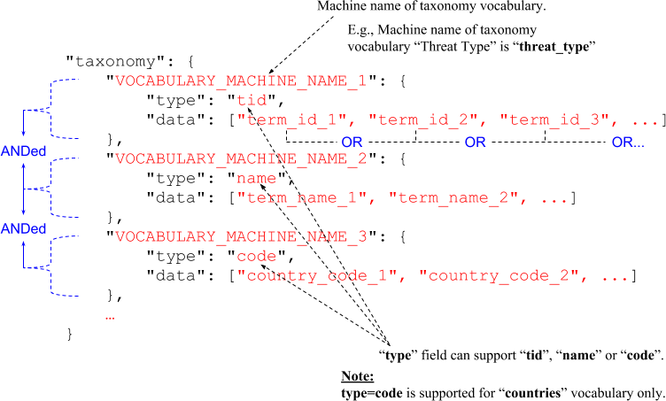

# Overview

Stratfor provides global awareness and guidance to individuals, governments and businesses around the world. We use a unique, intel-based approach to analyze world affairs.

This API reference provides information on available endpoints and how to interact with it.

**Base URL:** https://api.stratfor.com

## Content types

[https://www.drupal.org/docs/7/understanding-drupal/content-types](https://www.drupal.org/docs/7/understanding-drupal/content-types)

*A single web site could contain many types of content, such as informational pages, news items, polls, blog posts, real estate listings, etc. In Drupal, each item of content is called a node, and each node belongs to a single content type, which defines various default settings for nodes of that type, such as whether the node is published automatically and whether comments are permitted. (Note that in previous versions of Drupal, content types were known as node types.)*

### Content types for Threat Lens:

Content type name | Machine name | Description
--- | --- | ---
Analysis | lens_analysis | In-depth analysis, focusing on deconstructing the tactical aspects of global security incidents and trends to highlight the implications and outlook. Where applicable, we also include recommendations and strategies to help clients identify and mitigate risks within their organizations.
Intelligence Update | lens_incident_report | Reports of the tactics, trends and business implications of real-time critical security incidents.
Forecast | lens_forecast | Published quarterly and annually, these forecasts provide perspective on future threats and allow clients to see where and how the global security landscape is changing.
Report | lens_report | Reports offer in-depth and long-term protective intelligence assessments on special events or incidents. We will also profile groups, organizations or noteworthy risks/threats.
Graphics | lens_graphics |
Item of Interest | lens_item_of_interest | Brief updates on global security developments.

**nid**: Node ID or Content ID

## Taxonomy

Taxonomy vocabulary name | Vocabulary machine name | Taxonomy terms
--- | --- | ---
Countries | countries | **Taxonomy terms:**<br /><ul><li>South Sudan</li><li>Angola</li><li>Benin</li><li>...</li></ul>
Threat Type | threat_type | **Taxonomy terms:**<ul><li>Terrorism and Insurgency</li><li>Criminal Activity</li><li>Business Continuity</li><li>Industrial Espionage</li></ul>
Incident Type | incident_type | **Taxonomy terms:**<ul><li>Adverse Government Actions</li><li>Adverse NGO Activities</li><li>Armed Assault</li><li>Arson</li><li>Assassination/Attempted Assassination</li><li>Attacks against First Responders</li><li>Bombing</li><li>Cargo Threats</li><li>Corruption</li><li>Crimes Targeting Expats/Tourists</li><li>Crimes Targeting Public Figures</li><li>Cyber Crimes</li><li>Cyber Espionage</li><li>Drug Trafficking</li><li>Executive Protection</li><li>Health</li><li>Intellectual Property Theft</li><li>Kidnapping/Hostage Taking</li><li>Labor Actions</li><li>Natural Disaster</li><li>Organized Crime</li><li>Other Criminal Activity</li><li>Political Unrest</li><li>Seizure/Hijacking</li><li>Stalking</li><li>Traditional Espionage</li><li>Vehicular Assault</li><li>Workplace Violence/Insider Threat</li></ul>
Incident Target | incident_target | **Taxonomy terms:**<ul><li>Aviation</li><li>Energy</li><li>Telecommunications</li><li>Business/Corporate</li><li>Diplomatic</li><li>Education</li><li>Government</li><li>Infrastructure</li><li>Law Enforcement</li><li>Maritime</li><li>Media/Journalist/Blogger</li><li>Military</li><li>NGO</li><li>Public Figures/Officials</li><li>Religious Figures/Facilities/Events</li><li>Tourists/Expats</li></ul>
Weapon | weapon | **Taxonomy terms:**<ul><li>CBRN</li><li>Explosives</li><li>Firearms</li><li>Fire/Firebomb</li><li>Knife/Blade/Sharp Object</li></ul>

**vid**: Taxonomy Vocabulary ID

**tid**: Taxonomy Term ID

# Authentication

Stratfor utilizes API keys to allow access to the API.

The API expects for the API key to be included in all API requests to the server in either:

* A header that takes the following format: **`apiKey: YOUR_API_KEY`**
* A query string parameter that takes the following format: **`?apiKey=YOUR_API_KEY`**

<aside class="notice">
You must replace <code>YOUR_API_KEY</code> with your actual API key.
</aside>

# Content API

## List all contents

```shell
curl --request POST \
  --url 'https://api.stratfor.com/api/v3/content/lens' \
  --header 'apiKey: YOUR_API_KEY' \
  --header 'Content-Type: application/json' \
  --data '{
    "lens_type": "Threat",
    "page": 0,
    "limit": 10,
    "type": [
      "lens_analysis",
      "lens_incident_report",
      "lens_forecast",
      "lens_report",
      "lens_graphics"
    ],
    "sort_by": ["created", "DESC"],
    "taxonomy": {
      "countries": {
        "type": "code",
        "data": ["JP", "DE"]
      },
      "threat_type": {
        "type": "name",
        "data": ["Terrorism and Insurgency", "Criminal Activity"]
      },
      "incident_type": {
        "type": "tid",
        "data": [428, 429, 430]
      },
      "weapon": {
        "type": "tid",
        "data": [470]
      }
    }
  }'
```

```php
<?php
$curl = curl_init();

$post_fields = array(
  "lens_type" => "Threat",
  "page" => 0,
  "limit" => 10,
  "type" => array(
    "lens_analysis",
    "lens_incident_report",
    "lens_forecast",
    "lens_report",
    "lens_graphics",
  ),
  "sort_by" => array("created", "DESC"),
  "taxonomy" => array(
    "countries" => array(
      "type" => "code",
      "data" => array("JP", "DE"),
    ),
    "threat_type" => array(
      "type" => "name",
      "data" => array("Terrorism and Insurgency", "Criminal Activity"),
    ),
    "incident_type" => array(
      "type" => "tid",
      "data" => array(428, 429, 430),
    ),
    "weapon" => array(
      "type" => "tid",
      "data" => array(470),
    ),
  ),
);

curl_setopt_array($curl, array(
  CURLOPT_CUSTOMREQUEST => "POST",
  CURLOPT_URL => "https://api.stratfor.com/api/v3/content/lens",
  CURLOPT_HTTPHEADER => array(
    "apiKey: YOUR_API_KEY",
    "Content-Type: application/json"
  ),
  CURLOPT_POSTFIELDS => json_encode($post_fields),
  CURLOPT_RETURNTRANSFER => true,
));

$response = curl_exec($curl);
$err = curl_error($curl);

curl_close($curl);

if ($err) {
  echo "cURL Error #:" . $err;
}
else {
  echo $response;
}
```

> Response body:

```json
{
  "total_count": "521",
  "nodes": [
    {
      "nid": "290146",
      "type": "lens_analysis",
      "title": "Understanding Businesses' Duty of Care: The Duty to Foresee",
      "field_teaser_body": "Corporations must continually work to foresee risks to their personnel to avoid legal liability.",
      "source": "",
      "promo_image": {
        "alt": "Understanding Businesses' Duty of Care: The Duty to Foresee",
        "title": "Understanding Businesses' Duty of Care: The Duty to Foresee",
        "caption": "<p>Norwegian Refugee Council employee Steven Dennis (L) on July 2, 2012, at the airport in Nairobi after having been freed the night before. (TONY KARUMBA/AFP/Getty Images)</p>",
        "sizes": {
          "thumbnail_notification": "https://www.stratfor.com/sites/default/files/styles/thumbnail_192x108/public/duty-of-care-pt1-display.png?itok=dOs9v9iO",
          "thumbnail": "https://www.stratfor.com/sites/default/files/styles/9x6_280x187/public/duty-of-care-pt1-display.png?itok=pCpTD5SN",
          "medium": "https://www.stratfor.com/sites/default/files/styles/medium_640x200/public/duty-of-care-pt1-display.png?itok=1zS3CIid",
          "large": "https://www.stratfor.com/sites/default/files/styles/large_1504x470/public/duty-of-care-pt1-display.png?itok=tSIfMkds",
          "16x9": "https://www.stratfor.com/sites/default/files/styles/16x9_640x360/public/duty-of-care-pt1-display.png?itok=jgD4m-GL",
          "9x6": "https://www.stratfor.com/sites/default/files/styles/9x6_720x480/public/duty-of-care-pt1-display.png?itok=26OQ-0LJ",
          "full": "https://www.stratfor.com/sites/default/files/duty-of-care-pt1-display.png"
        }
      },
      "graphics_type": "",
      "graphics_image": "",
      "youtube_video_url": "",
      "taxonomy": [
        {
          "tid": "90",
          "vid": "5",
          "v_name": "countries",
          "name": "Norway",
          "code": "NO",
          "path_alias": "/region/europe/norway"
        },
        {
          "tid": "421",
          "vid": "21",
          "v_name": "threat_type",
          "name": "Terrorism and Insurgency",
          "path_alias": "/taxonomy/term/421"
        },
        {
          "tid": "430",
          "vid": "22",
          "v_name": "incident_type",
          "name": "Armed Assault",
          "path_alias": "/taxonomy/term/430"
        },
        {
          "tid": "434",
          "vid": "22",
          "v_name": "incident_type",
          "name": "Bombing",
          "path_alias": "/taxonomy/term/434"
        },
        {
          "tid": "453",
          "vid": "23",
          "v_name": "incident_target",
          "name": "Business/Corporate",
          "path_alias": "/taxonomy/term/453"
        },
        {
          "tid": "755",
          "vid": "26",
          "v_name": "series",
          "name": "Understanding Businesses' Duty of Care",
          "path_alias": "/taxonomy/term/755"
        },
        {
          "tid": "470",
          "vid": "24",
          "v_name": "weapon",
          "name": "Firearms",
          "path_alias": "/taxonomy/term/470"
        }
      ],
      "created": "1530210979",
      "created_formatted": "June 28, 2018 | 18:36 GMT",
      "changed": "1530217550",
      "changed_formatted": "June 28, 2018 | 20:25 GMT",
      "path_alias": "content/understanding-businesses-duty-care-duty-foresee",
      "label": "Analysis"
    },
    ... another node object ...
  ]
}
```

This endpoint lists all Threat Lens contents.

### HTTP Request

<a href="#list-all-contents" class="method post">POST</a> `/api/v3/content/lens`

### Request body parameters

Parameter | Default | Description
--- | --- | ---
lens_type<br />*`string, required`* | | Type of Stratfor Lens product.<br />**Available options:**<br />Threat<br />...
page<br />*`integer, optional`* | 0 |The page number to start with.<br />0 = First page<br />1 = Second page<Br />and, so on.
limit<br />*`integer, optional`* | 10 | The number of items to return in the response.
type<br />*`array, optional`* | | Lens content types.<br />**Available Threat Lens content types:**<ul><li>lens_analysis</li><li>lens_incident_report</li><li>lens_forecast</li><li>lens_report</li><li>lens_graphics</li></ul>**Note:** If not specified, it returns contents from all available content types.<br />[Click here](#content-types) to get more details about content types.
sort_by<br />*`array, optional`* | ["created", "DESC"] | Sort the list of contents.<br />**Available options:**<br />["created", "DESC"]<br />["created", "ASC"]<br />["changed", "DESC"]<br />["changed", "ASC"]<br />["nid", "DESC"]<br />["nid", "ASC"]
taxonomy<br />*`object, optional`* | | Filter by taxonomy terms.<br />[Click here](#taxonomy) to get more details about taxonomy vocabulary and terms.

### Format of "taxonomy" filter:



If **type**=**tid**, we have to pass an array of *Taxonomy Term ID* in **data** field.

If **type**=**name**, we have to pass an array of *Taxonomy Term Name* in **data** field.

If **type**=**code**, we have to pass an array of *Country Code* in **data** field. This is valid for "**countries**" vocabulary only.

## Retrieve full content

```shell
curl --request GET \
  --url 'https://api.stratfor.com/api/v3/content/290146?site=threatlens' \
  --header 'apiKey: YOUR_API_KEY' \
  --header 'Content-Type: application/json'
```

```php
<?php
$curl = curl_init();

curl_setopt_array($curl, array(
  CURLOPT_CUSTOMREQUEST => "GET",
  CURLOPT_URL => "https://api.stratfor.com/api/v3/content/290146?site=threatlens",
  CURLOPT_HTTPHEADER => array(
    "apiKey: YOUR_API_KEY",
    "Content-Type: application/json"
  ),
  CURLOPT_RETURNTRANSFER => true,
));

$response = curl_exec($curl);
$err = curl_error($curl);

curl_close($curl);

if ($err) {
  echo "cURL Error #:" . $err;
}
else {
  echo $response;
}
```

> Response body:

```json
{
  "nid": "290146",
  "type": "lens_analysis",
  "title": "Understanding Businesses' Duty of Care: The Duty to Foresee",
  "field_teaser_body": "Corporations must continually work to foresee risks to their personnel to avoid legal liability.",
  "summary": "<ul><li>The risk of lawsuits means companies must understand the duty of care &mdash; or the reasonable actions a person or entity must take to protect those under their care from injury or death &mdash; they owe their employees.</li><li>One of the three elements of the duty of care is the duty to foresee, or the expectation that companies remain aware of the reasonably foreseeable threats, both common and uncommon, to their personnel.</li><li>This can be tricky for multinational organizations where risk can vary drastically from country to country and may not always be fully understood &mdash; especially if the company lacks a global security department to monitor and evaluate threats.</li><li>We believe it is possible to identify trends and incidents to foresee many issues and problems before they crop up using protective intelligence.</li></ul>",
  "pov": "",
  "body": "<p><strong>Editor&#39;s Note:</strong> <em>This is the first in a three-part series on the three components of the duty of care.</em></p><p>In 2012, Steve Dennis was kidnapped while working for the Norwegian Refugee Council in a Kenyan refugee camp. After his release, he successfully sued his employer in Norwegian court for gross negligence and failing to properly exercise its duty of care to him in a case known as Steven Patrick Dennis v. Norwegian Refugee Council. Not only does Dennis seem to have been deployed without proper training, post-incident care apparently was also lacking. Dennis recovered over $500,000 in damages from the council due to its poor field security decisions and for ignoring its own duty of care regarding the protection of its personnel.</p><p>In today&#39;s global and virtually connected marketplace, employers like the Norwegian Refugee Council will continue to face increased scrutiny when their workers are injured or killed during the course of their company duties. An understanding of the need to meet one&#39;s duty of care is gaining traction among security personnel, particularly in the United States. Costly and embarrassing media reports and court cases involving employers&#39; failures to protect their workforce have brought many companies into line. In some countries, including the United Kingdom, duty of care laws mandate certain procedures when personnel are sent outside of their home country. As a result, companies are wisely choosing to adopt certain standards to help protect their personnel and limit their liability to lawsuits that can arise from sending employees into dangerous situations.</p><p>Employers are generally expected to meet industry standards regarding the duty of care. Companies that lack basic duty of care mechanisms are accordingly at greater risk of legal liability. The Norwegian court in the Dennis case described the issues as follows: &quot;The central issue pursuant to the fault-based liability standard is whether the NRC&#39;s employees should have acted differently to avert the risk of kidnapping. Central elements of this assessment include the degree of the risk, the nature of the risk, and whether the risk of injury was visible or foreseeable, and whether effective and practicable alternative courses of action existed. In addition, it may be of relevance whether or not industry standards were violated. On the basis of the said elements, the Court is to perform a concrete overall assessment of whether the NRC&#39;s course of action was negligent.&quot;</p><p>Duty of care can mean various things depending on context and the profession in question. In general, and for the purposes of this analysis, we see duty of care as the reasonable actions that a person or entity should take in order to protect others under their care from injury or death. We will examine the duty of care in relation to international personnel security and explore how protective intelligence aids security practitioners in meeting duty of care standards. This article is written from the perspective of protective intelligence and security practitioners, and is not intended as legal advice. You should consult with your legal counsel regarding the issues related to your specific situation.</p><p>The duty of care concept generally incorporates three duties: the duty to foresee, the duty to warn and the duty to protect.</p><h3>The Duty to Foresee</h3><p>The duty to foresee includes the expectation for companies to remain aware of the reasonably foreseeable threats, both common and uncommon, to their personnel. In many roles, these risks are easier to foresee than others. For example, a skydiving company can be expected to understand that the greatest risk to its clients exists after its aircraft leave the ground. Chief among these risks, of course, is an accident or injury resulting from the jump, whether caused by user error or parachute malfunction. These risks are fairly easy to foresee based on the limited scope of what a skydiving company actually does.</p><p>Things get trickier, however, for multinational organizations with international operations. Risk can vary drastically from country to country and may not always be fully understood &mdash; especially if the company lacks a global security department to monitor and evaluate threats. As the exposure threshold dramatically increases when the company is deploying personnel to these locales, hiring locals, building infrastructure (factories, warehouses, offices), and storing or transmitting proprietary data through these facilities, so does the difficulty in forecasting risks.</p><p>The question of foreseeability was debated after the 2007 Virginia Tech massacre. Relatives of the victims sued, arguing that university personnel should have recognized the risk of a mass shooting as soon as police officers became aware that two people had been shot in what turned out to have been a prelude to the main massacre. The plaintiffs argued that had law enforcement immediately placed the campus on lockdown, lives could have been saved.</p><p>Many companies use free and paid services to assist them with foreseeing such threats. Programs like the Overseas Security Advisory Council (better known as OSAC) and other open-source monitoring platforms can help. Many corporations, however, pay for services that offer enhanced capabilities, increasing their ability to collect and analyze trends and breaking events. A key consideration should be the size and experience level of your security team in relation to the footprint of your company&#39;s operations and personnel deployed around the world. Too many large companies that have operations in a multitude of countries have far too few security professionals &mdash; in extreme cases, one person may be tasked with covering the entire world.</p><p>Convincing a court that a company with just one security specialist in charge of monitoring the globe&nbsp;was adequately staffed to foresee threats&nbsp;would likely prove challenging. Offsetting the costs of these efforts by hiring only junior-level employees would also be unlikely to impress a court: Competency and training often play central roles in lawsuits. For this reason, security teams must have a diverse blend of seasoned professionals who understand the dynamics of threat recognition.</p><p>Protective intelligence can play a tremendously helpful role in this leg of the duty-of-care triad. A vast amount of security services are in the business of alerting. Once the package explodes, the gunman shoots, the crowd protests or the waves come ashore, those services send a message advising that the incident occurred in what is essentially an expensive wire service.</p><p>While such services can play an important role in advising personnel about risk, thus helping satisfy the duty to warn, they typically lack the analytical and predictive component that helps one foresee dangers. We believe it is possible to identify trends and incidents to foresee issues and problems before they crop up. Services like Threat Lens not only alert users to incidents, they help them spot trends, allowing security managers to foresee risk and take actions to protect their personnel, assets and intellectual property &mdash; and also to reduce their legal liability.</p><p><em>Next: The Duty to Warn</em></p>",
  "lens_type": [
    {
      "tid": "473",
      "vid": "27",
      "name": "Threat"
    }
  ],
  "source": "",
  "taxonomy": [
    {
      "tid": "90",
      "vid": "5",
      "v_name": "countries",
      "name": "Norway",
      "code": "NO",
      "path_alias": "/region/europe/norway"
    },
    {
      "tid": "421",
      "vid": "21",
      "v_name": "threat_type",
      "name": "Terrorism and Insurgency",
      "path_alias": "/taxonomy/term/421"
    },
    {
      "tid": "430",
      "vid": "22",
      "v_name": "incident_type",
      "name": "Armed Assault",
      "path_alias": "/taxonomy/term/430"
    },
    {
      "tid": "434",
      "vid": "22",
      "v_name": "incident_type",
      "name": "Bombing",
      "path_alias": "/taxonomy/term/434"
    },
    {
      "tid": "453",
      "vid": "23",
      "v_name": "incident_target",
      "name": "Business/Corporate",
      "path_alias": "/taxonomy/term/453"
    },
    {
      "tid": "755",
      "vid": "26",
      "v_name": "series",
      "name": "Understanding Businesses' Duty of Care",
      "path_alias": "/taxonomy/term/755"
    },
    {
      "tid": "470",
      "vid": "24",
      "v_name": "weapon",
      "name": "Firearms",
      "path_alias": "/taxonomy/term/470"
    }
  ],
  "location": "",
  "promo_image": {
    "alt": "Understanding Businesses' Duty of Care: The Duty to Foresee",
    "title": "Understanding Businesses' Duty of Care: The Duty to Foresee",
    "caption": "<p>Norwegian Refugee Council employee Steven Dennis (L) on July 2, 2012, at the airport in Nairobi after having been freed the night before. (TONY KARUMBA/AFP/Getty Images)</p>",
    "sizes": {
      "thumbnail_notification": "https://www.stratfor.com/sites/default/files/styles/thumbnail_192x108/public/duty-of-care-pt1-display.png?itok=dOs9v9iO",
      "thumbnail": "https://www.stratfor.com/sites/default/files/styles/9x6_280x187/public/duty-of-care-pt1-display.png?itok=pCpTD5SN",
      "medium": "https://www.stratfor.com/sites/default/files/styles/medium_640x200/public/duty-of-care-pt1-display.png?itok=1zS3CIid",
      "large": "https://www.stratfor.com/sites/default/files/styles/large_1504x470/public/duty-of-care-pt1-display.png?itok=tSIfMkds",
      "16x9": "https://www.stratfor.com/sites/default/files/styles/16x9_640x360/public/duty-of-care-pt1-display.png?itok=jgD4m-GL",
      "9x6": "https://www.stratfor.com/sites/default/files/styles/9x6_720x480/public/duty-of-care-pt1-display.png?itok=26OQ-0LJ",
      "full": "https://www.stratfor.com/sites/default/files/duty-of-care-pt1-display.png"
    }
  },
  "graphics_type": "",
  "graphics_image": "",
  "youtube_video_url": "",
  "pdf_file": "",
  "created": "1530210979",
  "created_formatted": "June 28, 2018 | 18:36 GMT",
  "changed": "1530217550",
  "path_alias": "content/understanding-businesses-duty-care-duty-foresee",
  "status": "1",
  "forecast_type": "",
  "lens_sections": [],
  "forecast": "",
  "thumbnail_url": "",
  "thumbnail_caption": "",
  "thumbnail_credit": "",
  "organizations": [],
  "forecast_child_nodes": [],
  "content_reference": [],
  "label": "Analysis"
}
```

This endpoint retrieves a full content details.

### HTTP Request

<a href="#retrieve-full-content" class="method get">GET</a> `/api/v3/content/{nid}?site=threatlens`

### Path parameters

Parameter | Type | Default | Required | Description
--- | --- | --- | --- | ---
nid | integer | | Yes | Node ID. Also called as "Content ID".

### Query parameters

Parameter | Type | Default | Required | Description
--- | --- | --- | --- | ---
site | string | threatlens | Yes | "**site**" parameter must be set to "**threatlens**" for Threat Lens site.

## Get maps content

```shell
curl --request POST \
  --url 'https://api.stratfor.com/api/v3/content/maps_content' \
  --header 'apiKey: YOUR_API_KEY' \
  --header 'Content-Type: application/json' \
  --data '{
    "lens_type":"Threat",
    "location":{
      "left": -98.4375,
      "top": 43.548548110912854,
      "right": 127.96875,
      "bottom": -25.20494115356912
    },
    "type": [
      "lens_analysis",
      "lens_incident_report",
      "lens_forecast",
      "lens_report",
      "lens_graphics"
    ],
    "date_range":{
      "start":1526500260,
      "end": 1526600260
    },
    "taxonomy": {
      "countries": {
        "type": "code",
        "data": ["JP", "DE"]
      }
    }
  }'
```

```php
<?php
$curl = curl_init();

$post_fields = array(
  "lens_type" => "Threat",
  "location" => array(
    "left" => -98.4375,
    "top" => 43.548548110912854,
    "right" => 127.96875,
    "bottom" => -25.20494115356912
  ),
  "type" => array(
    "lens_analysis",
    "lens_incident_report",
    "lens_forecast",
    "lens_report",
    "lens_graphics"
  ),
  "date_range" => array(
    "start" => 1526500260,
    "end" => 1526600260
  ),
  "taxonomy" => array(
    "countries" => array(
      "type" => "code",
      "data" => array("JP", "DE")
    )
  )
);

curl_setopt_array($curl, array(
  CURLOPT_CUSTOMREQUEST => "POST",
  CURLOPT_URL => "https://api.stratfor.com/api/v3/content/maps_content",
  CURLOPT_HTTPHEADER => array(
    "apiKey: YOUR_API_KEY",
    "Content-Type: application/json"
  ),
  CURLOPT_POSTFIELDS => json_encode($post_fields),
  CURLOPT_RETURNTRANSFER => true,
));

$response = curl_exec($curl);
$err = curl_error($curl);

curl_close($curl);

if ($err) {
  echo "cURL Error #:" . $err;
}
else {
  echo $response;
}
```

> Response body:

```json
{
  "total_count": 3,
  "nodes": [
    {
      "nid": "289934",
      "type": "lens_incident_report",
      "title": "China: Foreign Airline Resistance to Taiwan Designation Risks Retaliation From Beijing",
      "countries": [
        {
          "tid": "59",
          "vid": "5",
          "name": "United States",
          "code": "US"
        },
        {
          "tid": "195",
          "vid": "5",
          "name": "China",
          "code": "CN"
        },
        {
          "tid": "200",
          "vid": "5",
          "name": "Japan",
          "code": "JP"
        },
        {
          "tid": "215",
          "vid": "5",
          "name": "South Korea",
          "code": "KR"
        },
        {
          "tid": "221",
          "vid": "5",
          "name": "Vietnam",
          "code": "VN"
        },
        {
          "tid": "118",
          "vid": "5",
          "name": "India",
          "code": "IN"
        }
      ],
      "location": {
        "geom": "POINT (104.195397 35.86166)",
        "geo_type": "point",
        "lat": "35.861660000000",
        "lon": "104.195397000000",
        "left": "104.195397000000",
        "top": "35.861660000000",
        "right": "104.195397000000",
        "bottom": "35.861660000000",
        "geohash": "wq6h502v29zn"
      },
      "created": "1529002292",
      "label": "Intelligence Update"
    },
    {
      "nid": "289819",
      "type": "lens_incident_report",
      "title": "Singapore: Suspicious Activity Highlights Espionage Threat Ahead of Korea Summit",
      "countries": [
        {
          "tid": "59",
          "vid": "5",
          "name": "United States",
          "code": "US"
        },
        {
          "tid": "195",
          "vid": "5",
          "name": "China",
          "code": "CN"
        },
        {
          "tid": "200",
          "vid": "5",
          "name": "Japan",
          "code": "JP"
        },
        {
          "tid": "209",
          "vid": "5",
          "name": "North Korea",
          "code": "KP"
        },
        {
          "tid": "213",
          "vid": "5",
          "name": "Singapore",
          "code": "SG"
        },
        {
          "tid": "215",
          "vid": "5",
          "name": "South Korea",
          "code": "KR"
        },
        {
          "tid": "110",
          "vid": "5",
          "name": "Russia",
          "code": "RU"
        }
      ],
      "location": {
        "geom": "POINT (103.819836 1.352083)",
        "geo_type": "point",
        "lat": "1.352083000000",
        "lon": "103.819836000000",
        "left": "103.819836000000",
        "top": "1.352083000000",
        "right": "103.819836000000",
        "bottom": "1.352083000000",
        "geohash": "w21zdqpk3w89"
      },
      "created": "1528475707",
      "label": "Intelligence Update"
    },
    {
      "nid": "289573",
      "type": "lens_analysis",
      "title": "What Businesses Need to Know About Trump's North Korean Summit Cancellation",
      "countries": [
        {
          "tid": "59",
          "vid": "5",
          "name": "United States",
          "code": "US"
        },
        {
          "tid": "195",
          "vid": "5",
          "name": "China",
          "code": "CN"
        },
        {
          "tid": "200",
          "vid": "5",
          "name": "Japan",
          "code": "JP"
        },
        {
          "tid": "209",
          "vid": "5",
          "name": "North Korea",
          "code": "KP"
        },
        {
          "tid": "215",
          "vid": "5",
          "name": "South Korea",
          "code": "KR"
        }
      ],
      "location": {
        "geom": "POINT (127.510093 40.339852)",
        "geo_type": "point",
        "lat": "40.339852000000",
        "lon": "127.510093000000",
        "left": "127.510093000000",
        "top": "40.339852000000",
        "right": "127.510093000000",
        "bottom": "40.339852000000",
        "geohash": "wz4tmxdh8t2w"
      },
      "created": "1527180332",
      "label": "Analysis"
    }
  ]
}
```

Get list of contents with in the map boundary.

### HTTP Request

<a href="#get-maps-content" class="method post">POST</a> `/api/v3/content/maps_content`

### Request body parameters

Parameter | Default | Description
--- | --- | ---
lens_type<br />*`string, required`* | | Type of Stratfor Lens product.<br />**Available options:**<br />Threat<br />...
location<br />*`object, required`* | | Filter contents by left, top, right, bottom coordinates of a map.<br />**Format:**<br />`{"left": ..., "top": ..., "right": ..., "bottom": ...}`
type<br />*`array, optional`* | | Lens content types.<br />**Available Threat Lens content types:**<ul><li>lens_analysis</li><li>lens_incident_report</li><li>lens_forecast</li><li>lens_report</li><li>lens_graphics</li></ul>**Note:** If not specified, it returns contents from all available content types.<br />[Click here](#content-types) to get more details about content types.
date_range<br />*`object, optional`* | | Filter content by content published date.<br />`{"start": X}` <= Load all contents whose published date is greater than **X** timestamp.<br />`{"start": X, "end": Y}` <= Load all contents whose published date is between **X and Y** timestamp.<br />If not specified, it loads all published contents.
taxonomy<br />*`object, optional`* | | Filter by taxonomy terms.<br />[Click here](#taxonomy) to get more details about taxonomy vocabulary and terms.<br />Check [List all contents API](#list-all-contents) to get more details about taxonomy filter.

## Get country stats

```shell
curl --request POST \
  --url 'https://api.stratfor.com/api/v3/content/maps_content' \
  --header 'apiKey: YOUR_API_KEY' \
  --header 'Content-Type: application/json' \
  --data '{
    "lens_type": "Threat",
    "country": {
      "code": "MA"
    },
    "timestamp": 1483392086
  }'
```

```php
<?php
$curl = curl_init();

$post_fields = array(
  "lens_type" => "Threat",
  "country" => array(
    "code" => "MA"
  ),
  "timestamp" => 1483392086
);

curl_setopt_array($curl, array(
  CURLOPT_CUSTOMREQUEST => "POST",
  CURLOPT_URL => "https://api.stratfor.com/api/v3/content/maps_content",
  CURLOPT_HTTPHEADER => array(
    "apiKey: YOUR_API_KEY",
    "Content-Type: application/json"
  ),
  CURLOPT_POSTFIELDS => json_encode($post_fields),
  CURLOPT_RETURNTRANSFER => true,
));

$response = curl_exec($curl);
$err = curl_error($curl);

curl_close($curl);

if ($err) {
  echo "cURL Error #:" . $err;
}
else {
  echo $response;
}
```

> Response body:

```json
{
  "lens_type": "Threat",
  "country": {
    "name": "Morocco",
    "tid": "170"
  },
  "stats": {
    "lens_analysis": 1,
    "lens_forecast": 0,
    "lens_incident_report": 1,
    "lens_item_of_interest": 22,
    "lens_report": 1
  }
}
```

Get total number of contents published for particular country.

### HTTP Request

<a href="#get-country-stats" class="method post">POST</a> `/api/v3/content/country_stats`

### Request body parameters

Parameter | Default | Description
--- | --- | ---
lens_type<br />*`string, required`* | | Type of Stratfor Lens product.<br />**Available options:**<br />Threat<br />...
country<br />*`object, required`* | | **Format:**<br />`{"code": "MA"}` or,<br />`{"tid": 170}` or,<br />`{"name": "Morocco"}`
timestamp<br />*`integer, optional`* | | If timestamp is specified, it returns country stats for contents whose published date is greater than specified timestamp.

## Get related contents

```shell
curl --request POST \
  --url 'https://api.stratfor.com/api/v3/content/related_content/289916' \
  --header 'apiKey: YOUR_API_KEY' \
  --header 'Content-Type: application/json' \
  --data '{
    "lens_type": "Threat",
    "page": 0,
    "limit": 10
  }'
```

```php
<?php
$curl = curl_init();

$post_fields = array(
  "lens_type" => "Threat",
  "page" => 0,
  "limit" => 10
);

curl_setopt_array($curl, array(
  CURLOPT_CUSTOMREQUEST => "POST",
  CURLOPT_URL => "https://api.stratfor.com/api/v3/content/related_content/289916",
  CURLOPT_HTTPHEADER => array(
    "apiKey: YOUR_API_KEY",
    "Content-Type: application/json"
  ),
  CURLOPT_POSTFIELDS => json_encode($post_fields),
  CURLOPT_RETURNTRANSFER => true,
));

$response = curl_exec($curl);
$err = curl_error($curl);

curl_close($curl);

if ($err) {
  echo "cURL Error #:" . $err;
}
else {
  echo $response;
}
```

> Response body:

```json
{
  "total_count": 2279,
  "nodes": [
    {
      "nid": "285168",
      "type": "lens_incident_report",
      "title": "Yemen: Houthi Rebels Threaten Saudi and UAE Civilian Targets",
      "field_teaser_body": "Rhetoric aside, we do not expect a significant increase in the scale of Houthi attacks outside the Saudi-Yemeni border region.",
      "source": "",
      "promo_image": {
        "alt": "Threat Lens Incident Report",
        "title": "Threat Lens Incident Report",
        "caption": "",
        "sizes": {
          "thumbnail_notification": "https://www.stratfor.com/sites/default/files/styles/thumbnail_192x108/public/threat-lens-terrorism-4%20%282%29.jpg?itok=l2qzPE4W",
          "thumbnail": "https://www.stratfor.com/sites/default/files/styles/9x6_280x187/public/threat-lens-terrorism-4%20%282%29.jpg?itok=q9faHukl",
          "medium": "https://www.stratfor.com/sites/default/files/styles/medium_640x200/public/threat-lens-terrorism-4%20%282%29.jpg?itok=xRftVVyl",
          "large": "https://www.stratfor.com/sites/default/files/styles/large_1504x470/public/threat-lens-terrorism-4%20%282%29.jpg?itok=cG1RfrjY",
          "16x9": "https://www.stratfor.com/sites/default/files/styles/16x9_640x360/public/threat-lens-terrorism-4%20%282%29.jpg?itok=wPT-iYUv",
          "9x6": "https://www.stratfor.com/sites/default/files/styles/9x6_720x480/public/threat-lens-terrorism-4%20%282%29.jpg?itok=X6Cn6dX0",
          "full": "https://www.stratfor.com/sites/default/files/threat-lens-terrorism-4%20%282%29.jpg"
        }
      },
      "graphics_type": "",
      "graphics_image": "",
      "brightcove_video_id": "",
      "youtube_video_url": "",
      "taxonomy": [
        {
          "tid": "135",
          "vid": "5",
          "v_name": "countries",
          "name": "Saudi Arabia",
          "code": "SA",
          "path_alias": "/region/middle-east-and-north-africa/saudi-arabia"
        },
        {
          "tid": "138",
          "vid": "5",
          "v_name": "countries",
          "name": "United Arab Emirates",
          "code": "AE",
          "path_alias": "/region/middle-east-and-north-africa/united-arab-emirates"
        },
        {
          "tid": "139",
          "vid": "5",
          "v_name": "countries",
          "name": "Yemen",
          "code": "YE",
          "path_alias": "/region/middle-east-and-north-africa/yemen"
        },
        {
          "tid": "421",
          "vid": "21",
          "v_name": "threat_type",
          "name": "Terrorism and Insurgency",
          "path_alias": "/taxonomy/term/421"
        },
        {
          "tid": "452",
          "vid": "23",
          "v_name": "incident_target",
          "name": "Aviation",
          "path_alias": "/taxonomy/term/452"
        },
        {
          "tid": "458",
          "vid": "23",
          "v_name": "incident_target",
          "name": "Infrastructure",
          "path_alias": "/taxonomy/term/458"
        },
        {
          "tid": "460",
          "vid": "23",
          "v_name": "incident_target",
          "name": "Maritime",
          "path_alias": "/taxonomy/term/460"
        }
      ],
      "alert": false,
      "created": "1510087525",
      "created_formatted": "November 7, 2017 | 20:45 GMT",
      "changed": "1510087645",
      "changed_formatted": "November 7, 2017 | 20:47 GMT",
      "path_alias": "content/yemen-houthi-rebels-threaten-saudi-and-uae-civilian-targets",
      "label": "Intelligence Update"
    },
    ... another node object here ...
  ]
}
```

Get related contents for a particular node.

### HTTP Request

<a href="#get-related-content" class="method post">POST</a> `/api/v3/content/related_content/{nid}`

### Path parameters

Parameter | Type | Default | Required | Description
--- | --- | --- | --- | ---
nid | integer | | Yes | Node ID. Also called as "Content ID".

### Request body parameters

Parameter | Default | Description
--- | --- | ---
lens_type<br />*`string, required`* | | Type of Stratfor Lens product.<br />**Available options:**<br />Threat<br />...
page<br />*`integer, optional`* | 0 |The page number to start with.<br />0 = First page<br />1 = Second page<Br />and, so on.
limit<br />*`integer, optional`* | 10 | The number of items to return in the response.

## Get lens library

```shell
curl --request POST \
  --url 'https://api.stratfor.com/api/v3/content/lens_library' \
  --header 'apiKey: YOUR_API_KEY' \
  --header 'Content-Type: application/json' \
  --data '{
    "lens_type": "Threat"
  }'
```

```php
<?php
$curl = curl_init();

$post_fields = array(
  "lens_type" => "Threat"
);

curl_setopt_array($curl, array(
  CURLOPT_CUSTOMREQUEST => "POST",
  CURLOPT_URL => "https://api.stratfor.com/api/v3/content/lens_library",
  CURLOPT_HTTPHEADER => array(
    "apiKey: YOUR_API_KEY",
    "Content-Type: application/json"
  ),
  CURLOPT_POSTFIELDS => json_encode($post_fields),
  CURLOPT_RETURNTRANSFER => true,
));

$response = curl_exec($curl);
$err = curl_error($curl);

curl_close($curl);

if ($err) {
  echo "cURL Error #:" . $err;
}
else {
  echo $response;
}
```

> Response body:

```json
{
  "lens_library_highlights": {
    "title": "Lens: Library Highlights",
    "qid": "73",
    "total_count": "8",
    "nodes": [
      {
        "nid": "286593",
        "type": "lens_report",
        "title": "The Global Jihadist Movement in 2018: The Threat Lens Forecast",
        "field_teaser_body": "We will examine the jihadist movement in 2018 by its main components, the al Qaeda pole, the Islamic State pole and the grassroots jihadist threat.",
        "source": "",
        "promo_image": {
          "alt": "The Global Jihadist Movement in 2018: The Threat Lens Forecast",
          "title": "The Global Jihadist Movement in 2018: The Threat Lens Forecast",
          "caption": "<p>(MOHAMED ABDIWAHAB/AFP/Getty Images)</p>",
          "sizes": {
            "thumbnail_notification": "http://stratpublish.dd:8083/sites/default/files/styles/thumbnail_192x108/public/al-qaeda-pole.jpg?itok=75oZi1VW",
            "thumbnail": "http://stratpublish.dd:8083/sites/default/files/styles/9x6_280x187/public/al-qaeda-pole.jpg?itok=ok1STljf",
            "medium": "http://stratpublish.dd:8083/sites/default/files/styles/medium_640x200/public/al-qaeda-pole.jpg?itok=uvV5SVFq",
            "large": "http://stratpublish.dd:8083/sites/default/files/styles/large_1504x470/public/al-qaeda-pole.jpg?itok=kBi3cqvD",
            "16x9": "http://stratpublish.dd:8083/sites/default/files/styles/16x9_640x360/public/al-qaeda-pole.jpg?itok=fPdTKXAB",
            "9x6": "http://stratpublish.dd:8083/sites/default/files/styles/9x6_720x480/public/al-qaeda-pole.jpg?itok=OPHH_sSW",
            "full": "http://stratpublish.dd:8083/sites/default/files/al-qaeda-pole.jpg"
          }
        },
        "graphics_type": "",
        "graphics_image": "",
        "brightcove_video_id": "",
        "youtube_video_url": "",
        "taxonomy": [
          {
            "tid": "146",
            "vid": "5",
            "v_name": "countries",
            "name": "Cameroon",
            "code": "CM",
            "path_alias": "/region/sub-saharan-africa/cameroon"
          },
          {
            "tid": "149",
            "vid": "5",
            "v_name": "countries",
            "name": "Chad",
            "code": "TD",
            "path_alias": "/region/sub-saharan-africa/chad"
          },
          {
            "tid": "472",
            "vid": "24",
            "v_name": "weapon",
            "name": "Knife/Blade/Sharp Object",
            "path_alias": "/taxonomy/term/472"
          }
        ],
        "alert": false,
        "created": "1515623525",
        "created_formatted": "January 10, 2018 | 22:32 GMT",
        "changed": "1517413960",
        "changed_formatted": "January 31, 2018 | 15:52 GMT",
        "path_alias": "content/global-jihadist-movement-2018-threat-lens-forecast",
        "label": "Report"
      },
      ... another node object here ...
    ]
  },
  "lens_forecast": {
    "total_count": "7",
    "nodes": [
      {
        "nid": "288255",
        "type": "lens_forecast",
        "title": "The 2018 Threat Lens Second-Quarter Forecast",
        "field_teaser_body": "The Threat Lens Second-Quarter Forecast serves as an invaluable tool for predicting the changes that matter most to security professionals.",
        "source": "",
        "promo_image": {
          "alt": "The 2018 Threat Lens Second-Quarter Forecast",
          "title": "The 2018 Threat Lens Second-Quarter Forecast",
          "caption": "",
          "sizes": {
            "thumbnail_notification": "http://stratpublish.dd:8083/sites/default/files/styles/thumbnail_192x108/public/TL%202018%20Second%20Quarter%20Update.png?itok=y1tf2cao",
            "thumbnail": "http://stratpublish.dd:8083/sites/default/files/styles/9x6_280x187/public/TL%202018%20Second%20Quarter%20Update.png?itok=KXDLFtkG",
            "medium": "http://stratpublish.dd:8083/sites/default/files/styles/medium_640x200/public/TL%202018%20Second%20Quarter%20Update.png?itok=JoBQBcPD",
            "large": "http://stratpublish.dd:8083/sites/default/files/styles/large_1504x470/public/TL%202018%20Second%20Quarter%20Update.png?itok=Jvvyr3pn",
            "16x9": "http://stratpublish.dd:8083/sites/default/files/styles/16x9_640x360/public/TL%202018%20Second%20Quarter%20Update.png?itok=ojecwRSB",
            "9x6": "http://stratpublish.dd:8083/sites/default/files/styles/9x6_720x480/public/TL%202018%20Second%20Quarter%20Update.png?itok=zE8tl02A",
            "full": "http://stratpublish.dd:8083/sites/default/files/TL%202018%20Second%20Quarter%20Update.png"
          }
        },
        "graphics_type": "",
        "graphics_image": "",
        "brightcove_video_id": "",
        "youtube_video_url": "",
        "taxonomy": [
          {
            "tid": "59",
            "vid": "5",
            "v_name": "countries",
            "name": "United States",
            "code": "US",
            "path_alias": "/region/americas/united-states"
          },
          {
            "tid": "209",
            "vid": "5",
            "v_name": "countries",
            "name": "North Korea",
            "code": "KP",
            "path_alias": "/region/asia-pacific/north-korea"
          },
          {
            "tid": "215",
            "vid": "5",
            "v_name": "countries",
            "name": "South Korea",
            "code": "KR",
            "path_alias": "/region/asia-pacific/south-korea"
          }
        ],
        "alert": false,
        "created": "1520872814",
        "created_formatted": "March 12, 2018 | 16:40 GMT",
        "changed": "1522182055",
        "changed_formatted": "March 27, 2018 | 20:20 GMT",
        "path_alias": "content/2018-threat-lens-second-quarter-forecast-0",
        "label": "Forecast"
      },
      ... another node object here ...
    ]
  },
  "additional_nodequeues": {
    "executive_protection": {
      "title": "Executive Protection",
      "qid": "76",
      "total_count": "24",
      "nodes": [
        {
          "nid": "236679",
          "type": "lens_analysis",
          "title": "A Threat Lens Case Study: The assassination of Myanmar lawyer U Ko Ni",
          "field_teaser_body": "In a press conference held at Myanmar’s Drug Elimination Museum, the Chief of Myanmar Police, Major-General Zaw Win, announced an investigation had concluded the murder was an isolated conspiracy plotted by a group of ultra-nationalist former army officers. Still, there are strong indications that factions of the military may have known the plot, or at the least consented to the assassination. Here is a graphic that details the tactics and extensive plot behind the assassination &mdash; and a possible cover-up.",
          "source": {
            "title": "Threat Lens",
            "url": ""
          },
          "promo_image": {
            "alt": "",
            "title": "",
            "caption": "",
            "sizes": {
              "thumbnail_notification": "http://stratpublish.dd:8083/sites/default/files/styles/thumbnail_192x108/public/ki-no-murder-tl-display.jpg?itok=N-nw6Z5P",
              "thumbnail": "http://stratpublish.dd:8083/sites/default/files/styles/9x6_280x187/public/ki-no-murder-tl-display.jpg?itok=4DQRuJwa",
              "medium": "http://stratpublish.dd:8083/sites/default/files/styles/medium_640x200/public/ki-no-murder-tl-display.jpg?itok=A_fmn8V1",
              "large": "http://stratpublish.dd:8083/sites/default/files/styles/large_1504x470/public/ki-no-murder-tl-display.jpg?itok=AnKcxZ9j",
              "16x9": "http://stratpublish.dd:8083/sites/default/files/styles/16x9_640x360/public/ki-no-murder-tl-display.jpg?itok=B5wUahVz",
              "9x6": "http://stratpublish.dd:8083/sites/default/files/styles/9x6_720x480/public/ki-no-murder-tl-display.jpg?itok=4QQQUgjo",
              "full": "http://stratpublish.dd:8083/sites/default/files/ki-no-murder-tl-display.jpg"
            }
          },
          "graphics_type": "",
          "graphics_image": "",
          "brightcove_video_id": "",
          "youtube_video_url": "",
          "taxonomy": [
            {
              "tid": "206",
              "vid": "5",
              "v_name": "countries",
              "name": "Myanmar",
              "code": "MM",
              "path_alias": "/region/asia-pacific/myanmar"
            },
            {
              "tid": "422",
              "vid": "21",
              "v_name": "threat_type",
              "name": "Criminal Activity",
              "path_alias": "/taxonomy/term/422"
            }
          ],
          "alert": false,
          "created": "1488470378",
          "created_formatted": "March 2, 2017 | 15:59 GMT",
          "changed": "1488470378",
          "changed_formatted": "March 2, 2017 | 15:59 GMT",
          "path_alias": "content/threat-lens-case-study-assassination-myanmar-lawyer-u-ko-ni",
          "label": "Analysis"
        },
        ... another node object here ...
      ]
    },
    "corporate_security": {
      "title": "Corporate Security",
      "qid": "77",
      "total_count": "20",
      "nodes": [
        {
          "nid": "284057",
          "type": "lens_analysis",
          "title": "Mitigating Corporate Risk",
          "field_teaser_body": "Understanding how an incident was conducted allows corporate security leaders to develop countermeasures to mitigate against specific risks.",
          "source": "",
          "promo_image": {
            "alt": "Mitigating Corporate Risk",
            "title": "Mitigating Corporate Risk",
            "caption": "<p>(HYWARDS/Shutterstock)</p>",
            "sizes": {
              "thumbnail_notification": "http://stratpublish.dd:8083/sites/default/files/styles/thumbnail_192x108/public/digital-security.jpg?itok=8FHbvjGV",
              "thumbnail": "http://stratpublish.dd:8083/sites/default/files/styles/9x6_280x187/public/digital-security.jpg?itok=MUAvIDH8",
              "medium": "http://stratpublish.dd:8083/sites/default/files/styles/medium_640x200/public/digital-security.jpg?itok=y_kOB3a9",
              "large": "http://stratpublish.dd:8083/sites/default/files/styles/large_1504x470/public/digital-security.jpg?itok=HxoTlrYN",
              "16x9": "http://stratpublish.dd:8083/sites/default/files/styles/16x9_640x360/public/digital-security.jpg?itok=85aOoke7",
              "9x6": "http://stratpublish.dd:8083/sites/default/files/styles/9x6_720x480/public/digital-security.jpg?itok=zYKL-IGi",
              "full": "http://stratpublish.dd:8083/sites/default/files/digital-security.jpg"
            }
          },
          "graphics_type": "",
          "graphics_image": "",
          "brightcove_video_id": "",
          "youtube_video_url": "",
          "taxonomy": [
            {
              "tid": "423",
              "vid": "21",
              "v_name": "threat_type",
              "name": "Business Continuity",
              "path_alias": "/taxonomy/term/423"
            },
            {
              "tid": "424",
              "vid": "21",
              "v_name": "threat_type",
              "name": "Industrial Espionage",
              "path_alias": "/taxonomy/term/424"
            }
          ],
          "alert": false,
          "created": "1507040523",
          "created_formatted": "October 3, 2017 | 14:22 GMT",
          "changed": "1507040981",
          "changed_formatted": "October 3, 2017 | 14:29 GMT",
          "path_alias": "content/mitigating-corporate-risk",
          "label": "Analysis"
        },
        ... another node object here ...
      ]
    },
    "cybersecurity": {
      "title": "Cybersecurity",
      "qid": "85",
      "total_count": "26",
      "nodes": [
        {
          "nid": "287158",
          "type": "lens_analysis",
          "title": "Moving Beyond SMS for Multifactor Authentication",
          "field_teaser_body": "Malicious entities have targeted users employing SMS as an additional factor, necessitating a new approach to authentication.",
          "source": "",
          "promo_image": {
            "alt": "Moving Beyond SMS for Multifactor Authentication",
            "title": "Moving Beyond SMS for Multifactor Authentication",
            "caption": "<p>(vchal/Shutterstock)</p>",
            "sizes": {
              "thumbnail_notification": "http://stratpublish.dd:8083/sites/default/files/styles/thumbnail_192x108/public/sms.jpg?itok=_OjJApjc",
              "thumbnail": "http://stratpublish.dd:8083/sites/default/files/styles/9x6_280x187/public/sms.jpg?itok=3xVRmLah",
              "medium": "http://stratpublish.dd:8083/sites/default/files/styles/medium_640x200/public/sms.jpg?itok=45iuCxIj",
              "large": "http://stratpublish.dd:8083/sites/default/files/styles/large_1504x470/public/sms.jpg?itok=Ue1xxJdN",
              "16x9": "http://stratpublish.dd:8083/sites/default/files/styles/16x9_640x360/public/sms.jpg?itok=kUwzNHb0",
              "9x6": "http://stratpublish.dd:8083/sites/default/files/styles/9x6_720x480/public/sms.jpg?itok=ROeUBbHX",
              "full": "http://stratpublish.dd:8083/sites/default/files/sms.jpg"
            }
          },
          "graphics_type": "",
          "graphics_image": "",
          "brightcove_video_id": "",
          "youtube_video_url": "",
          "taxonomy": [
            {
              "tid": "422",
              "vid": "21",
              "v_name": "threat_type",
              "name": "Criminal Activity",
              "path_alias": "/taxonomy/term/422"
            },
            {
              "tid": "423",
              "vid": "21",
              "v_name": "threat_type",
              "name": "Business Continuity",
              "path_alias": "/taxonomy/term/423"
            },
            {
              "tid": "440",
              "vid": "22",
              "v_name": "incident_type",
              "name": "Cyber Crimes",
              "path_alias": "/taxonomy/term/440"
            },
            {
              "tid": "453",
              "vid": "23",
              "v_name": "incident_target",
              "name": "Business/Corporate",
              "path_alias": "/taxonomy/term/453"
            }
          ],
          "alert": false,
          "created": "1517926087",
          "created_formatted": "February 6, 2018 | 14:08 GMT",
          "changed": "1518633279",
          "changed_formatted": "February 14, 2018 | 18:34 GMT",
          "path_alias": "content/moving-beyond-sms-multifactor-authentication",
          "label": "Analysis"
        },
        ... another node object here ...
      ]
    },
    "crisis_planning": {
      "title": "Crisis Planning",
      "qid": "86",
      "total_count": "15",
      "nodes": [
        {
          "nid": "283106",
          "type": "lens_analysis",
          "title": "What to Do in Case of a Flood",
          "field_teaser_body": "Knowing what to do in case of a flood can mean the difference between life and death.",
          "source": "",
          "promo_image": {
            "alt": "Hurricane Harvey Houston Flooding Disaster Preparing Flooding",
            "title": "People evacuate from flooding from Hurricane Harvey on Aug. 27, 2017, in Houston, Texas.",
            "caption": "<p>(Photo by JOE RAEDELE/Getty Images)</p>",
            "sizes": {
              "thumbnail_notification": "http://stratpublish.dd:8083/sites/default/files/styles/thumbnail_192x108/public/harvey-display.jpg?itok=9mkPfhaR",
              "thumbnail": "http://stratpublish.dd:8083/sites/default/files/styles/9x6_280x187/public/harvey-display.jpg?itok=MqksOee0",
              "medium": "http://stratpublish.dd:8083/sites/default/files/styles/medium_640x200/public/harvey-display.jpg?itok=weV-wN-c",
              "large": "http://stratpublish.dd:8083/sites/default/files/styles/large_1504x470/public/harvey-display.jpg?itok=MMq7kWJo",
              "16x9": "http://stratpublish.dd:8083/sites/default/files/styles/16x9_640x360/public/harvey-display.jpg?itok=k8zN-jvJ",
              "9x6": "http://stratpublish.dd:8083/sites/default/files/styles/9x6_720x480/public/harvey-display.jpg?itok=f3IzcvoQ",
              "full": "http://stratpublish.dd:8083/sites/default/files/harvey-display.jpg"
            }
          },
          "graphics_type": "",
          "graphics_image": "",
          "brightcove_video_id": "",
          "youtube_video_url": "",
          "taxonomy": [
            {
              "tid": "59",
              "vid": "5",
              "v_name": "countries",
              "name": "United States",
              "code": "US",
              "path_alias": "/region/americas/united-states"
            },
            {
              "tid": "423",
              "vid": "21",
              "v_name": "threat_type",
              "name": "Business Continuity",
              "path_alias": "/taxonomy/term/423"
            }
          ],
          "alert": false,
          "created": "1503966787",
          "created_formatted": "August 29, 2017 | 00:33 GMT",
          "changed": "1504012904",
          "changed_formatted": "August 29, 2017 | 13:21 GMT",
          "path_alias": "content/what-do-case-flood",
          "label": "Analysis"
        },
        ... another node object here ...
      ]
    },
    "industrial_espionage": {
      "title": "Industrial Espionage",
      "qid": "87",
      "total_count": "20",
      "nodes": [
        {
          "nid": "283697",
          "type": "lens_incident_report",
          "title": "Iran: Hackers Targeting Aviation and Petrochemical Firms With Middle Eastern Links",
          "field_teaser_body": "The targeting could signal Iranian efforts to counter Saudi Arabia.",
          "source": {
            "title": "FireEye",
            "url": ""
          },
          "promo_image": {
            "alt": "Threat Lens Incident Report",
            "title": "Threat Lens Incident Report",
            "caption": "",
            "sizes": {
              "thumbnail_notification": "http://stratpublish.dd:8083/sites/default/files/styles/thumbnail_192x108/public/threat-lens-cyber-espionage_7%20%281%29.jpg?itok=sHD5LgS4",
              "thumbnail": "http://stratpublish.dd:8083/sites/default/files/styles/9x6_280x187/public/threat-lens-cyber-espionage_7%20%281%29.jpg?itok=EhypeSLb",
              "medium": "http://stratpublish.dd:8083/sites/default/files/styles/medium_640x200/public/threat-lens-cyber-espionage_7%20%281%29.jpg?itok=KaVDLjQS",
              "large": "http://stratpublish.dd:8083/sites/default/files/styles/large_1504x470/public/threat-lens-cyber-espionage_7%20%281%29.jpg?itok=_vF7EAbo",
              "16x9": "http://stratpublish.dd:8083/sites/default/files/styles/16x9_640x360/public/threat-lens-cyber-espionage_7%20%281%29.jpg?itok=tpscpU-A",
              "9x6": "http://stratpublish.dd:8083/sites/default/files/styles/9x6_720x480/public/threat-lens-cyber-espionage_7%20%281%29.jpg?itok=IBaKFcGt",
              "full": "http://stratpublish.dd:8083/sites/default/files/threat-lens-cyber-espionage_7%20%281%29.jpg"
            }
          },
          "graphics_type": "",
          "graphics_image": "",
          "brightcove_video_id": "",
          "youtube_video_url": "",
          "taxonomy": [
            {
              "tid": "59",
              "vid": "5",
              "v_name": "countries",
              "name": "United States",
              "code": "US",
              "path_alias": "/region/americas/united-states"
            },
            {
              "tid": "215",
              "vid": "5",
              "v_name": "countries",
              "name": "South Korea",
              "code": "KR",
              "path_alias": "/region/asia-pacific/south-korea"
            },
            {
              "tid": "125",
              "vid": "5",
              "v_name": "countries",
              "name": "Iran",
              "code": "IR",
              "path_alias": "/region/middle-east-and-north-africa/iran"
            },
            {
              "tid": "135",
              "vid": "5",
              "v_name": "countries",
              "name": "Saudi Arabia",
              "code": "SA",
              "path_alias": "/region/middle-east-and-north-africa/saudi-arabia"
            },
            {
              "tid": "424",
              "vid": "21",
              "v_name": "threat_type",
              "name": "Industrial Espionage",
              "path_alias": "/taxonomy/term/424"
            },
            {
              "tid": "441",
              "vid": "22",
              "v_name": "incident_type",
              "name": "Cyber Espionage",
              "path_alias": "/taxonomy/term/441"
            },
            {
              "tid": "453",
              "vid": "23",
              "v_name": "incident_target",
              "name": "Business/Corporate",
              "path_alias": "/taxonomy/term/453"
            }
          ],
          "alert": false,
          "created": "1505952729",
          "created_formatted": "September 21, 2017 | 00:12 GMT",
          "changed": "1505952729",
          "changed_formatted": "September 21, 2017 | 00:12 GMT",
          "path_alias": "content/iran-hackers-targeting-aviation-and-petrochemical-firms-middle-eastern-links",
          "label": "Intelligence Update"
        },
        ... another node object here ...
      ]
    },
    "personal_security": {
      "title": "Personal Security",
      "qid": "78",
      "total_count": "15",
      "nodes": [
        {
          "nid": "280363",
          "type": "lens_report",
          "title": "Cybersecurity Basics: A Primer on Risk Management",
          "field_teaser_body": "With a global ransom ware crisis dominating headlines, the Internet seemingly has become a more dangerous place than ever for the unwary. This report will help ordinary computer users protect themselves when going online.",
          "source": "",
          "promo_image": {
            "alt": "",
            "title": "",
            "caption": "",
            "sizes": {
              "thumbnail_notification": "http://stratpublish.dd:8083/sites/default/files/styles/thumbnail_192x108/public/tl-display-cyber-security.png?itok=uQjrQ0Uy",
              "thumbnail": "http://stratpublish.dd:8083/sites/default/files/styles/9x6_280x187/public/tl-display-cyber-security.png?itok=7U3unDmZ",
              "medium": "http://stratpublish.dd:8083/sites/default/files/styles/medium_640x200/public/tl-display-cyber-security.png?itok=aZm0oDTj",
              "large": "http://stratpublish.dd:8083/sites/default/files/styles/large_1504x470/public/tl-display-cyber-security.png?itok=_aElPBPt",
              "16x9": "http://stratpublish.dd:8083/sites/default/files/styles/16x9_640x360/public/tl-display-cyber-security.png?itok=WEVujmPW",
              "9x6": "http://stratpublish.dd:8083/sites/default/files/styles/9x6_720x480/public/tl-display-cyber-security.png?itok=ftpVd3CH",
              "full": "http://stratpublish.dd:8083/sites/default/files/tl-display-cyber-security.png"
            }
          },
          "graphics_type": "",
          "graphics_image": "",
          "brightcove_video_id": "",
          "youtube_video_url": "",
          "taxonomy": [
            {
              "tid": "422",
              "vid": "21",
              "v_name": "threat_type",
              "name": "Criminal Activity",
              "path_alias": "/taxonomy/term/422"
            },
            {
              "tid": "423",
              "vid": "21",
              "v_name": "threat_type",
              "name": "Business Continuity",
              "path_alias": "/taxonomy/term/423"
            },
            {
              "tid": "440",
              "vid": "22",
              "v_name": "incident_type",
              "name": "Cyber Crimes",
              "path_alias": "/taxonomy/term/440"
            },
            {
              "tid": "441",
              "vid": "22",
              "v_name": "incident_type",
              "name": "Cyber Espionage",
              "path_alias": "/taxonomy/term/441"
            }
          ],
          "alert": false,
          "created": "1495483603",
          "created_formatted": "May 22, 2017 | 20:06 GMT",
          "changed": "1495504318",
          "changed_formatted": "May 23, 2017 | 01:51 GMT",
          "path_alias": "content/cybersecurity-basics-primer-risk-management",
          "label": "Report"
        },
        ... another node object here ...
      ]
    },
    "jihadism": {
      "title": "Jihadism",
      "qid": "79",
      "total_count": "20",
      "nodes": [
        {
          "nid": "286593",
          "type": "lens_report",
          "title": "The Global Jihadist Movement in 2018: The Threat Lens Forecast",
          "field_teaser_body": "We will examine the jihadist movement in 2018 by its main components, the al Qaeda pole, the Islamic State pole and the grassroots jihadist threat.",
          "source": "",
          "promo_image": {
            "alt": "The Global Jihadist Movement in 2018: The Threat Lens Forecast",
            "title": "The Global Jihadist Movement in 2018: The Threat Lens Forecast",
            "caption": "<p>(MOHAMED ABDIWAHAB/AFP/Getty Images)</p>",
            "sizes": {
              "thumbnail_notification": "http://stratpublish.dd:8083/sites/default/files/styles/thumbnail_192x108/public/al-qaeda-pole.jpg?itok=75oZi1VW",
              "thumbnail": "http://stratpublish.dd:8083/sites/default/files/styles/9x6_280x187/public/al-qaeda-pole.jpg?itok=ok1STljf",
              "medium": "http://stratpublish.dd:8083/sites/default/files/styles/medium_640x200/public/al-qaeda-pole.jpg?itok=uvV5SVFq",
              "large": "http://stratpublish.dd:8083/sites/default/files/styles/large_1504x470/public/al-qaeda-pole.jpg?itok=kBi3cqvD",
              "16x9": "http://stratpublish.dd:8083/sites/default/files/styles/16x9_640x360/public/al-qaeda-pole.jpg?itok=fPdTKXAB",
              "9x6": "http://stratpublish.dd:8083/sites/default/files/styles/9x6_720x480/public/al-qaeda-pole.jpg?itok=OPHH_sSW",
              "full": "http://stratpublish.dd:8083/sites/default/files/al-qaeda-pole.jpg"
            }
          },
          "graphics_type": "",
          "graphics_image": "",
          "brightcove_video_id": "",
          "youtube_video_url": "",
          "taxonomy": [
            {
              "tid": "146",
              "vid": "5",
              "v_name": "countries",
              "name": "Cameroon",
              "code": "CM",
              "path_alias": "/region/sub-saharan-africa/cameroon"
            },
            {
              "tid": "149",
              "vid": "5",
              "v_name": "countries",
              "name": "Chad",
              "code": "TD",
              "path_alias": "/region/sub-saharan-africa/chad"
            }
          ],
          "alert": false,
          "created": "1515623525",
          "created_formatted": "January 10, 2018 | 22:32 GMT",
          "changed": "1517413960",
          "changed_formatted": "January 31, 2018 | 15:52 GMT",
          "path_alias": "content/global-jihadist-movement-2018-threat-lens-forecast",
          "label": "Report"
        },
        ... another node object here ...
      ]
    },
    "leaderless_resistance": {
      "title": "Leaderless Resistance",
      "qid": "80",
      "total_count": "6",
      "nodes": [
        {
          "nid": "233550",
          "type": "lens_report",
          "title": "The Global Jihadist Movement In 2017: The Threat Lens Forecast",
          "field_teaser_body": "For years now Stratfor has published an annual jihadist outlook, but our dedicated Threat Lens team can now produce a deeper and more comprehensive report on the subject. This is the only place to get the full and unabridged Stratfor analysis. The forecast has three main sections: background and terrorist theory; the al Qaeda and Islamic State core, their franchises and grassroots attackers; and the final outlook. Combined, they make the most informative compendium on the subject you will likely read this year. Enjoy, and happy digging.",
          "source": {
            "title": "Threat Lens",
            "url": ""
          },
          "promo_image": {
            "alt": "",
            "title": "",
            "caption": "",
            "sizes": {
              "thumbnail_notification": "http://stratpublish.dd:8083/sites/default/files/styles/thumbnail_192x108/public/jihadist-annual-forecast-display-threatlens_0.jpg?itok=RQYDdGcV",
              "thumbnail": "http://stratpublish.dd:8083/sites/default/files/styles/9x6_280x187/public/jihadist-annual-forecast-display-threatlens_0.jpg?itok=dcxOmICo",
              "medium": "http://stratpublish.dd:8083/sites/default/files/styles/medium_640x200/public/jihadist-annual-forecast-display-threatlens_0.jpg?itok=aSg_-Hhk",
              "large": "http://stratpublish.dd:8083/sites/default/files/styles/large_1504x470/public/jihadist-annual-forecast-display-threatlens_0.jpg?itok=Ksmyh8D_",
              "16x9": "http://stratpublish.dd:8083/sites/default/files/styles/16x9_640x360/public/jihadist-annual-forecast-display-threatlens_0.jpg?itok=-aGXmVLy",
              "9x6": "http://stratpublish.dd:8083/sites/default/files/styles/9x6_720x480/public/jihadist-annual-forecast-display-threatlens_0.jpg?itok=3KF679qC",
              "full": "http://stratpublish.dd:8083/sites/default/files/jihadist-annual-forecast-display-threatlens_0.jpg"
            }
          },
          "graphics_type": "",
          "graphics_image": "",
          "brightcove_video_id": "",
          "youtube_video_url": "",
          "taxonomy": [
            {
              "tid": "421",
              "vid": "21",
              "v_name": "threat_type",
              "name": "Terrorism and Insurgency",
              "path_alias": "/taxonomy/term/421"
            }
          ],
          "alert": false,
          "created": "1484333721",
          "created_formatted": "January 13, 2017 | 18:55 GMT",
          "changed": "1487853805",
          "changed_formatted": "February 23, 2017 | 12:43 GMT",
          "path_alias": "content/global-jihadist-movement-2017-threat-lens-forecast",
          "label": "Report"
        },
        ... another node object here ...
      ]
    },
    "travel_security": {
      "title": "Travel Security",
      "qid": "81",
      "total_count": "16",
      "nodes": [
        {
          "nid": "281397",
          "type": "lens_analysis",
          "title": "Traveling Heavy: How we prepare for emergencies on the road",
          "field_teaser_body": "We are often asked how we personally pack to prepare for emergencies when we travel. Here are some of the items we (try to) never leave home without.",
          "source": {
            "title": "Threat Lens",
            "url": ""
          },
          "promo_image": {
            "alt": "",
            "title": "",
            "caption": "",
            "sizes": {
              "thumbnail_notification": "http://stratpublish.dd:8083/sites/default/files/styles/thumbnail_192x108/public/electronics%20travel-display_0.jpg?itok=KO36OyrN",
              "thumbnail": "http://stratpublish.dd:8083/sites/default/files/styles/9x6_280x187/public/electronics%20travel-display_0.jpg?itok=m8iXqi3S",
              "medium": "http://stratpublish.dd:8083/sites/default/files/styles/medium_640x200/public/electronics%20travel-display_0.jpg?itok=ST2ovW2n",
              "large": "http://stratpublish.dd:8083/sites/default/files/styles/large_1504x470/public/electronics%20travel-display_0.jpg?itok=kW1D_KFO",
              "16x9": "http://stratpublish.dd:8083/sites/default/files/styles/16x9_640x360/public/electronics%20travel-display_0.jpg?itok=Bg_oodJ8",
              "9x6": "http://stratpublish.dd:8083/sites/default/files/styles/9x6_720x480/public/electronics%20travel-display_0.jpg?itok=Qnw3_UOV",
              "full": "http://stratpublish.dd:8083/sites/default/files/electronics%20travel-display_0.jpg"
            }
          },
          "graphics_type": "",
          "graphics_image": "",
          "brightcove_video_id": "",
          "youtube_video_url": "",
          "taxonomy": [
            {
              "tid": "422",
              "vid": "21",
              "v_name": "threat_type",
              "name": "Criminal Activity",
              "path_alias": "/taxonomy/term/422"
            },
            {
              "tid": "423",
              "vid": "21",
              "v_name": "threat_type",
              "name": "Business Continuity",
              "path_alias": "/taxonomy/term/423"
            },
            {
              "tid": "437",
              "vid": "22",
              "v_name": "incident_type",
              "name": "Crimes Targeting Expats/Tourists",
              "path_alias": "/taxonomy/term/437"
            }
          ],
          "alert": false,
          "created": "1498081070",
          "created_formatted": "June 21, 2017 | 21:37 GMT",
          "changed": "1498081070",
          "changed_formatted": "June 21, 2017 | 21:37 GMT",
          "path_alias": "content/traveling-heavy-how-we-prepare-emergencies-road",
          "label": "Analysis"
        },
        ... another node object here ...
      ]
    },
    "kidnapping_threats": {
      "title": "Kidnapping Threats",
      "qid": "82",
      "total_count": "9",
      "nodes": [
        {
          "nid": "279603",
          "type": "lens_analysis",
          "title": "Tactical Guide for Kidnapping Survival - Part III: Resolution",
          "field_teaser_body": "In parts one and two of this series, we discussed kidnappings from the hostage’s point of view, beginning at the spot we never wanted to be &mdash; the takedown on the X of the abduction site. In part two we moved on to long-term confinement, and under what circumstances to consider an escape attempt. Now we conclude with resolution: ransom negotiations, rescue and maintaining post-resolution health and wellness.",
          "source": "",
          "promo_image": {
            "alt": "",
            "title": "",
            "caption": "",
            "sizes": {
              "thumbnail_notification": "http://stratpublish.dd:8083/sites/default/files/styles/thumbnail_192x108/public/kidnapping-part-3-resolution-display.jpg?itok=96jEiN9i",
              "thumbnail": "http://stratpublish.dd:8083/sites/default/files/styles/9x6_280x187/public/kidnapping-part-3-resolution-display.jpg?itok=8KC5YcNn",
              "medium": "http://stratpublish.dd:8083/sites/default/files/styles/medium_640x200/public/kidnapping-part-3-resolution-display.jpg?itok=9sPnrTBG",
              "large": "http://stratpublish.dd:8083/sites/default/files/styles/large_1504x470/public/kidnapping-part-3-resolution-display.jpg?itok=CABtLFbO",
              "16x9": "http://stratpublish.dd:8083/sites/default/files/styles/16x9_640x360/public/kidnapping-part-3-resolution-display.jpg?itok=m81f2ZhK",
              "9x6": "http://stratpublish.dd:8083/sites/default/files/styles/9x6_720x480/public/kidnapping-part-3-resolution-display.jpg?itok=jO9YCjLI",
              "full": "http://stratpublish.dd:8083/sites/default/files/kidnapping-part-3-resolution-display.jpg"
            }
          },
          "graphics_type": "",
          "graphics_image": "",
          "brightcove_video_id": "",
          "youtube_video_url": "",
          "taxonomy": [
            {
              "tid": "421",
              "vid": "21",
              "v_name": "threat_type",
              "name": "Terrorism and Insurgency",
              "path_alias": "/taxonomy/term/421"
            },
            {
              "tid": "422",
              "vid": "21",
              "v_name": "threat_type",
              "name": "Criminal Activity",
              "path_alias": "/taxonomy/term/422"
            }
          ],
          "alert": false,
          "created": "1493509765",
          "created_formatted": "April 29, 2017 | 23:49 GMT",
          "changed": "1505318184",
          "changed_formatted": "September 13, 2017 | 15:56 GMT",
          "path_alias": "content/tactical-guide-kidnapping-survival-part-iii-resolution",
          "label": "Analysis"
        },
        ... another node object here ...
      ]
    },
    "cbrn_threats": {
      "title": "CBRN Threats",
      "qid": "83",
      "total_count": "8",
      "nodes": [
        {
          "nid": "278443",
          "type": "lens_analysis",
          "title": "Assessing Libya's Chemical Weapons Threat",
          "field_teaser_body": "Chemical weapons have been an ineffective tool for terrorists in the past, and the challenges of transporting large quantities of chemical materials — though surmountable — nearly always outweigh the benefits for terrorist groups.",
          "source": "",
          "promo_image": {
            "alt": "",
            "title": "",
            "caption": "Missiles and shells lie among the stones outside the town of Waddan, in southern Libya. The fall of Libya's government in 2011 left various weapons, potentially including chemical agents, available for the taking by rebel and jihadist groups. (PHILIPPE DESMAZES/AFP/Getty Images)",
            "sizes": {
              "thumbnail_notification": "http://stratpublish.dd:8083/sites/default/files/styles/thumbnail_192x108/public/chemical-weapons-tl-display.jpg?itok=xKSRV16C",
              "thumbnail": "http://stratpublish.dd:8083/sites/default/files/styles/9x6_280x187/public/chemical-weapons-tl-display.jpg?itok=nePzdip9",
              "medium": "http://stratpublish.dd:8083/sites/default/files/styles/medium_640x200/public/chemical-weapons-tl-display.jpg?itok=7sDAtiny",
              "large": "http://stratpublish.dd:8083/sites/default/files/styles/large_1504x470/public/chemical-weapons-tl-display.jpg?itok=sebcCItk",
              "16x9": "http://stratpublish.dd:8083/sites/default/files/styles/16x9_640x360/public/chemical-weapons-tl-display.jpg?itok=wdECYnrD",
              "9x6": "http://stratpublish.dd:8083/sites/default/files/styles/9x6_720x480/public/chemical-weapons-tl-display.jpg?itok=IRLBM4Wd",
              "full": "http://stratpublish.dd:8083/sites/default/files/chemical-weapons-tl-display.jpg"
            }
          },
          "graphics_type": "",
          "graphics_image": "",
          "brightcove_video_id": "",
          "youtube_video_url": "",
          "taxonomy": [
            {
              "tid": "131",
              "vid": "5",
              "v_name": "countries",
              "name": "Libya",
              "code": "LY",
              "path_alias": "/region/middle-east-and-north-africa/libya"
            },
            {
              "tid": "421",
              "vid": "21",
              "v_name": "threat_type",
              "name": "Terrorism and Insurgency",
              "path_alias": "/taxonomy/term/421"
            },
            {
              "tid": "468",
              "vid": "24",
              "v_name": "weapon",
              "name": "CBRN",
              "path_alias": "/taxonomy/term/468"
            }
          ],
          "alert": false,
          "created": "1455494400",
          "created_formatted": "February 15, 2016 | 00:00 GMT",
          "changed": "1490887473",
          "changed_formatted": "March 30, 2017 | 15:24 GMT",
          "path_alias": "content/assessing-libyas-chemical-weapons-threat",
          "label": "Analysis"
        },
        ... another node object here ...
      ]
    },
    "terrorist_attack_cycle": {
      "title": "Terrorist Attack Cycle",
      "qid": "84",
      "total_count": "9",
      "nodes": [
        {
          "nid": "278316",
          "type": "lens_analysis",
          "title": "Expendable But Indispensable: The indictment of a low-level Iranian operative pulls back the curtain on a hostile surveillance operation",
          "field_teaser_body": "A court in Berlin is hearing a case against Pakistani engineering student Haider Syed Mustafa, who was accused of conducting surveillance on at least two European soft targets for Iranian intelligence outfits from July 2015 to July 2016. The case offers key lessons in general countersurveillance as well as a rare look at an Iranian operational architecture.",
          "source": {
            "title": "Threat Lens",
            "url": ""
          },
          "promo_image": {
            "alt": "",
            "title": "",
            "caption": "",
            "sizes": {
              "thumbnail_notification": "http://stratpublish.dd:8083/sites/default/files/styles/thumbnail_192x108/public/surveillance-tl-display.jpg?itok=JQTqPkUE",
              "thumbnail": "http://stratpublish.dd:8083/sites/default/files/styles/9x6_280x187/public/surveillance-tl-display.jpg?itok=jwTMOVXQ",
              "medium": "http://stratpublish.dd:8083/sites/default/files/styles/medium_640x200/public/surveillance-tl-display.jpg?itok=dw4eYAW2",
              "large": "http://stratpublish.dd:8083/sites/default/files/styles/large_1504x470/public/surveillance-tl-display.jpg?itok=gx_aE6o3",
              "16x9": "http://stratpublish.dd:8083/sites/default/files/styles/16x9_640x360/public/surveillance-tl-display.jpg?itok=aFca-uMK",
              "9x6": "http://stratpublish.dd:8083/sites/default/files/styles/9x6_720x480/public/surveillance-tl-display.jpg?itok=bfgInouh",
              "full": "http://stratpublish.dd:8083/sites/default/files/surveillance-tl-display.jpg"
            }
          },
          "graphics_type": "",
          "graphics_image": "",
          "brightcove_video_id": "",
          "youtube_video_url": "",
          "taxonomy": [
            {
              "tid": "73",
              "vid": "5",
              "v_name": "countries",
              "name": "France",
              "code": "FR",
              "path_alias": "/region/europe/france"
            },
            {
              "tid": "74",
              "vid": "5",
              "v_name": "countries",
              "name": "Germany",
              "code": "DE",
              "path_alias": "/region/europe/germany"
            }
          ],
          "alert": false,
          "created": "1490654536",
          "created_formatted": "March 27, 2017 | 22:42 GMT",
          "changed": "1490719576",
          "changed_formatted": "March 28, 2017 | 16:46 GMT",
          "path_alias": "content/expendable-indispensable-indictment-low-level-iranian-operative-pulls-back-curtain-hostile",
          "label": "Analysis"
        },
        ... another node object here ...
      ]
    }
  }
}
```

Get lens library contents.

### HTTP Request

<a href="#get-lens-library" class="method post">POST</a> `/api/v3/content/lens_library`

### Request body parameters

Parameter | Default | Description
--- | --- | ---
lens_type<br />*`string, required`* | | Type of Stratfor Lens product.<br />**Available options:**<br />Threat<br />...

## Get nodequeue nodes

```shell
curl --request POST \
  --url 'https://api.stratfor.com/api/v3/content/nodequeue_nodes' \
  --header 'apiKey: YOUR_API_KEY' \
  --header 'Content-Type: application/json' \
  --data '{
    "lens_type": "Threat",
    "qid":73,
    "page": 0,
    "limit": 10,
    "sort_by": ["node_created", "DESC"]
  }'
```

```php
<?php
$curl = curl_init();

$post_fields = array(
  "lens_type" => "Threat",
  "qid" => 73,
  "page" => 0,
  "limit" => 10,
  "sort_by" => array("node_created", "DESC")
);

curl_setopt_array($curl, array(
  CURLOPT_CUSTOMREQUEST => "POST",
  CURLOPT_URL => "https://api.stratfor.com/api/v3/content/nodequeue_nodes",
  CURLOPT_HTTPHEADER => array(
    "apiKey: YOUR_API_KEY",
    "Content-Type: application/json"
  ),
  CURLOPT_POSTFIELDS => json_encode($post_fields),
  CURLOPT_RETURNTRANSFER => true,
));

$response = curl_exec($curl);
$err = curl_error($curl);

curl_close($curl);

if ($err) {
  echo "cURL Error #:" . $err;
}
else {
  echo $response;
}
```

> Response body:

```json
{
  "name": "lens_library_highlights",
  "title": "Lens: Library Highlights",
  "qid": "73",
  "total_count": "9",
  "nodes": [
    {
      "nid": "290151",
      "type": "lens_analysis",
      "title": "Understanding Businesses' Duty of Care: The Duty to Warn",
      "field_teaser_body": "Employers must also disclose all the known and perceived risks of the workplace or mission they place their employees into.",
      "source": "",
      "promo_image": {
        "alt": "Understanding Businesses' Duty of Care: The Duty to Warn",
        "title": "Understanding Businesses' Duty of Care: The Duty to Warn",
        "caption": "<p>(ROUF BHAT/AFP/Getty Images)</p>",
        "sizes": {
          "thumbnail_notification": "https://www.stratfor.com/sites/default/files/styles/thumbnail_192x108/public/Parachutist.jpg?itok=iwr1yt4_",
          "thumbnail": "https://www.stratfor.com/sites/default/files/styles/9x6_280x187/public/Parachutist.jpg?itok=0tHOWIlV",
          "medium": "https://www.stratfor.com/sites/default/files/styles/medium_640x200/public/Parachutist.jpg?itok=3CE8ZCMP",
          "large": "https://www.stratfor.com/sites/default/files/styles/large_1504x470/public/Parachutist.jpg?itok=6XHwo-qV",
          "16x9": "https://www.stratfor.com/sites/default/files/styles/16x9_640x360/public/Parachutist.jpg?itok=8rrXUYPl",
          "9x6": "https://www.stratfor.com/sites/default/files/styles/9x6_720x480/public/Parachutist.jpg?itok=0c04iCNE",
          "full": "https://www.stratfor.com/sites/default/files/Parachutist.jpg"
        }
      },
      "graphics_type": "",
      "graphics_image": "",
      "brightcove_video_id": "",
      "youtube_video_url": "",
      "taxonomy": [
        {
          "tid": "59",
          "vid": "5",
          "v_name": "countries",
          "name": "United States",
          "code": "US",
          "path_alias": "/region/americas/united-states"
        },
        {
          "tid": "421",
          "vid": "21",
          "v_name": "threat_type",
          "name": "Terrorism and Insurgency",
          "path_alias": "/taxonomy/term/421"
        },
        {
          "tid": "755",
          "vid": "26",
          "v_name": "series",
          "name": "Understanding Businesses' Duty of Care",
          "path_alias": "/taxonomy/term/755"
        }
      ],
      "alert": false,
      "created": "1530262800",
      "created_formatted": "June 29, 2018 | 09:00 GMT",
      "changed": "1530262801",
      "changed_formatted": "June 29, 2018 | 09:00 GMT",
      "path_alias": "content/understanding-businesses-duty-care-duty-warn",
      "label": "Analysis"
    },
    ... another node object here ...
  ]
}
```

Get a list of contents added in the Nodequeue.

### HTTP Request

<a href="#get-nodequeue-nodes" class="method post">POST</a> `/api/v3/content/nodequeue_nodes`

### Request body parameters

Parameter | Default | Description
--- | --- | ---
lens_type<br />*`string, required`* | | Type of Stratfor Lens product.<br />**Available options:**<br />Threat<br />...
qid<br />*`string, required`* | | Nodequeue ID
page<br />*`integer, optional`* | 0 |The page number to start with.<br />0 = First page<br />1 = Second page<Br />and, so on.
limit<br />*`integer, optional`* | 10 | The number of items to return in the response.
sort_by<br />*`array, optional`* | ["nodequeue_timestamp", "DESC"] | Sort the list of contents.<br />**Available options:**<br />["nodequeue_timestamp", "DESC"]<br />["nodequeue_timestamp", "ASC"]<br />["nodequeue_position", "DESC"]<br />["nodequeue_position", "ASC"]<br />["node_created", "DESC"]<br />["node_created", "ASC"]

# Taxonomy API

## List taxonomy

> Example 1: List all "Threat Type" taxonomy terms.

```shell
curl --request GET \
  --url 'https://api.stratfor.com/api/v3/taxonomy?vocabulary[type]=machine_name&vocabulary[data][0]=threat_type' \
  --header 'apiKey: YOUR_API_KEY' \
  --header 'Content-Type: application/json' \
  --globoff
```

```php
<?php
$curl = curl_init();

curl_setopt_array($curl, array(
  CURLOPT_CUSTOMREQUEST => "GET",
  CURLOPT_URL => "https://api.stratfor.com/api/v3/taxonomy?vocabulary[type]=machine_name&vocabulary[data][0]=threat_type",
  CURLOPT_HTTPHEADER => array(
    "apiKey: YOUR_API_KEY",
    "Content-Type: application/json"
  ),
  CURLOPT_RETURNTRANSFER => true,
));

$response = curl_exec($curl);
$err = curl_error($curl);

curl_close($curl);

if ($err) {
  echo "cURL Error #:" . $err;
}
else {
  echo $response;
}
```

> Example 2: List all "Threat Type" taxonomy terms ordered by weight in descending order.

```shell
curl --request GET \
  --url 'https://api.stratfor.com/api/v3/taxonomy?vocabulary[type]=machine_name&vocabulary[data][0]=threat_type&sort_by[0]=weight&sort_by[1]=DESC' \
  --header 'apiKey: YOUR_API_KEY' \
  --header 'Content-Type: application/json' \
  --globoff
```

```php
<?php
$curl = curl_init();

curl_setopt_array($curl, array(
  CURLOPT_CUSTOMREQUEST => "GET",
  CURLOPT_URL => "https://api.stratfor.com/api/v3/taxonomy?vocabulary[type]=machine_name&vocabulary[data][0]=threat_type&sort_by[0]=weight&sort_by[1]=DESC",
  CURLOPT_HTTPHEADER => array(
    "apiKey: YOUR_API_KEY",
    "Content-Type: application/json"
  ),
  CURLOPT_RETURNTRANSFER => true,
));

$response = curl_exec($curl);
$err = curl_error($curl);

curl_close($curl);

if ($err) {
  echo "cURL Error #:" . $err;
}
else {
  echo $response;
}
```

> Example 3: List all "Threat Type" and "Incident Type" taxonomy terms.

```shell
curl --request GET \
  --url 'https://api.stratfor.com/api/v3/taxonomy?vocabulary[type]=machine_name&vocabulary[data][0]=threat_type&vocabulary[data][1]=incident_type' \
  --header 'apiKey: YOUR_API_KEY' \
  --header 'Content-Type: application/json' \
  --globoff
```

```php
<?php
$curl = curl_init();

curl_setopt_array($curl, array(
  CURLOPT_CUSTOMREQUEST => "GET",
  CURLOPT_URL => "https://api.stratfor.com/api/v3/taxonomy?vocabulary[type]=machine_name&vocabulary[data][0]=threat_type&vocabulary[data][1]=incident_type",
  CURLOPT_HTTPHEADER => array(
    "apiKey: YOUR_API_KEY",
    "Content-Type: application/json"
  ),
  CURLOPT_RETURNTRANSFER => true,
));

$response = curl_exec($curl);
$err = curl_error($curl);

curl_close($curl);

if ($err) {
  echo "cURL Error #:" . $err;
}
else {
  echo $response;
}
```

> Example 4: List all "Threat Type" and "Weapon" taxonomy terms grouped by vocabulary.

```shell
curl --request GET \
  --url 'https://api.stratfor.com/api/v3/taxonomy?vocabulary[type]=machine_name&vocabulary[data][0]=threat_type&vocabulary[data][1]=weapon&options[group_by_vocabulary]=1' \
  --header 'apiKey: YOUR_API_KEY' \
  --header 'Content-Type: application/json' \
  --globoff
```

```php
<?php
$curl = curl_init();

curl_setopt_array($curl, array(
  CURLOPT_CUSTOMREQUEST => "GET",
  CURLOPT_URL => "https://api.stratfor.com/api/v3/taxonomy?vocabulary[type]=machine_name&vocabulary[data][0]=threat_type&vocabulary[data][1]=weapon&options[group_by_vocabulary]=1",
  CURLOPT_HTTPHEADER => array(
    "apiKey: YOUR_API_KEY",
    "Content-Type: application/json"
  ),
  CURLOPT_RETURNTRANSFER => true,
));

$response = curl_exec($curl);
$err = curl_error($curl);

curl_close($curl);

if ($err) {
  echo "cURL Error #:" . $err;
}
else {
  echo $response;
}
```

> Example 5: List all "Threat Type" and "Weapon" taxonomy terms by Vocabulary ID.

```shell
curl --request GET \
  --url 'https://api.stratfor.com/api/v3/taxonomy?vocabulary[type]=vid&vocabulary[data][0]=21&vocabulary[data][1]=24' \
  --header 'apiKey: YOUR_API_KEY' \
  --header 'Content-Type: application/json' \
  --globoff
```

```php
<?php
$curl = curl_init();

curl_setopt_array($curl, array(
  CURLOPT_CUSTOMREQUEST => "GET",
  CURLOPT_URL => "https://api.stratfor.com/api/v3/taxonomy?vocabulary[type]=vid&vocabulary[data][0]=21&vocabulary[data][1]=24",
  CURLOPT_HTTPHEADER => array(
    "apiKey: YOUR_API_KEY",
    "Content-Type: application/json"
  ),
  CURLOPT_RETURNTRANSFER => true,
));

$response = curl_exec($curl);
$err = curl_error($curl);

curl_close($curl);

if ($err) {
  echo "cURL Error #:" . $err;
}
else {
  echo $response;
}
```

> Response body (not grouped by vocabulary):

```json
[
  {
    "tid": "421",
    "vid": "21",
    "vocabulary_machine_name": "threat_type",
    "term_name": "Terrorism and Insurgency",
    "path_alias": "/taxonomy/term/421",
    "description": "",
    "synopsis": "",
    "image": []
  },
  {
    "tid": "422",
    "vid": "21",
    "vocabulary_machine_name": "threat_type",
    "term_name": "Criminal Activity",
    "path_alias": "/taxonomy/term/422",
    "description": "",
    "synopsis": "",
    "image": []
  },
  {
    "tid": "423",
    "vid": "21",
    "vocabulary_machine_name": "threat_type",
    "term_name": "Business Continuity",
    "path_alias": "/taxonomy/term/423",
    "description": "",
    "synopsis": "",
    "image": []
  },
  {
    "tid": "424",
    "vid": "21",
    "vocabulary_machine_name": "threat_type",
    "term_name": "Industrial Espionage",
    "path_alias": "/taxonomy/term/424",
    "description": "",
    "synopsis": "",
    "image": []
  }
]
```

> Response body (grouped by vocabulary):

```json
[
  {
    "vid": "21",
    "vocabulary_name": "Threat Type",
    "vocabulary_machine_name": "threat_type",
    "terms": [
      {
        "tid": "421",
        "term_name": "Terrorism and Insurgency",
        "path_alias": "/taxonomy/term/421",
        "description": "",
        "synopsis": "",
        "image": []
      },
      {
        "tid": "422",
        "term_name": "Criminal Activity",
        "path_alias": "/taxonomy/term/422",
        "description": "",
        "synopsis": "",
        "image": []
      },
      {
        "tid": "423",
        "term_name": "Business Continuity",
        "path_alias": "/taxonomy/term/423",
        "description": "",
        "synopsis": "",
        "image": []
      },
      {
        "tid": "424",
        "term_name": "Industrial Espionage",
        "path_alias": "/taxonomy/term/424",
        "description": "",
        "synopsis": "",
        "image": []
      }
    ]
  },
  {
    "vid": "24",
    "vocabulary_name": "Weapon",
    "vocabulary_machine_name": "weapon",
    "terms": [
      {
        "tid": "468",
        "term_name": "CBRN",
        "path_alias": "/taxonomy/term/468",
        "description": "",
        "synopsis": "",
        "image": []
      },
      {
        "tid": "738",
        "term_name": "Vehicle",
        "path_alias": "/taxonomy/term/738",
        "description": "",
        "synopsis": "",
        "image": []
      },
      {
        "tid": "469",
        "term_name": "Explosives",
        "path_alias": "/taxonomy/term/469",
        "description": "",
        "synopsis": "",
        "image": []
      },
      {
        "tid": "470",
        "term_name": "Firearms",
        "path_alias": "/taxonomy/term/470",
        "description": "",
        "synopsis": "",
        "image": []
      },
      {
        "tid": "471",
        "term_name": "Fire/Firebomb",
        "path_alias": "/taxonomy/term/471",
        "description": "",
        "synopsis": "",
        "image": []
      },
      {
        "tid": "472",
        "term_name": "Knife/Blade/Sharp Object",
        "path_alias": "/taxonomy/term/472",
        "description": "",
        "synopsis": "",
        "image": []
      }
    ]
  }
]
```

This endpoint returns a list of taxonomy terms in a vocabulary.

### HTTP Request

<a href="#list-taxonomy" class="method get">GET</a> `/api/v3/taxonomy`

### Query parameters

Parameter | Default | Description
--- | --- | --- | --- | ---
vocabulary<br />`array, required` | | Load taxonomy terms of a vocabulary<br /><br />**Format:**<br />vocabulary[type]=`vid` or `machine_name`<br />vocabulary[data][0]=threat_type<br />vocabulary[data][1]=countries<br />...<br /><br />If vocabulary[type] = machine_name, add an array of vocabulary machine names in vocabulary[data].<br /><br />If vocabulary[type] = vid, add an array of vocabulary IDs in vocabulary[data].
sort_by<br />`array, optional` | sort_by[0]=weight<br />sort_by[1]=ASC | Sort the taxonomy list. <br />Available options for sort_by[0]:<br /><ul><li>created</li><li>changed</li><li>weight</li></ul>Available options for sort_by[1]:<br /><ul><li>ASC</li><li>DESC</li></ul>
options<br />`array, optional` | | Additional options

### Additional options

options[group_by_vocabulary]=1 <= Group taxonomy terms by vocabulary.

## Get country synopsis

```shell
curl --request POST \
  --url 'https://api.stratfor.com/api/v3/content/country_synopsis' \
  --header 'apiKey: YOUR_API_KEY' \
  --header 'Content-Type: application/json' \
  --data '{
    "country_code": "MA"
  }'
```

```php
<?php
$curl = curl_init();

$post_fields = array(
  "country_code" => "MA"
);

curl_setopt_array($curl, array(
  CURLOPT_CUSTOMREQUEST => "POST",
  CURLOPT_URL => "https://api.stratfor.com/api/v3/content/country_synopsis",
  CURLOPT_HTTPHEADER => array(
    "apiKey: YOUR_API_KEY",
    "Content-Type: application/json"
  ),
  CURLOPT_POSTFIELDS => json_encode($post_fields),
  CURLOPT_RETURNTRANSFER => true,
));

$response = curl_exec($curl);
$err = curl_error($curl);

curl_close($curl);

if ($err) {
  echo "cURL Error #:" . $err;
}
else {
  echo $response;
}
```

> Response body:

```json
{
  "name": "Morocco",
  "tid": "170",
  "vid": "5",
  "synopsis": "Criminal Activity - Medium\r\nThere is a moderate amount of nonviolent crime in urban areas of Morocco, and violent crime is rare. The most serious crime foreigners face is theft at knifepoint, which typically occurs in the country’s main tourist areas. Crime victimizing foreigners is more common in Marrakech and Casablanca than in the capital, Rabat. Petty theft, including pickpocketing and bag snatching, is also relatively common in major urban areas, though such crimes rarely turn violent.\r\n \r\nTerrorism - Medium\r\nMorocco has recently been home to a number of militant arrests and uncovered plots. The country has a demonstrable history of attacks, however, and both the Islamic State and al Qaeda in the Islamic Maghreb have called for more. Militant groups want to target foreigners in major population areas, including the U.N. mission and popular tourist destinations. Moroccan security forces are highly competent, and few plots have been successful, but in 2011 bombings in Marrakech killed 17 people, mostly foreigners. Many of the recent attacks in Europe have had connections to Morocco, indicating there may be increased radicalization in the country. Morocco also faces elevated risk from the high number of nationals who have traveled to fight with the Islamic State in Iraq and Syria and who may try to return home. Security issues in Tunisia and Libya have necessitated more cooperation with Algeria at the border.\r\n \r\nIndustrial Espionage - Low\r\nThere is little evidence that Moroccan or other national intelligence services have the capability or interest to engage in industrial espionage in the country.\r\n \r\nBusiness Continuity - Low\r\nCorruption and a heavily bureaucratic system are the biggest challenges foreign businesses are likely to face. The government has sought to decrease the complexity of the country’s regulatory environment, with varying success. Protest activity is not a substantial problem in most of Morocco, though the risk varies from sector to sector -- teacher’s unions are quite active, for example. Though protests can sometimes be large, Moroccan security forces typically quell them before they escalate to violence. Businesses attempting to invest in the Western Sahara region are likely to face additional complications: Negotiations about the status of the region restarted in 2007, and a ceasefire has been in effect since 1991. Security forces are more likely to react swiftly against significant protest activity in Western Sahara, particularly if related to Moroccan control of the territory. Though there’s not much risk the situation will deteriorate, there might be short-term business disruptions."
}
```

Get country synopsis.

### HTTP Request

<a href="#get-country-synopsis" class="method post">POST</a> `/api/v3/content/country_synopsis`

### Request body parameters

Parameter | Default | Description
--- | --- | ---
country_code<br />*`string, required`* | | Country code

# Threat Score API

## Get threat score

```shell
curl --request POST \
  --url 'https://api.stratfor.com/api/v3/content/threat_score' \
  --header 'apiKey: YOUR_API_KEY' \
  --header 'Content-Type: application/json' \
  --data '{
    "timestamp": 1483392086
  }'
```

```php
<?php
$curl = curl_init();

$post_fields = array(
  "timestamp" => 1483392086,
);

curl_setopt_array($curl, array(
  CURLOPT_CUSTOMREQUEST => "POST",
  CURLOPT_URL => "https://api.stratfor.com/api/v3/content/threat_score",
  CURLOPT_HTTPHEADER => array(
    "apiKey: YOUR_API_KEY",
    "Content-Type: application/json"
  ),
  CURLOPT_POSTFIELDS => json_encode($post_fields),
  CURLOPT_RETURNTRANSFER => true,
));

$response = curl_exec($curl);
$err = curl_error($curl);

curl_close($curl);

if ($err) {
  echo "cURL Error #:" . $err;
}
else {
  echo $response;
}
```

> Response body:

```json
{
  "countries": [
    {
      "country_name": "Afghanistan",
      "tid": 115,
      "code": "AF",
      "scores": {
        "terror": {
          "label": "Terrorism and Insurgency",
          "current_score": {
            "value": 9,
            "created": 1506116356
          },
          "last_score": {
            "value": 9,
            "created": 1505761554
          },
          "trend_ranking": "increasing"
        },
        "crime": {
          "label": "Criminal Activity",
          "current_score": {
            "value": 9,
            "created": 1506116356
          },
          "last_score": {
            "value": 9,
            "created": 1505761554
          },
          "trend_ranking": "increasing"
        },
        "business": {
          "label": "Business Continuity",
          "current_score": {
            "value": 9,
            "created": 1506116356
          },
          "last_score": {
            "value": 9,
            "created": 1505761554
          },
          "trend_ranking": "stable"
        },
        "espionage": {
          "label": "Industrial Espionage",
          "current_score": {
            "value": 3,
            "created": 1506116356
          },
          "last_score": {
            "value": 3,
            "created": 1505761554
          },
          "trend_ranking": "stable"
        },
        "overall": {
          "label": "Overall Threat Score",
          "current_score": {
            "value": 9,
            "created": 1506116356
          },
          "last_score": {
            "value": 9,
            "created": 1505761554
          },
          "trend_ranking": "increasing"
        }
      }
    },
    {
      "country_name": "Albania",
      "tid": 62,
      "code": "AL",
      "scores": {
        "terror": {
          "label": "Terrorism and Insurgency",
          "current_score": {
            "value": 5,
            "created": 1503528169
          },
          "last_score": {
            "value": 5,
            "created": 1503528045
          },
          "trend_ranking": "stable"
        },
        "crime": {
          "label": "Criminal Activity",
          "current_score": {
            "value": 7,
            "created": 1503528169
          },
          "last_score": {
            "value": 7,
            "created": 1503528045
          },
          "trend_ranking": "stable"
        },
        "business": {
          "label": "Business Continuity",
          "current_score": {
            "value": 7,
            "created": 1503528169
          },
          "last_score": {
            "value": 7,
            "created": 1503528045
          },
          "trend_ranking": "stable"
        },
        "espionage": {
          "label": "Industrial Espionage",
          "current_score": {
            "value": 3,
            "created": 1503528169
          },
          "last_score": {
            "value": 3,
            "created": 1503528045
          },
          "trend_ranking": "stable"
        },
        "overall": {
          "label": "Overall Threat Score",
          "current_score": {
            "value": 7,
            "created": 1503528169
          },
          "last_score": {
            "value": 7,
            "created": 1503528045
          },
          "trend_ranking": "stable"
        }
      }
    },
    ... threat score data for another country ...
  ]
}
```

Get last and current threat scores of countries.

### HTTP Request

<a href="#get-threat-score" class="method post">POST</a> `/api/v3/content/threat_score`

### Request body parameters

Parameter | Default | Description
--- | --- | ---
timestamp<br />*`string, optional`* | {current-timestamp} - (60*60*24*30) | If the timestamp is specified, the last_score will be set to one at passed in timestamp.

# Search API

## Get search results

```shell
curl --request POST \
  --url 'https://api.stratfor.com/api/v3/search/param' \
  --header 'apiKey: YOUR_API_KEY' \
  --header 'Content-Type: application/json' \
  --data '{
    "lens_type": "Threat",  
    "page": 0,
    "limit": 5,
    ...
  }'
```

```php
<?php
$curl = curl_init();

$post_fields = array(
);

curl_setopt_array($curl, array(
  CURLOPT_CUSTOMREQUEST => "POST",
  CURLOPT_URL => "https://api.stratfor.com/api/v3/search/param",
  CURLOPT_HTTPHEADER => array(
    "apiKey: YOUR_API_KEY",
    "Content-Type: application/json"
  ),
  CURLOPT_POSTFIELDS => json_encode($post_fields),
  CURLOPT_RETURNTRANSFER => true,
));

$response = curl_exec($curl);
$err = curl_error($curl);

curl_close($curl);

if ($err) {
  echo "cURL Error #:" . $err;
}
else {
  echo $response;
}
```

> Response body:

```json
{
    "total_count": 889,
    "facet_counts": {
        "facet_queries": {},
        "facet_fields": {
            "sm_vid_WV_Topics": {},
            "sm_vid_WV_Themes": {},
            "sm_vid_Countries": {
                "Europe": 236,
                "France": 112,
                "Germany": 103,
                "Middle East and North Africa": 81,
                "Americas": 73,
                "Turkey": 71,
                "Spain": 63,
                "United Kingdom": 58,
                "Italy": 52,
                "United States": 52,
                "_empty_": 51,
                "Belgium": 47,
                "Greece": 45,
                "Eurasia": 39,
                "Russia": 37,
                "Asia-Pacific": 31,
                "Libya": 27,
                "Netherlands": 23,
                "Morocco": 20,
                "Sweden": 20,
                "Ukraine": 19,
                "Colombia": 17,
                "Iran": 17,
                "Sub-Saharan Africa": 17,
                "Israel": 16,
                "Austria": 15,
                "Iraq": 14,
                "Syria": 13,
                "Thailand": 11,
                "Brazil": 10,
                "China": 10,
                "Switzerland": 10,
                "Denmark": 9,
                "Philippines": 9,
                "Venezuela": 9,
                "Hungary": 8,
                "Mexico": 8,
                "Pakistan": 8,
                "Egypt": 7,
                "Nigeria": 7,
                "Poland": 7,
                "South Asia": 7,
                "Lebanon": 6,
                "South Korea": 6,
                "Tunisia": 6,
                "Bulgaria": 5,
                "Indonesia": 5,
                "Macedonia": 5,
                "North Korea": 5,
                "Serbia": 5,
                "Slovakia": 5,
                "Somalia": 5,
                "Albania": 4,
                "Australia": 4,
                "Jordan": 4,
                "Malaysia": 4,
                "Mali": 4,
                "Montenegro": 4,
                "Palestinian Territories": 4,
                "Portugal": 4,
                "Saudi Arabia": 4,
                "Yemen": 4,
                "Afghanistan": 3,
                "Algeria": 3,
                "Argentina": 3,
                "Bosnia and Herzegovina": 3,
                "Croatia": 3,
                "Czech Republic": 3,
                "Czechia": 3,
                "Ecuador": 3,
                "Ghana": 3,
                "India": 3,
                "Kenya": 3,
                "Kosovo": 3,
                "Kyrgyzstan": 3,
                "Romania": 3,
                "Bahrain": 2,
                "Bosnia-Herzegovina": 2,
                "Cambodia": 2,
                "Chad": 2,
                "Cyprus": 2,
                "Finland": 2,
                "Gambia": 2,
                "Guinea Bissau": 2,
                "Honduras": 2,
                "Iceland": 2,
                "Ireland": 2,
                "Ivory Coast": 2,
                "Kazakhstan": 2,
                "Lithuania": 2,
                "Malta": 2,
                "Niger": 2,
                "Norway": 2,
                "Paraguay": 2,
                "Peru": 2,
                "Senegal": 2,
                "Sierra Leone": 2,
                "Slovenia": 2,
                "Armenia": 1,
                "Azerbaijan": 1
            },
            "sm_vid_Article_Type": {},
            "sm_vid_Analysis_type": {},
            "sm_vid_Column_Type": {},
            "sm_vid_Video_Type": {},
            "sm_vid_Forecast_Type": {
                "Quarterly": 6,
                "Annual": 2
            },
            "sm_vid_Global_Perspectives_Type": {},
            "bundle": {
                "ioi": 524,
                "lens_item_of_interest": 167,
                "lens_incident_report": 92,
                "lens_analysis": 84,
                "lens_forecast": 8,
                "lens_perspective": 8,
                "lens_report": 6
            },
            "sm_opencalais_name": {},
            "ss_threatlens_content_label": {
                "Item of Interest": 525,
                "Intelligence Update": 234,
                "Analysis": 92,
                "Forecast": 8,
                "Report": 5
            },
            "sm_vid_Threat_Type": {
                "Criminal Activity": 378,
                "Business Continuity": 304,
                "Terrorism and Insurgency": 234,
                "Other": 57,
                "Industrial Espionage": 27
            }
        },
        "facet_dates": {
            "ds_created": {
                "2008-07-01T00:00:00Z": 1,
                "2012-02-01T00:00:00Z": 1,
                "2013-02-01T00:00:00Z": 1,
                "2014-04-01T00:00:00Z": 1,
                "2014-08-01T00:00:00Z": 1,
                "2014-09-01T00:00:00Z": 3,
                "2014-11-01T00:00:00Z": 1,
                "2015-02-01T00:00:00Z": 1,
                "2015-04-01T00:00:00Z": 1,
                "2015-06-01T00:00:00Z": 2,
                "2015-07-01T00:00:00Z": 1,
                "2015-08-01T00:00:00Z": 3,
                "2015-09-01T00:00:00Z": 1,
                "2015-11-01T00:00:00Z": 8,
                "2016-01-01T00:00:00Z": 6,
                "2016-02-01T00:00:00Z": 16,
                "2016-03-01T00:00:00Z": 14,
                "2016-04-01T00:00:00Z": 39,
                "2016-05-01T00:00:00Z": 17,
                "2016-06-01T00:00:00Z": 20,
                "2016-07-01T00:00:00Z": 34,
                "2016-08-01T00:00:00Z": 33,
                "2016-09-01T00:00:00Z": 35,
                "2016-10-01T00:00:00Z": 37,
                "2016-11-01T00:00:00Z": 48,
                "2016-12-01T00:00:00Z": 40,
                "2017-01-01T00:00:00Z": 25,
                "2017-02-01T00:00:00Z": 24,
                "2017-03-01T00:00:00Z": 36,
                "2017-04-01T00:00:00Z": 25,
                "2017-05-01T00:00:00Z": 37,
                "2017-06-01T00:00:00Z": 29,
                "2017-07-01T00:00:00Z": 41,
                "2017-08-01T00:00:00Z": 38,
                "2017-09-01T00:00:00Z": 26,
                "2017-10-01T00:00:00Z": 30,
                "2017-11-01T00:00:00Z": 20,
                "2017-12-01T00:00:00Z": 39,
                "2018-01-01T00:00:00Z": 27,
                "2018-02-01T00:00:00Z": 27,
                "2018-03-01T00:00:00Z": 21,
                "2018-04-01T00:00:00Z": 23,
                "2018-05-01T00:00:00Z": 30,
                "2018-06-01T00:00:00Z": 27,
                "gap": "+1MONTH",
                "start": "2008-07-01T00:00:00Z",
                "end": "2018-08-01T00:00:00Z"
            }
        },
        "facet_ranges": {},
        "facet_intervals": {},
        "facet_dates_years": {
            "ds_created": {
                "gap": "+1YEAR",
                "start": "2008-07-01T00:00:00Z",
                "end": "2018-08-01T00:00:00Z",
                "2008-01-01T00:00:00Z": 1,
                "2012-01-01T00:00:00Z": 1,
                "2013-01-01T00:00:00Z": 1,
                "2014-01-01T00:00:00Z": 6,
                "2015-01-01T00:00:00Z": 17,
                "2016-01-01T00:00:00Z": 339,
                "2017-01-01T00:00:00Z": 370,
                "2018-01-01T00:00:00Z": 155
            }
        }
    },
    "nodes": [
        {
            "id": "hak4nf/ioi/8aebf853-90cb-40f5-812c-7040d6d80aef",
            "bundle": "ioi",
            "label": "Migrants continue entering France along alpine routes in Pian del Colle",
            "ds_created": "2018-06-30T23:06:00Z",
            "ds_changed": "2018-07-02T07:07:25Z",
            "tid": [
                80,
                422
            ],
            "ss_reportedby_name": "",
            "zs_detail": "<p>The latest route into France used by migrants is increasingly coming to the attention of populist Right-wing political groups that have risen to prominence on the back of Europe's migrant crisis.</p>",
            "zs_summary": "Migrants continue entering France along alpine routes in Pian del Colle",
            "ss_threatlens_content_label": "Item of Interest",
            "score": 1.4512062,
            "taxonomy": [
                {
                    "tid": "80",
                    "vid": "5",
                    "v_name": "countries",
                    "name": "Italy",
                    "code": "IT",
                    "path_alias": "/region/europe/italy"
                },
                {
                    "tid": "422",
                    "vid": "21",
                    "v_name": "threat_type",
                    "name": "Criminal Activity",
                    "path_alias": "/taxonomy/term/422"
                }
            ]
        }
    ]
}
```

Search Threat Lens contents.

### HTTP Request

<a href="#get-search-result" class="method post">POST</a> `/api/v3/search/param`

### Request body parameters

Parameter | Default | Description
--- | --- | ---
lens_type<br />*`string, required`* | | Type of Stratfor Lens product.<br />**Available options:**<br />Threat<br />...
page<br />*`integer, optional`* | 0 |The page number to start with.<br />0 = First page<br />1 = Second page<Br />and, so on.
limit<br />*`integer, optional`* | 10 | The number of items to return in the response.
... | ... | ...
